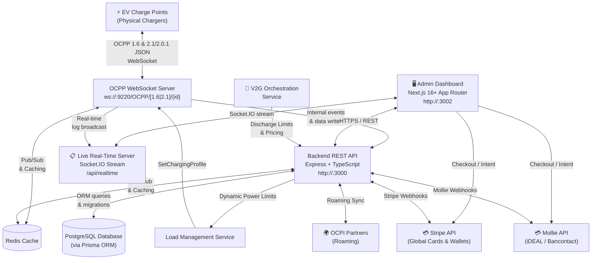

# AI Agent Guide: OCPP-CPMS Repository

Welcome to the **OCPP-CPMS (Charge Point Management System)** repository. This file serves as the definitive reference manual for autonomous AI coding agents working on this codebase.

---

## 1. System Overview & Architecture

OCPP-CPMS is an enterprise-grade Centralized Charging Station Management System supporting multi-protocol EV charging hardware (OCPP 1.6-J, 2.0.1, and draft 2.1), real-time WebSockets, dynamic EPEX spot pricing, predictive solar load balancing, V2G orchestration, SEPA XML ISO 20022 export, Stripe & Mollie payment processing, OCPI 2.2.1 roaming, and interactive station ground plans.



---

## 2. Directory Layout

```
OCPP-CPMS/
├── Backend/                            # Express + TypeScript API & OCPP WebSocket Server
│   ├── prisma/
│   │   ├── schema.prisma               # PostgreSQL Prisma Schema
│   │   └── migrations/                 # Migration history
│   ├── src/
│   │   ├── api/                        # REST Controllers & Routes by Domain
│   │   │   ├── analytics/              # Aggregated kWh, revenue, and utilization reports
│   │   │   ├── auth/                   # JWT Auth, 2FA TOTP, Password Reset, Email Verify
│   │   │   ├── chargeGroups/           # Load balancing group definitions
│   │   │   ├── chargers/               # Charger CRUD & Connector mappings
│   │   │   ├── companies/              # Multi-tenant corporate accounts
│   │   │   ├── config-profiles/        # Standardized OCPP config templates
│   │   │   ├── connectors/             # EVSE Connector CRUD
│   │   │   ├── dashboard/              # Metrics, live sessions, fleet capacity
│   │   │   ├── mail/                   # SMTP & HTML email templates
│   │   │   ├── media-campaigns/        # Charger screen video/image promotions
│   │   │   ├── ocpi/                   # OCPI 2.2.1 roaming endpoints
│   │   │   ├── ocpp/                   # OCPP REST triggers & live log history
│   │   │   ├── oicp/                   # Hubject OICP roaming endpoints
│   │   │   ├── payments/               # Stripe & Mollie payment intents & webhooks
│   │   │   ├── quirk-profiles/         # Vendor-specific hardware compatibility quirks
│   │   │   ├── reimbursements/         # Employee home charging SEPA calculation
│   │   │   ├── rfid/                   # RFID whitelist & tag management
│   │   │   ├── roaming/                # Roaming partner credentials
│   │   │   ├── settings/               # System settings (tariffs, hardware risk, mail, payments)
│   │   │   ├── stations/               # Charging stations & Ground Plan maps
│   │   │   ├── tariffs/                # Tariff CRUD & dynamic pricing formulas
│   │   │   ├── transactions/           # Charging session history & active sessions
│   │   │   ├── users/                  # User accounts & roles
│   │   │   └── vehicles/               # Vehicle energy profiles & contract certificates
│   │   ├── config/                     # Environment, Database, and Redis instances
│   │   ├── cron/                       # Scheduled background jobs (autoHeal, balancing, reimbursement)
│   │   ├── middleware/                 # authenticateToken, requireAdmin, errorHandler, upload
│   │   ├── ocpp/                       # Dual OCPP 1.6 & 2.1 WebSocket Server & Handlers
│   │   │   ├── handlers/               # OCPP 1.6 JSON message handlers
│   │   │   ├── logsWebSocket.ts        # Live log stream
│   │   │   ├── ocppServer.ts           # Central WebSocket router
│   │   │   ├── realtime.socket.ts      # Socket.IO event broadcaster
│   │   │   └── remoteControl.ts        # Remote control RPC helpers
│   │   ├── services/                   # Business logic services
│   │   │   ├── AnalyticsService.ts
│   │   │   ├── DynamicTariffService.ts
│   │   │   ├── EpexSpotService.ts
│   │   │   ├── FirmwareUpdateService.ts
│   │   │   ├── GeoLocationService.ts
│   │   │   ├── LoadManagementService.ts
│   │   │   ├── MailService.ts
│   │   │   ├── MeterValueService.ts
│   │   │   ├── MollieService.ts
│   │   │   ├── OcpiService.ts
│   │   │   ├── PredictiveBalancingService.ts
│   │   │   ├── ReimbursementService.ts
│   │   │   ├── SepaXmlService.ts
│   │   │   ├── StripeService.ts
│   │   │   ├── TotpService.ts
│   │   │   └── V2GOrchestrationService.ts
│   │   ├── utils/                      # Validation, logger, config-profile helpers
│   │   ├── app.ts                      # Express App factory
│   │   └── server.ts                   # Process bootstrap entrypoint
│   └── package.json
│
├── Frontend/                           # Next.js 16+ App Router Admin Dashboard
│   ├── app/                            # Next.js App Router Pages
│   │   ├── (auth)/                     # Login, Register, Forgot Password, Verify Email
│   │   ├── analytics/                  # Reporting graphs & CSV export
│   │   ├── charge-groups/              # Group load balancing management
│   │   ├── chargers/                   # Charger lists, detail, remote control, config
│   │   ├── config-profiles/            # Standard OCPP parameter templates
│   │   ├── dashboard/                  # KPI overview, map view, active sessions
│   │   ├── hardware-at-risk/           # Auto-heal & hardware maintenance alerts
│   │   ├── media-campaigns/            # Multimedia advertisement scheduler
│   │   ├── mobile/                     # Responsive driver companion interface
│   │   ├── ocpp/                       # Raw OCPP live log stream inspector
│   │   ├── payments/                   # Ad-hoc charging session checkout (Stripe & Mollie)
│   │   ├── quirk-profiles/             # Hardware quirk overrides
│   │   ├── reimbursements/             # Home charger reimbursement ledger & SEPA
│   │   ├── rfid/                       # RFID card management
│   │   ├── roaming/                    # OCPI / OICP partner connections
│   │   ├── settings/                   # Platform configurations (Stripe, Mollie, PKI, EPEX)
│   │   ├── stations/                   # Stations & Ground Plan builder
│   │   ├── tariffs/                    # Tariff definitions & dynamic spot rates
│   │   ├── transactions/               # Session records
│   │   ├── users/                      # User & client administration
│   │   ├── v2g/                        # V2G fleet battery orchestration
│   │   └── vehicle-identity-management/# ISO 15118 vehicle contract certificates
│   ├── components/                     # Modular UI Components (shadcn/ui + Tailwind)
│   ├── hooks/                          # React hooks (useAuth, useToast, etc.)
│   ├── lib/                            # Axios API client, utils, logger
│   ├── locales/                        # en.json, nl.json, fr.json (i18n)
│   └── package.json
│
├── Manual/                             # Technical & User Guides
├── AGENTS.md                           # This agent instruction manual
├── proposals.md                        # Architectural proposals & agent prompts
└── README.md                           # Public repository overview
```

---

## 3. Technology Stack & Key Libraries

| Component | Technology / Library | Description |
| :--- | :--- | :--- |
| **Backend Runtime** | Node.js (v22 - v24) | Modern JavaScript / ESM |
| **Backend Framework** | Express 5 + TypeScript 6+ | Typed REST API Server |
| **Database & ORM** | PostgreSQL + Prisma ORM 7.10 | Type-safe SQL migrations & queries |
| **Cache & Pub/Sub** | Redis 7 + `ioredis` | Cross-pod communication, state & telemetry cache |
| **OCPP WebSocket** | `ws` (RFC 6455) | Low-level WebSocket server on port 9220 |
| **Realtime Events** | Socket.IO 4 | WebSocket event push to frontend dashboard |
| **Scheduled Tasks** | `node-cron` | Background recurring maintenance & calculations |
| **Payment Gateways** | `stripe` & `@mollie/api-client` | Ad-hoc card/Apple Pay/Google Pay & iDEAL payments |
| **Banking Standards** | `fast-xml-parser` | ISO 20022 SEPA XML generation (`pain.001` & `pain.008`) |
| **Frontend Framework** | Next.js 16 (App Router + Turbopack) | React 19 server/client components |
| **UI Design System** | TailwindCSS + Radix UI (shadcn/ui) | Modern dark-mode enterprise UI |
| **Drag & Drop** | `@dnd-kit/core` & `@dnd-kit/sortable` | Station ground plan interactive canvas |
| **Mapping** | `leaflet` + `react-leaflet` | Geospatial charger & station map views |
| **Internationalization** | `react-i18next` | Multi-language (English / Dutch / French) |

---

## 4. Database Schema Summary (Key Models)

- **`User`**: Account identity. Roles: `superadmin`, `admin`, `user`. Supports 2FA TOTP and email verification.
- **`Company`**: Multi-tenant organization grouping users and billing configurations.
- **`ChargingStation`**: Physical station with geolocation (latitude/longitude) and ground plan layout settings.
- **`Charger`**: Physical OCPP charge point (identifier matching hardware identity). Belongs to a station.
- **`Connector`**: Individual charging plug (EVSE id, connector id, type: `Type2`, `CCS2`, `CHAdeMO`, max power).
- **`RfidUser`**: RFID whitelist mapping card `idTag` to users and vehicle profiles.
- **`Transaction`**: Active or completed session record (`transactionId`, `meterStart`, `meterStop`, `totalCost`, `soc`, `currentDirection: Charging|Discharging`).
- **`MeterValue`**: Time-series telemetry record (`soc`, `voltage`, `current`, `power`, `energy_active_import_register`).
- **`Tariff`**: Pricing matrix with four elements (`energyFee`, `connectionFee`, `timeFee`, `idleFee`, `pricingType: fixed|dynamic_epex`).
- **`ChargeGroup`**: Dynamic load balancing cluster with site capacity limits.
- **`VehicleEnergyProfile`**: Battery capacity and minimum SoC reserve thresholds for V2G discharging.
- **`VehicleContractCertificate`**: ISO 15118 Plug & Charge contract certificate records.
- **`ReimbursementContract` & `ReimbursementLedger`**: Employee home charging monthly expense tracking.
- **`StripeConfig` & `MollieConfig`**: Multi-tenant payment gateway API credentials, webhook secrets, and test/live sandbox flags.

---

## 5. OCPP Protocol Pipeline & Architecture

### Dual-Protocol Routing & Unified Endpoint
The WebSocket server listens on port **9220** (configurable via `OCPP_PORT`) and routes connections based on the subprotocol header and URL path:
- `ws://<host>:9220/OCPP/<chargerId>` (or `wss://.../OCPP/<chargerId>`) -> Unified endpoint: automatically routes based on `Sec-WebSocket-Protocol` (`ocpp1.6`, `ocpp2.0.1`, `ocpp2.1`).
- `ws://<host>:9220/OCPP/1.6/<chargerId>` -> Handled by OCPP 1.6-J pipeline (`Backend/src/ocpp/handlers/`).
- `ws://<host>:9220/OCPP/2.1/<chargerId>` -> Handled by OCPP 2.0.1 / 2.1 router (`Backend/src/ocpp/v201/`).

### OCPP Message Format (JSON-RPC)
- **`CALL`** (Type 2): `[2, "<uniqueMessageId>", "<Action>", { <payload> }]`
- **`CALLRESULT`** (Type 3): `[3, "<uniqueMessageId>", { <responsePayload> }]`
- **`CALLERROR`** (Type 4): `[4, "<uniqueMessageId>", "<ErrorCode>", "<ErrorDescription>", { <details> }]`

### Core Supported Actions
1. **`BootNotification`**: Validates charger registration, records model/firmware, responds with heartbeat interval.
2. **`Heartbeat`**: Updates charger online status and timestamp.
3. **`Authorize`**: Validates RFID `idTag` or ISO 15118 contract certificate against whitelist.
4. **`StatusNotification`**: Tracks EVSE connector states (`Available`, `Preparing`, `Charging`, `SuspendedEVSE`, `SuspendedEV`, `Finishing`, `Reserved`, `Unavailable`, `Faulted`).
5. **`StartTransaction`**: Initiates session, captures initial meter reading, creates `Transaction` record in database.
6. **`MeterValues`**: Ingests periodic energy, power, voltage, and battery SoC telemetry.
7. **`StopTransaction`**: Finalizes session, computes net energy consumed, calculates financial cost via `DynamicTariffService`, and triggers reimbursement ledgers.
8. **`DataTransfer` / `FirmwareStatusNotification` / `DiagnosticsStatusNotification`**: Custom diagnostics and vendor payloads.

### Remote Control Commands (`Backend/src/ocpp/remoteControl.ts`)
- `remoteStartTransaction({ chargerId, connectorId, idTag })`
- `remoteStopTransaction({ chargerId, transactionId })`
- `resetCharger({ chargerId, type: "Soft" | "Hard" })`
- `unlockConnector({ chargerId, connectorId })`
- `changeAvailability({ chargerId, connectorId, type: "Operative" | "Inoperative" })`
- `setChargingProfile({ chargerId, connectorId, csChargingProfiles })`
- `getConfiguration({ chargerId, keys })` / `changeConfiguration({ chargerId, key, value })`
- `triggerMessage({ chargerId, requestedMessage, connectorId })`
- `updateFirmware({ chargerId, location, retrieveDate })`

---

## 6. Authentication, Security & Tenant Isolation Rules

1. **JWT Authentication**: All `/api/*` endpoints (except login, register, password reset, public payments, and health) enforce `authenticateToken`.
2. **Role Hierarchy**:
   - `superadmin`: Global platform access, company management, roaming configs.
   - `admin`: Manages chargers, stations, tariffs, users within their company.
   - `user`: Access restricted to own vehicles, RFID tags, and charging sessions.
3. **Strict Multi-Tenant Isolation**:
   - When writing API queries, non-admins (`userRole !== "admin" && userRole !== "superadmin"`) **must always be scoped** by `owner_id: req.userId` or `client_id: req.userId`.
4. **Rate Limiting**: Redis-backed rate limiter on `/api/*` (1000 requests / 15 minutes per IP).

---

## 7. Developer & Agent Commands Reference

### Backend Commands
```bash
# Navigate to Backend
cd Backend

# Generate Prisma Client (MUST be run after schema.prisma modifications)
npx prisma generate

# Synchronize Schema with PostgreSQL Database (without interactive prompt)
npx prisma db push --accept-data-loss

# Typecheck TypeScript (MUST exit with code 0)
npx tsc --noEmit

# Run Backend Unit Tests
npm test

# Run a specific unit test file
npx jest src/tests/services/V2GOrchestrationService.test.ts

# Create initial Superadmin account
npm run create-superadmin -- "admin@example.com" "password123"
```

### Frontend Commands
```bash
# Navigate to Frontend
cd Frontend

# Typecheck Frontend TypeScript (MUST exit with code 0)
npx tsc --noEmit

# Build production bundle / verify static page generation
npm run build
```

---

## 8. Agent Working Commandments

1. **ESM Modules Only**: The Backend uses `"type": "module"`. When importing local TypeScript files, always include the `.js` extension (e.g. `import { prisma } from "../config/database.js";`).
2. **Never Run `prisma migrate dev` Interactively**: In containerized or non-interactive agent runs, `prisma migrate dev` will hang. Always use `npx prisma db push` and `npx prisma generate`.
3. **Preserve Documentation & Comments**: Never blindly delete comments or docstrings in untouched code sections.
4. **Zero Compilation Errors**: Always run `npx tsc --noEmit` on both Backend and Frontend before completing a task.
5. **No Ad-Hoc CSS Utility Sprawl**: In Frontend, use predefined design tokens (`#1e2228`, `#54a8c7`, `#3f78e0`, `#45c4a0`, `#fab758`, `#e2626b`) and existing UI components from `@/components/ui/`.
6. **Decoupled Smart Charging**: Smart Charging (EPEX spot pricing, predictive solar, V2G) is native to the CPMS and operates without external EMS hardware. Keep energy routing services decoupled from external hardware gateways.

---

*Authored for AI Agents & Pair Programmers — webdotpulse/GRID-OCPP-CPMS.*
