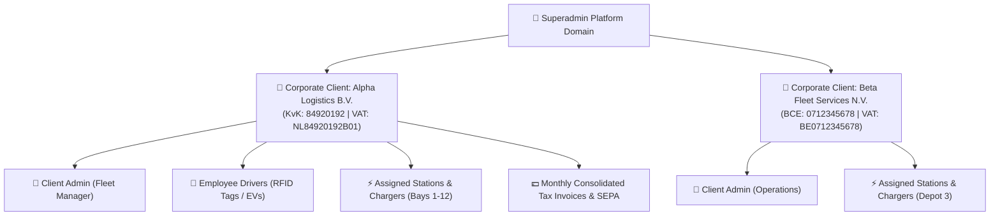
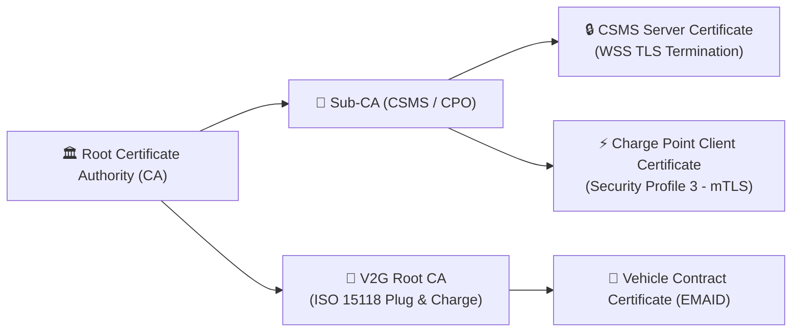
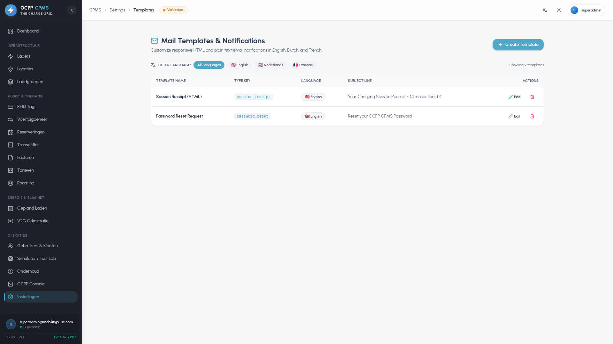
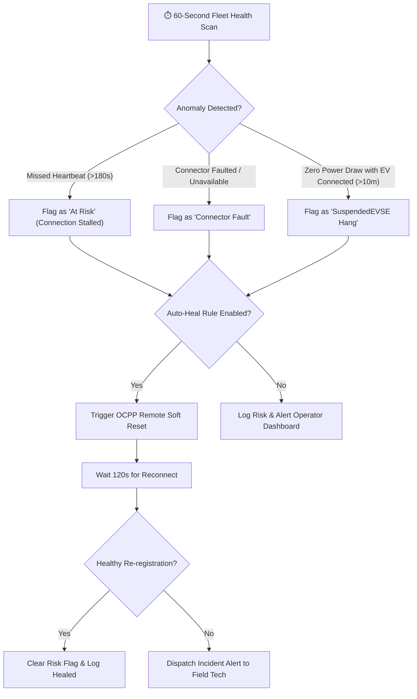
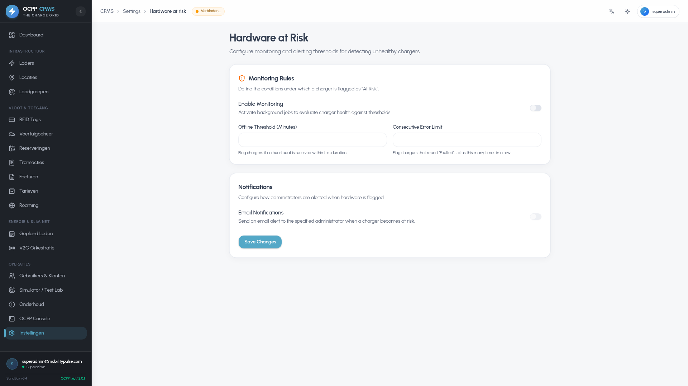

# OCPP Charge Point Management System (CPMS)
# Comprehensive System Administration & Enterprise Management Manual

Welcome to the **OCPP-CPMS System Administration & Enterprise Management Manual**. This document is designed for System Administrators, Security Officers, Roaming Coordinators, and Enterprise Technical Operators managing multi-tenant corporate accounts, granular Role-Based Access Control (RBAC), PKI certificates, automated hardware-at-risk rules, dynamic EPEX spot pricing, payment gateways, and live OCPP packet inspection.

---

## Table of Contents

1. [Multi-Tenant Architecture & Corporate Hierarchy](#1-multi-tenant-architecture--corporate-hierarchy)
2. [User Accounts, Corporate Clients & RBAC Matrix](#2-user-accounts-corporate-clients--rbac-matrix)
3. [Security Profiles & PKI / TLS Certificates](#3-security-profiles--pki--tls-certificates)
4. [Enterprise Audit Trail & Compliance Logging](#4-enterprise-audit-trail--compliance-logging)
5. [Dynamic EPEX Spot Tariff Configuration & Feeds](#5-dynamic-epex-spot-tariff-configuration--feeds)
6. [SMTP Server & HTML Mail Template Engine](#6-smtp-server--html-mail-template-engine)
7. [Screen Advertising Manager & Target Playlists](#7-screen-advertising-manager--target-playlists)
8. [Hardware-at-Risk Engine & Auto-Heal Rules](#8-hardware-at-risk-engine--auto-heal-rules)
9. [Payment Gateways Configuration (Stripe & Mollie)](#9-payment-gateways-configuration-stripe--mollie)
10. [Roaming Hubs: OCPI 2.2.1 & Hubject OICP Credentials](#10-roaming-hubs-ocpi-221--hubject-oicp-credentials)
11. [Live OCPP Packet Inspector & WebSocket Triggers](#11-live-ocpp-packet-inspector--websocket-triggers)
12. [Hardware Quirk Profiles & Config Profile Templates](#12-hardware-quirk-profiles--config-profile-templates)
13. [Scheduled Background Cron Jobs & Auto-Maintenance](#13-scheduled-background-cron-jobs--auto-maintenance)

---

## 1. Multi-Tenant Architecture & Corporate Hierarchy

The CPMS provides strict multi-tenant isolation, enabling enterprise operators to host multiple independent corporate clients (fleets, commercial properties, municipalities) on a single platform instance.

### Multi-Tenancy Rules
* **Data Scoping:** All transactions, RFID cards, vehicle profiles, and invoices are partitioned by `companyId` / `owner_id`.
* **Cross-Tenant Isolation:** Client administrators can only inspect, control, and export telemetry for chargers assigned to their corporate profile.
* **Superadmin Global Override:** Superadmin roles have global multi-tenant visibility for system-wide auditing, billing runs, and roaming routing.

---

## 2. User Accounts, Corporate Clients & RBAC Matrix

### 2.1 Corporate B2B Clients Directory (`/users`)
Corporate clients represent billing entities and enterprise fleet accounts. Each record stores:
* **Company & Legal Identity:** Company Name, KvK / Chamber of Commerce number, Tax / VAT identification.
* **Billing & Contact Information:** Invoice email, billing address, phone, and designated contact person.
* **SEPA Direct Debit Mandate:** Mandate ID (UMR), IBAN, BIC, and mandate signature date.
* **Assigned Assets:** Link specific charging stations, chargers, and employee drivers to the corporate account.

### 2.2 User Accounts & Authentication Security
User records represent individual authenticating human accounts:
* **Authentication:** Email address, salted bcrypt password hash, and email verification status.
* **Two-Factor Authentication (2FA TOTP):** Time-based One-Time Password support (Google Authenticator, Authy, 1Password) with 6-digit verification and backup recovery keys.
* **Associated Data:** Link to corporate client, personal RFID cards, and vehicle battery energy profiles.

### 2.3 5-Tier Role-Based Access Control (RBAC Matrix)

| Operational Domain | Superadmin | Platform Admin | Operator / Tech | Client Admin | User / Driver |
| :--- | :---: | :---: | :---: | :---: | :---: |
| **Infrastructure & Stations** | Full CRUD | Full CRUD | View & Diagnostics | Assigned Only | Map View |
| **Remote Controls (Reset/Unlock)** | Full Access | Full Access | Full Access | Restricted | Own Connector |
| **Dynamic Tariffs & EPEX** | Full CRUD | Full CRUD | View Only | View Assigned | View Rates |
| **Invoicing & SEPA Exports** | Full CRUD | Full CRUD | No Access | Own Invoices | Own Receipts |
| **Roaming Hubs (OCPI/OICP)** | Full CRUD | Manage | View Only | No Access | No Access |
| **PKI Security & Audit Trail** | Full CRUD | View Audit | No Access | No Access | No Access |
| **System Settings & Mail** | Full CRUD | Company Level | No Access | No Access | No Access |

---

## 3. Security Profiles & PKI / TLS Certificates

The CPMS supports full compliance with **OCPP 1.6 Security Whitepaper Edition 3** and **ISO 15118 PKI**:

### Security Profiles Configuration (`/settings/security`)
* **Security Profile 1 (Unsecured):** HTTP / WS transport without TLS encryption. Recommended strictly for isolated private VPNs.
* **Security Profile 2 (TLS with Basic Auth):** WSS connection with HTTP Basic Authentication (charger identity + password).
* **Security Profile 3 (Mutual TLS / mTLS):** WSS with bidirectional X.509 client and server certificate verification.
* **Certificate Authority Management:** Upload Root CA certificates, intermediate CAs, and inspect certificate validity dates, SHA-256 fingerprints, and revocation lists (CRLs).

---

## 4. Enterprise Audit Trail & Compliance Logging

The **Enterprise Audit Trail** (`/settings/audit`) provides an immutable chronological log of administrative and operational events:
* **Recorded Parameters:** Timestamp (UTC), User ID, User Email, Action Type (e.g. `REMOTE_RESET`, `TARIFF_UPDATE`, `SEPA_EXPORT`), Target Resource ID, Client IP Address, User-Agent, and Result (`SUCCESS` / `FAILED`).
* **Filtering & Search:** Filter by date range, administrative actor, specific charger ID, or severity level.
* **Export for Compliance:** Export audit logs in CSV or JSON format for SOC 2 and ISO 27001 regulatory audits.

---

## 5. Dynamic EPEX Spot Tariff Configuration & Feeds

The **Dynamic Tariffs Engine** (`/settings/tariffs`) integrates Day-Ahead wholesale electricity market prices into consumer and corporate charging tariffs.

### EPEX Integration Workflow
1. **Automated Price Fetching:** A background cron job pulls Day-Ahead hourly spot market prices daily at 13:15 CET from providers like **EnergyZero**, **ENTSO-E Transparency Platform**, or **Energy-Charts API**.
2. **Pricing Formula:**
   $$\text{Final Tariff (€/kWh)} = (\text{Spot Price} \times \text{Multiplier}) + \text{CPO Markup} + \text{Grid Operator Fee} + \text{VAT (21\%)}$$
3. **Transaction Slicing:** When a multi-hour charging session completes, the metering service breaks consumption into distinct hourly intervals and applies the exact corresponding spot rate.

---

## 6. SMTP Server & HTML Mail Template Engine

### 6.1 Outgoing Mail Configuration (`/settings/mail`)
Configure transactional email delivery via Postmark, SendGrid, Amazon SES, or custom SMTP servers:
* Hostname, Port (587 / 465 / 25), TLS/STARTTLS mode, SMTP User, and Password.
* Test Email Dispatcher to verify deliverability and SPF/DKIM alignment.

### 6.2 HTML Mail Template Editor (`/settings/templates`)
Customize responsive HTML email templates with visual previews and dynamic variables:
* **Supported Templates:** Welcome & Account Activation, Password Reset Request, Monthly Invoice Delivery (with PDF attachment), Charging Session Receipt, and Hardware Fault Warning.
* **Dynamic Placeholders:** `{{user_name}}`, `{{invoice_number}}`, `{{total_amount}}`, `{{kwh_delivered}}`, `{{charger_name}}`, `{{reset_link}}`.

---

## 7. Screen Advertising Manager & Target Playlists

The **Screen Ad Manager** (`/settings/ad-manager`) schedules and delivers media campaigns to EV chargers equipped with color multimedia screens:
* **Asset Formats:** MP4 video (H.264), PNG, JPG, and HTML5 responsive widgets.
* **Display Locations:** Idle attract screen, Active charging banner, and Post-session thank-you screen.
* **Targeting Rules:** Filter campaigns by specific charging stations, geographic cities, or charge groups.
* **OCPP DataTransfer Delivery:** Assets and playlists are distributed to hardware using customized `DataTransfer` vendor commands.

---

## 8. Hardware-at-Risk Engine & Auto-Heal Rules

The **Hardware-at-Risk Subsystem** (`/settings/hardware-at-risk` and `/hardware-at-risk`) continuously monitors fleet telemetry to identify deteriorating or stalled hardware before drivers experience outages.

### Configurable Healing Rules
1. **Heartbeat Timeout:** Maximum allowed delay before triggering an automated soft reset.
2. **Connector Stuck Unlock:** Automatically fire `UnlockConnector` if a session terminates with connector locked for >3 minutes.
3. **Firmware Rollback:** Fall back to stable firmware if newly deployed firmware produces error rates > 5%.

| Hardware at Risk Live Status | Auto-Heal Configuration Rules |
| :---: | :---: |
|  |  |

---

## 9. Payment Gateways Configuration (Stripe & Mollie)

Configure ad-hoc walk-in payment processing under `/settings/payments`:

### 9.1 Stripe Configuration
* **API Keys:** Live Publishable Key, Live Secret Key, Test Publishable Key, Test Secret Key.
* **Webhook Secret:** Signing secret (`whsec_...`) used by `/api/payments/webhook/stripe` to verify transaction events (`checkout.session.completed`, `payment_intent.succeeded`).
* **Supported Methods:** Visa, MasterCard, American Express, Apple Pay, Google Pay.

### 9.2 Mollie Configuration
* **API Key:** `live_...` or `test_...` key.
* **Webhook Endpoint:** `/api/payments/webhook/mollie`.
* **European Methods:** iDEAL 2.0, Bancontact, EPS, KBC/CBC, Belfius Direct Net.

---

## 10. Roaming Hubs: OCPI 2.2.1 & Hubject OICP Credentials

The CPMS operates as both a **CPO (Charge Point Operator)** and an **eMSP (e-Mobility Service Provider)** across standard roaming protocols.

### 10.1 OCPI 2.2.1 Configuration (`/roaming`)
* **Role Credentials:** Set your Country Code (e.g. `NL`), Party ID (e.g. `PUL`), and generate `TOKEN_A` / `TOKEN_B` / `TOKEN_C` authentication handshakes.
* **Supported Modules:**
  * `locations`: Synchronize charging stations, connectors, tariffs, and real-time status.
  * `tariffs`: Export multi-currency tariff matrices.
  * `sessions`: Stream active charging sessions to roaming partners.
  * `cdrs`: Transmit finalized Charge Detail Records.
  * `tokens`: Ingest and validate roaming RFID cards and tokens in real-time.

### 10.2 Hubject OICP 2.3 Integration
* Configure Hubject Operator ID, Staging/Production endpoints, and client certificates for eRoaming Authorization, EVSE Data, and CDR Push.

| OCPI Roaming Hubs | Hubject OICP Roaming | Roaming Settlement Visualizer |
| :---: | :---: | :---: |
|  |  |  |

---

## 11. Live OCPP Packet Inspector & WebSocket Triggers

The **Live Packet Inspector** (`/ocpp`) provides low-level diagnostics for debugging charging hardware communications:
* **Raw JSON-RPC Stream:** Real-time stream of incoming `CALL` [2], `CALLRESULT` [3], and `CALLERROR` [4] frames.
* **Message Parsing:** Decodes action types (`BootNotification`, `StatusNotification`, `MeterValues`, `StartTransaction`, `StopTransaction`).
* **Manual RPC Dispatcher:** Send ad-hoc RPC commands to any connected charger (`GetConfiguration`, `ChangeConfiguration`, `TriggerMessage`, `RemoteStartTransaction`, `RemoteStopTransaction`, `UnlockConnector`, `Reset`).

---

## 12. Hardware Quirk Profiles & Config Profile Templates

### 12.1 Quirk Profiles (`/quirk-profiles`)
Manufacturers often deviate slightly from the official OCPP specification. Quirk Profiles allow operators to normalize hardware behaviors non-intrusively:
* **Missing Active Power:** Synthesize `Power.Active.Import` from active voltage and current telemetry if omitted by hardware.
* **Scaling Multipliers:** Correct raw integer meter values from chargers requiring 0.1x or 10x division.
* **Card Tag Normalization:** Strip leading zeroes or convert RFID UID endianness before database validation.

### 12.2 Configuration Profile Templates (`/config-profiles`)
Create standardized templates containing standard OCPP parameters (e.g. `HeartbeatInterval: 60`, `MeterValueSampleInterval: 30`, `MeterValuesSampledData: "Energy.Active.Import.Register,Power.Active.Import,SoC,Current.Import,Voltage"`) and push them in bulk to chargers across a station.

---

## 13. Scheduled Background Cron Jobs & Auto-Maintenance

The CPMS runs several background cron jobs managed by `node-cron` and BullMQ:

| Job Name | Schedule | Description |
| :--- | :--- | :--- |
| **`fetchEpexSpotRates`** | Daily at `13:15 CET` | Pulls Day-Ahead hourly spot rates for tomorrow's 24 hours. |
| **`autoHealFleetScan`** | Every `60 seconds` | Scans all chargers for stalled connections, missed heartbeats, and fault states. |
| **`predictiveLoadOptimization`**| Every `15 minutes` | Computes 24-hour solar forecast and dynamic power allocation limits. |
| **`reimbursementLedgerMonthly`**| 1st of month at `01:00` | Aggregates employee home charging and generates SEPA Credit Transfer records. |
| **`roamingStatusSync`** | Every `30 seconds` | Broadcasts connector status changes to active OCPI and Hubject connections. |
| **`auditLogPurge`** | Monthly | Archives audit trail records older than the configured retention policy (e.g. 7 years). |

---
*Authored for Enterprise Platform Administrators & DevOps — webdotpulse/GRID-OCPP-CPMS.*
