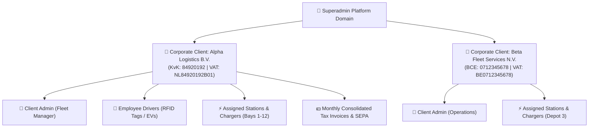

# OCPP Charge Point Management System (CPMS)
# Comprehensive System Administration & Enterprise Management Manual

Welcome to the **OCPP-CPMS System Administration & Enterprise Management Manual**. This document is designed for System Administrators, Security Officers, Roaming Coordinators, and Enterprise Technical Operators managing multi-tenant corporate accounts, granular Role-Based Access Control (RBAC), PKI certificates, automated hardware-at-risk rules, dynamic EPEX spot pricing, payment gateways, and live OCPP packet inspection.

---

## 📑 Table of Contents

1. [Multi-Tenant Architecture & Corporate Hierarchy](#1-multi-tenant-architecture--corporate-hierarchy)
2. [User Accounts, Corporate Clients & RBAC Matrix](#2-user-accounts-corporate-clients--rbac-matrix)
3. [Security Profiles & PKI / TLS Certificates](#3-security-profiles--pki--tls-certificates)
4. [Enterprise Audit Trail & Compliance Logging](#4-enterprise-audit-trail--compliance-logging)
5. [Dynamic EPEX Spot Tariff Configuration & Feeds](#5-dynamic-epex-spot-tariff-configuration--feeds)
6. [SMTP Server & HTML Mail Template Engine](#6-smtp-server--html-mail-template-engine)
7. [Screen Advertising Manager & Target Playlists](#7-screen-advertising-manager--target-playlists)
8. [Hardware-at-Risk Engine & Auto-Heal Rules](#8-hardware-at-risk-engine--auto-heal-rules)
9. [Payment Gateways Configuration (Stripe & Mollie)](#9-payment-gateways-configuration-stripe--mollie)
10. [Roaming Hubs: OCPI 2.2.1 & Hubject OICP Credentials](#10-roaming-hubs-ocpi-221--hubject-oicp-credentials)
11. [Live OCPP Packet Inspector & WebSocket Triggers](#11-live-ocpp-packet-inspector--websocket-triggers)
12. [Hardware Quirk Profiles & Config Profile Templates](#12-hardware-quirk-profiles--config-profile-templates)
13. [Scheduled Background Cron Jobs & Auto-Maintenance](#13-scheduled-background-cron-jobs--auto-maintenance)

---

## 1. Multi-Tenant Architecture & Corporate Hierarchy

The CPMS provides strict multi-tenant isolation, enabling enterprise operators to host multiple independent corporate clients (fleets, commercial properties, municipalities) on a single platform instance.

### Multi-Tenancy Rules
* **Data Scoping:** All transactions, RFID cards, vehicle profiles, and invoices are partitioned by `companyId` / `owner_id`.
* **Cross-Tenant Isolation:** Client administrators can only inspect, control, and export telemetry for chargers assigned to their corporate profile.
* **Superadmin Global Override:** Superadmin roles have global multi-tenant visibility for system-wide auditing, billing runs, and roaming routing.

---

## 2. User Accounts, Corporate Clients & RBAC Matrix

### 2.1 Corporate B2B Clients Directory (`/users` - Clients Tab)
Corporate clients represent billing entities and enterprise fleet accounts. Each record stores:
* **Company & Legal Identity:** Company Name, KvK / Chamber of Commerce number, Tax / VAT identification.
* **Billing & Contact Information:** Invoice email, billing address, phone, and designated contact person.
* **SEPA Direct Debit Mandate:** Mandate ID (UMR), IBAN, BIC, and mandate signature date.
* **Assigned Assets:** Link specific charging stations, chargers, and employee drivers to the corporate account.

### 2.2 Granular RBAC Matrix (`/users` - Roles Tab & `/settings/roles`)
The platform enforces a five-tier Role-Based Access Control matrix across six distinct operational domains:

| Role Tier | Scope | Typical Assignment | Key Capabilities |
| :--- | :--- | :--- | :--- |
| **`superadmin`** | Global Platform | Platform Owner / Lead Architect | Full unrestricted access to all corporate tenants, hardware configurations, and global financial ledgers. |
| **`admin`** | CPO Network | Network Operations Director | Manage site locations, load groups, dynamic tariffs, client accounts, and billing runs. |
| **`operator`** | Hardware & Field | Field Maintenance Technician | Monitor live telemetry, execute remote charger commands, configure hardware profiles, and view packet inspector. |
| **`client_admin`** | Corporate Tenant | Corporate Fleet Manager | View assigned chargers, register employee drivers and RFID tags, and download monthly consolidated invoices. |
| **`user`** | Self-Service | Individual EV Driver | View personal charging receipts, manage registered vehicle battery profiles, and access the mobile driver companion. |

---

## 3. Security Profiles & PKI / TLS Certificates

The CPMS supports the **OCPP Security Whitepaper** profiles to ensure encrypted and authenticated hardware communication:

* **Security Profile 1 (Unsecured Transport):** HTTP / WS over port 9220 with HTTP Basic Authentication. Recommended only for isolated local lab networks.
* **Security Profile 2 (TLS with Basic Authentication):** HTTPS / WSS over port 9220 with server-side TLS certificates and charger-specific Basic Auth credentials.
* **Security Profile 3 (Mutual TLS / mTLS):** WSS with dual-ended certificate verification. Both the CPMS and the charge point validate each other's X.509 certificates.

### PKI Certificate Management (`/settings/security`)
* **Certificate Authority (CA) Chaining:** Upload trusted root and intermediate CA certificates.
* **Client Certificate Enrollment:** Automated generation of certificate signing requests (CSR) via OCPP `SignCertificate.req`.
* **Certificate Revocation Lists (CRL):** Real-time validation preventing decommissioned chargers from establishing WebSocket connections.

---

## 4. Enterprise Audit Trail & Compliance Logging

The **Audit Trail** (`/settings/audit`) provides an immutable chronological ledger of all platform administrative interactions:

* **Logged Actions:** Remote commands (`RemoteStart`, `Reset`), configuration parameter changes, tariff modifications, user role promotions, and SEPA batch exports.
* **Metadata Recorded:** Executing user ID, IP address, timestamp (microsecond precision), affected entity, and complete pre/post mutation JSON diffs.
* **Tamper-Evidence:** Records are cryptographically signed and stored in an append-only table.

---

## 5. Dynamic EPEX Spot Tariff Configuration & Feeds

The **Dynamic Tariffs Engine** (`/settings/tariffs`) configures automated wholesale spot market ingestion:

* **Market Feeds:** Integrates with ENTSO-E Transparency Platform and EnergyZero API for hourly Day-Ahead electricity pricing across European bidding zones (NL, BE, DE, FR, UK).
* **CPO Pricing Formulas:** Configure custom margin formulas:
  $$\text{Driver Rate} = (\text{Wholesale Spot Rate} \times \text{Multiplier}) + \text{CPO Margin Markup} + \text{Grid Tax}$$
* **Negative Price Handling:** Automatically enforce minimum floor rates or pass negative pricing incentives to smart fleet drivers to absorb grid surpluses.

---

## 6. SMTP Server & HTML Mail Template Engine

### 6.1 SMTP Configuration (`/settings/mail`)
Connect enterprise mail transfer agents (Mailgun, SendGrid, Amazon SES, Postmark, or custom Postfix relays) with support for TLS/STARTTLS authentication.

### 6.2 HTML Mail Templates (`/settings/templates`)
Visual editor for customizing transactional email notifications with variable substitution (`{{driver_name}}`, `{{kwh_delivered}}`, `{{total_cost}}`, `{{station_name}}`):
* Driver Welcome & Email Verification
* Password Reset & 2FA Setup
* Monthly Consolidated Invoice Notification with Attached PDF
* Charging Session Started & Completed Receipts
* Hardware Offline & Anomaly Alerts

---

## 7. Screen Advertising Manager & Target Playlists

The **Screen Ad Manager** (`/settings/ad-manager` & `/media-campaigns`) controls multimedia assets displayed on charger screens:

* **Asset Management:** Upload high-resolution images (PNG, JPEG) and video files (MP4, WebM) formatted for charger aspect ratios.
* **Targeting Rules:** Bind campaigns to specific charging stations, geographical regions, or corporate client bays.
* **Trigger Events:** Display promotional media during specific charging lifecycle states (`Standby`, `Preparing`, `Charging`, `Thank You / Disconnect`).

| Screen Advertising Settings | Media Campaigns Scheduler |
| :---: | :---: |
|  |  |

---

## 8. Hardware-at-Risk Engine & Auto-Heal Rules

The **Auto-Heal Engine** (`/settings/hardware-at-risk` & `/auto-heal-playbooks`) prevents charger downtime by automatically remedying common hardware faults without requiring on-site technician dispatches:

* **Trigger Conditions:**
  - `MissedHeartbeats > 3`: Charger fails to send heartbeats within expected interval.
  - `ConnectorLockFailure`: Mechanical cable pin fails to latch or unlatch.
  - `HighTemperatureFault`: Internal power module reports overheating.
  - `GroundFailure`: RCD ground fault trip.
* **Automated Remediation Workflows:**
  1. Trigger OCPP `UnlockConnector` RPC.
  2. If fault persists after 60 seconds, issue `Reset (Soft)`.
  3. If charger remains unresponsive after 5 minutes, issue `Reset (Hard)` to power-cycle the controller.
  4. Dispatch urgent SMS and email alert to the field service team.

| Hardware-at-Risk Engine | Auto-Heal Playbooks |
| :---: | :---: |
|  |  |

---

## 9. Payment Gateways Configuration (Stripe & Mollie)

The **Payment Gateway Hub** (`/settings/payments`) manages credentials for ad-hoc driver checkout:

* **Stripe Configuration:** Enter Stripe Publishable Key, Secret Key, and Webhook Secret for credit cards, Apple Pay, and Google Pay.
* **Mollie Configuration:** Enter Mollie Live / Test API Key for Benelux payment rails (iDEAL, Bancontact).
* **Pre-Authorization Limits:** Configure the default card hold amount (e.g., €35.00) and automatic release window upon transaction completion.

---

## 10. Roaming Hubs: OCPI 2.2.1 & Hubject OICP Credentials

The **Roaming Settings** (`/roaming`) establish automated clearinghouse connections with external e-Mobility Service Providers:

* **OCPI 2.2.1 Configuration:**
  - CPO Credentials URL and Token generation.
  - Module endpoints: `locations`, `sessions`, `cdrs`, `tariffs`, `tokens`.
* **Hubject Intercharge (OICP 2.3):**
  - Operator ID (`NL-PUL`), Hubject Environment (`QA` / `PROD`), and Service Certificate.
* **Automated Clearing & Settlement:** Transactions performed by roaming RFID cards are automatically bundled into Charge Detail Records (CDRs) and dispatched for inter-operator settlement.

| Roaming OCPI Hubs | Roaming Settlement Visualizer |
| :---: | :---: |
|  |  |

---

## 11. Live OCPP Packet Inspector & WebSocket Triggers

The **OCPP Packet Inspector** (`/ocpp`) is an enterprise-grade protocol analyzer providing sub-second streaming visibility into low-level WebSocket traffic:

* **Protocol Filtering:** Filter frames by Message Type (`2: CALL`, `3: CALLRESULT`, `4: CALLERROR`), Action Name (`BootNotification`, `Authorize`, `StartTransaction`, `MeterValues`, `StopTransaction`), or specific Charger ID.
* **Payload Deep Dive:** Expand JSON payloads to inspect exact parameter keys, timestamps, and firmware return codes.
* **Manual Message Injection:** Formulate and transmit custom OCPP calls directly to any connected charge point to test firmware behavior.

---

## 12. Hardware Quirk Profiles & Config Profile Templates

### 12.1 Quirk Profiles (`/quirk-profiles`)
Resolve hardware-specific firmware deviations from the OCPP standard:
* **Alfen ICU:** Enable proprietary lock timeout mitigation and double-socket power combining.
* **ABB E-Mobility:** Override non-standard `MeterValues` sample timestamp formats.
* **EVBox:** Enforce custom heartbeat interval tolerances.

### 12.2 Config Profile Templates (`/config-profiles`)
Create standardized parameter sets (e.g., `Alfen Commercial Baseline`, `Fast DC 150kW Standard`) that can be applied to newly onboarded chargers in a single click:
* `HeartbeatInterval = 60`
* `MeterValueSampleInterval = 30`
* `MeterValuesSampledData = Energy.Active.Import.Register,Power.Active.Import,SoC,Voltage,Current.Import`
* `StopTransactionOnEVSideDisconnect = true`
* `UnlockConnectorOnEVSideDisconnect = true`

---

## 13. Scheduled Background Cron Jobs & Auto-Maintenance

The backend runs recurring automated maintenance tasks orchestrated by `node-cron`:

| Background Task | Frequency | Implementation File | Operational Purpose |
| :--- | :--- | :--- | :--- |
| **Auto-Heal Evaluation** | Every 60 seconds | `Backend/src/cron/autoHealCron.ts` | Scans all chargers for missed heartbeats and initiates automated recovery playbooks. |
| **EPEX Spot Rate Ingestion** | Daily at 13:15 CET | `Backend/src/cron/epexSpotCron.ts` | Ingests Day-Ahead wholesale electricity rates for the next 24-hour cycle. |
| **Predictive Load Balancing** | Hourly | `Backend/src/cron/balancingCron.ts` | Computes solar absorption schedules and dispatches `SetChargingProfile` commands. |
| **Monthly Invoicing Run** | 1st of month at 02:00 | `Backend/src/cron/reimbursementCron.ts` | Finalizes monthly corporate billing ledgers and generates SEPA `pain.008` batch XML files. |

---

*Authored for enterprise EV infrastructure administration — webdotpulse/GRID-OCPP-CPMS.*
