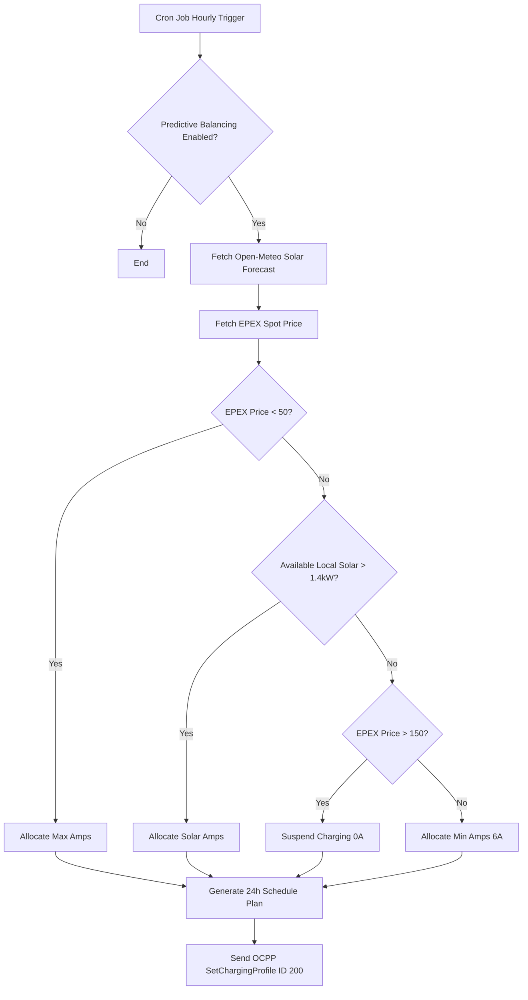

# Smart Charging, Dynamic Tariffs & V2G Guide

Welcome to the Smart Charging & V2G Guide for the CPMS platform. This document explains the platform's intelligent energy routing, dynamic tariffs, predictive solar balancing, and Vehicle-to-Grid (V2G) capabilities.

## 1. Dynamic Tariffs & Spot Pricing

The platform integrates directly with Day-Ahead markets to offer dynamic, spot-priced charging sessions.

### Data Ingestion Strategy
The `EpexSpotService` coordinates the retrieval of Day-Ahead EPEX spot prices.
*   **Providers:** It fetches pricing primarily from EnergyZero (for NL/BE), ENTSO-E (if an API key is configured in the database under `ENTSOE_API_KEY`), and falls back to Energy-Charts if needed.
*   **Execution:** A background worker evaluates pricing data daily. If the current time is past the standard publication time (around 13:00 - 14:00 CET), it fetches pricing for the following day.
*   **Storage:** Prices are standardized and stored as `pricePerMwh` in the `epexSpotPrice` database table, enabling granular markup configurations by Charge Point Operators (CPOs).

## 2. Predictive Solar Load Balancing

Predictive Balancing transforms reactive load management into proactive, cost-optimized energy dispatch. This is orchestrated by the `PredictiveBalancingService` and executed via the `predictiveBalancingCron.ts` hourly background job.

### Algorithmic Decision Making
For chargers with Predictive Balancing enabled, the system generates a rolling 24-hour charging plan. The algorithm factors in:
1.  **Weather/Solar Forecast:** Queries the Open-Meteo API for shortwave radiation to estimate local solar generation (`localSolarKwp`).
2.  **Spot Prices:** Evaluates the EPEX Day-Ahead prices for the target hour.

> **Warning:** Improperly configuring the `localSolarKwp` or maximum amperage settings on the charger can result in severe phase imbalances or tripped breakers. Ensure site electrical limits are physically verified before enabling predictive dispatch.

### Load Balancing Decision Tree

## 3. V2G & Fleet Battery Management

### Dashboard Fleet Capacity & SoC Sliders
The CPMS dashboard features interactive widgets to monitor and manage fleet capacity. These **fleet capacity widgets** and **SoC (State of Charge) sliders** calculate available energy by dynamically querying the latest `MeterValue.soc` reported by the vehicle during the transaction. If real-time SoC is unavailable, the system safely falls back to `tx.finalMeterValue` or transaction baseline to estimate fleet reserve capacity.

The `V2GOrchestrationService` manages bidirectional energy flows, turning EV fleets into active grid assets.

### Discharging Triggers
The service evaluates active transactions with vehicle energy profiles:
*   **Capacity Checks:** The service queries the `VehicleEnergyProfile` associated with the active RFID user. It respects the `minSocThreshold` (e.g., 40%) to ensure vehicles retain enough charge for commuting.
*   **Discharge Dispatch:** When a discharge is triggered, the system calculates the required offset (capped by the charger's `power_capacity`) and sends an OCPP `SetChargingProfile` command.
*   **Discharge Profile:** A negative amperage limit is dispatched via Profile ID 300 to command the hardware to return energy to the grid.

> **Warning:** V2G Orchestration requires specialized bidirectional DC chargers (or emerging AC V2G standards) and specific vehicle support. Ensure hardware compatibility. Incorrectly pushing negative limit profiles to standard unidirectional chargers may cause hardware fault states.

## 4. General Load Management Service

For standard site and group load balancing, the `LoadManagementService` evaluates active load against theoretical capacities to prevent site overload.
*   **Site Load Profile:** Profile ID 100 is reserved for general Power Balancing/Site Load profiles.
*   **Amperage Profile:** Profile ID 101 is reserved for Amperage Load Management profiles.
*   **Safe Limit Enforcement:** If the theoretical maximum load drops back below 95% of the safe limit, the load management profiles are automatically cleared to resume maximum output.
