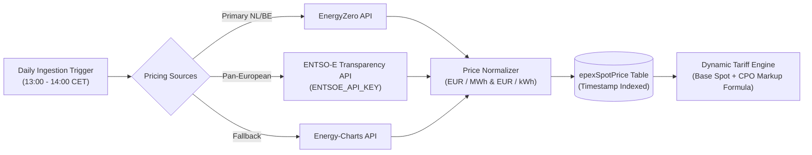
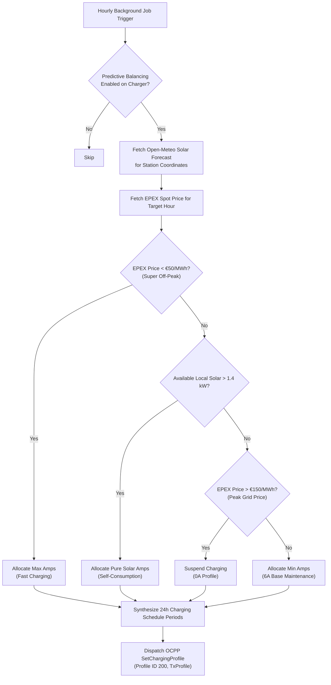
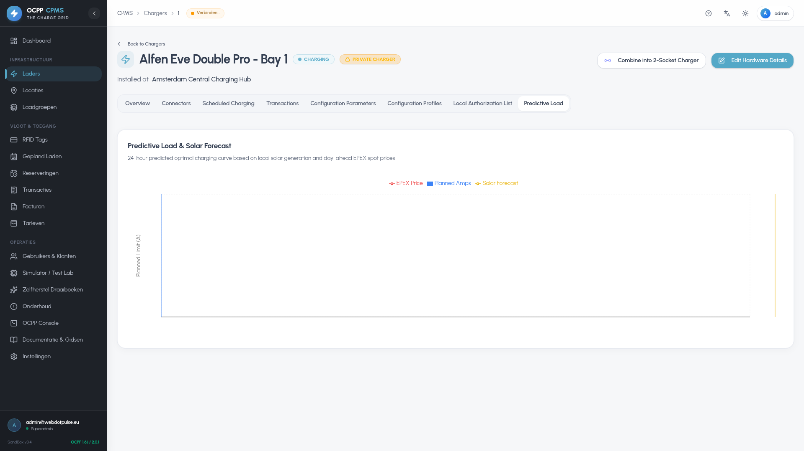
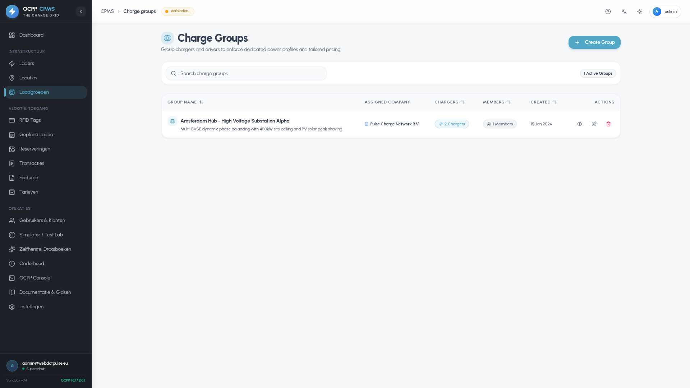
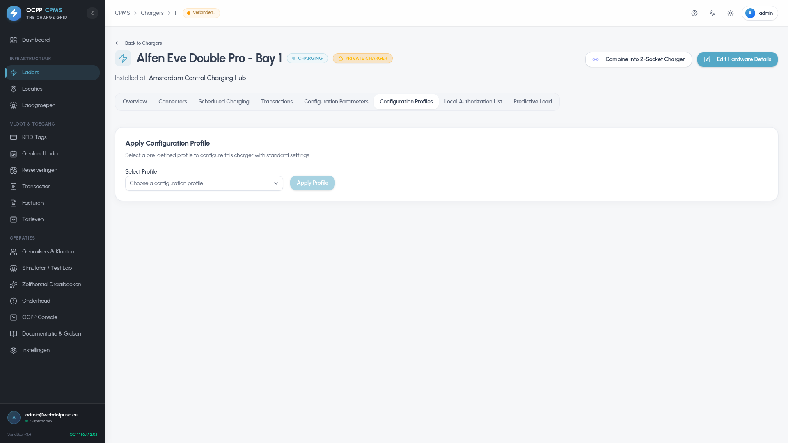
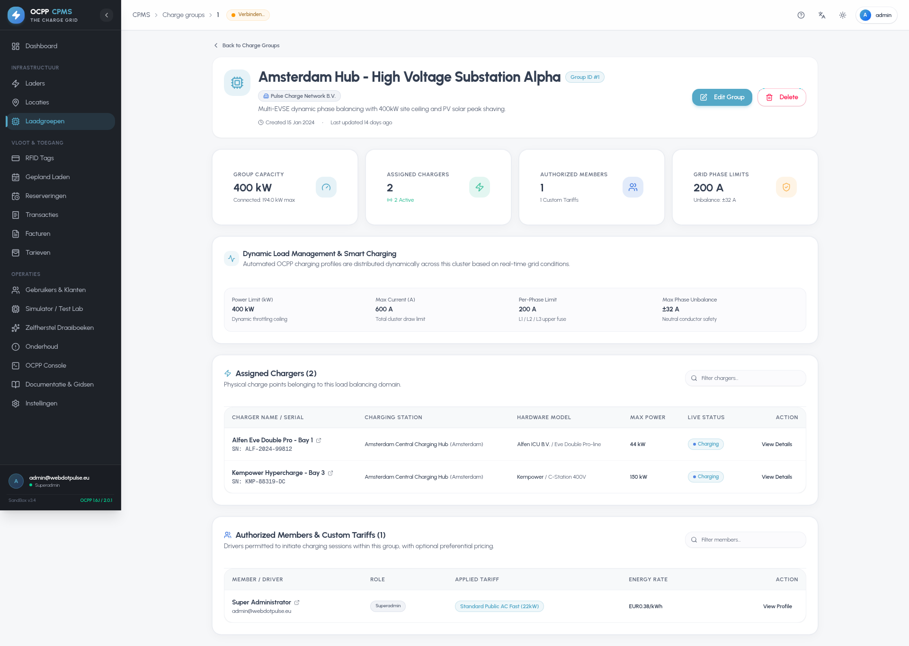
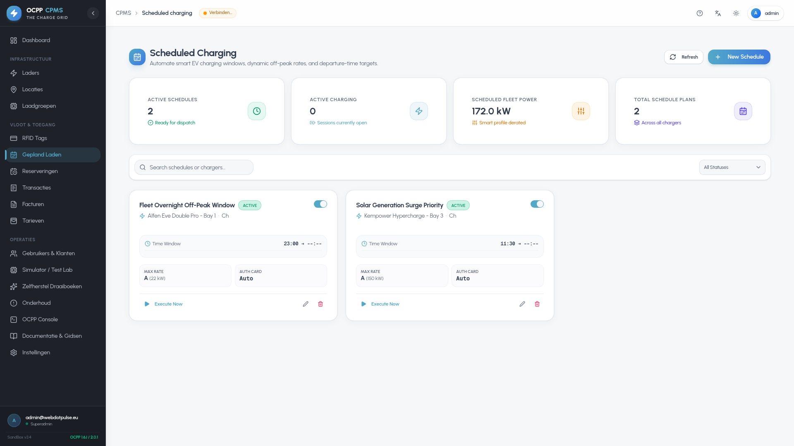
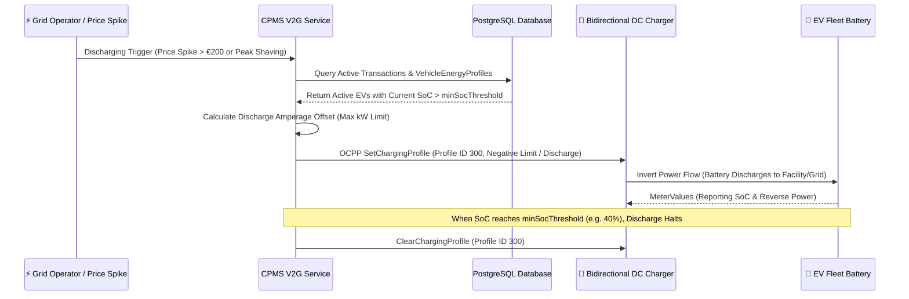

# Smart Charging, Dynamic Tariffs & V2G Guide

Welcome to the **Smart Charging, Dynamic Tariffs & V2G Guide** for the OCPP Central Processing Management System (CPMS). This document provides an in-depth technical explanation of the platform's intelligent energy routing, dynamic day-ahead pricing, predictive solar load balancing, 3-phase dynamic load management, and Vehicle-to-Grid (V2G) bidirectional battery orchestration.

---

## 1. Dynamic Tariffs & EPEX Spot Pricing

The platform integrates directly with Day-Ahead European wholesale electricity markets to offer automated dynamic pricing and cost-optimized charging dispatch.

### Data Ingestion Pipeline (`EpexSpotService.ts`)

* **Providers:** Primary ingestion from EnergyZero (for NL/BE spot markets), ENTSO-E (pan-European bidding zones via configured `ENTSOE_API_KEY`), with fallback to Energy-Charts.
* **Granular Calculation:** When a transaction ends, the `DynamicTariffService` slices the session into exact intervals matching the `MeterValue` telemetry timestamps. Each delta energy consumed is multiplied by the spot market price of that exact hour.

| Dynamic EPEX Settings | Tariff Structures |
| :---: | :---: |
|  |  |

---

## 2. Predictive Solar Load Balancing

Predictive Balancing transforms reactive load management into proactive, cost-optimized energy dispatch. This is orchestrated by the `PredictiveBalancingService` and executed via the `predictiveBalancingCron.ts` hourly background job.

### Algorithmic Schedule Generation

For chargers with Predictive Balancing enabled, the system computes a rolling 24-hour charging plan:
1. **Weather/Solar Forecast:** Queries the Open-Meteo API for hourly shortwave solar radiation ($W/m^2$) to estimate local solar generation based on the site's configured `localSolarKwp`.
2. **Spot Price Optimization:** Evaluates Day-Ahead spot prices for each target hour.
3. **Dispatch Allocation:** Calculates optimal amperage limits and sends an OCPP `SetChargingProfile` command using **Profile ID 200**.

### Load Balancing Decision Logic

| Predictive Load 24h Schedule | Charge Groups Load Limits |
| :---: | :---: |
|  |  |

---

## 3. 3-Phase Dynamic Load Management & Phase Balancing

The `LoadManagementService` maintains grid stability across complex multi-charger sites, preventing breaker trips and mitigating phase current unbalance:

### Multi-Tier OCPP Profile Stack
* **Profile ID 100 (Site Capacity Cap, Level 1):** Limits aggregate site wattage to the physical electrical supply rating.
* **Profile ID 101 (Phase Balancing, Level 2):** Dynamically redistributes power across individual phases (L1, L2, L3) when single-phase EVs cause phase skew.
* **Profile ID 200 (Predictive Solar, Level 0):** Baseline 24-hour economic schedule.
* **Profile ID 300 (V2G Discharging, Level 3):** High-priority bidirectional energy dispatch.

### Safe Headroom Restoration
If aggregate load across a station drops below **95%** of the physical safety threshold, active throttling profiles are automatically cleared to restore full charging speed to connected vehicles.

| Charger Active Profiles | Charge Group Phase Allocator |
| :---: | :---: |
|  |  |

---

## 4. Scheduled Smart Charging Calendar

The **Scheduled Charging Engine** (`/scheduled-charging`) allows operators and corporate fleets to schedule recurring daily and weekly power allocations:

* **Time-of-Use Window Alignment:** Enforce lower charging rates during standard daytime business hours and unlock maximum 22kW/150kW throughput during overnight off-peak or high-wind intervals.
* **Recurring Profiles:** Define Monday-Friday corporate fleet schedules and weekend visitor tariffs.

---

## 4. V2G & Fleet Battery Orchestration

The `V2GOrchestrationService` manages bidirectional power flows, transforming EV fleet batteries into active decentralized grid assets capable of peak shaving and grid stabilization.

### Fleet Capacity & Real-Time SoC Tracking
* **Real-Time Battery Telemetry:** Ingests live battery State of Charge (`MeterValue.soc`) reported by the vehicle during active sessions.
* **SoC Reserve Sliders:** Operators and drivers configure a `minSocThreshold` (e.g., 40%) in their `VehicleEnergyProfile` to guarantee sufficient driving range for subsequent commutes.

### Bidirectional Discharging Dispatch

> [!WARNING]
> **Hardware Compatibility:** V2G Orchestration requires specialized bidirectional DC chargers (ISO 15118-20 or CHAdeMO V2G protocols). Pushing negative limit charging profiles to standard unidirectional chargers may trigger hardware fault codes.
