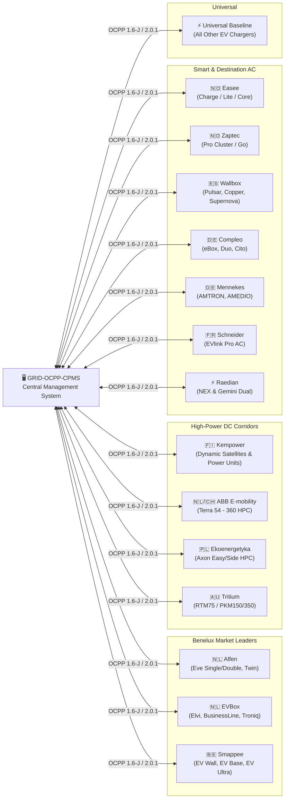
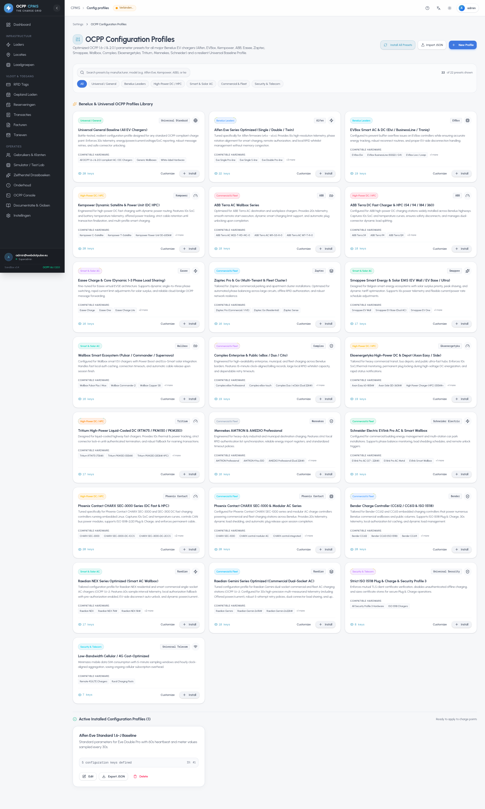
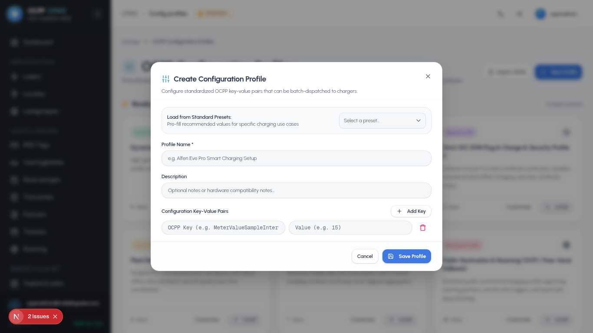
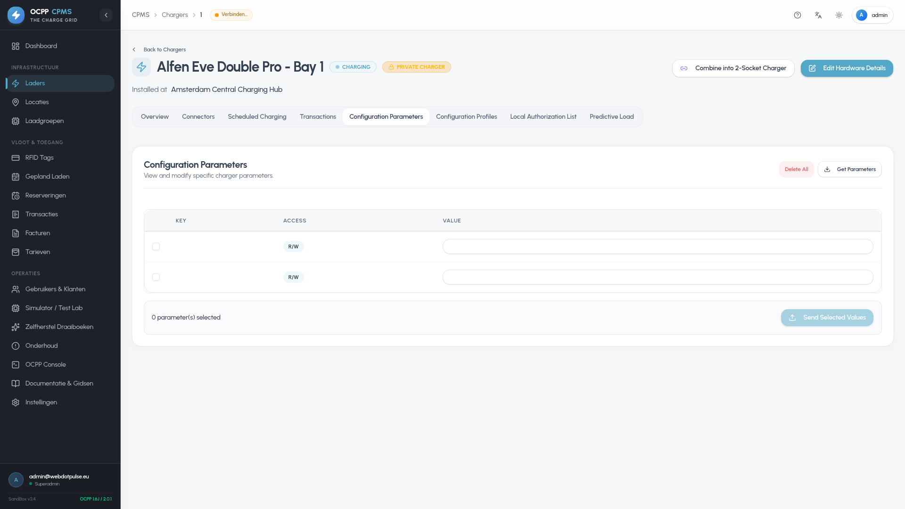

# Benelux EV Charger Landscape & Optimized OCPP Configuration Guide

## 1. Executive Summary & Benelux Market Overview

The Benelux region (Netherlands, Belgium, Luxembourg) possesses one of the highest densities and most technologically advanced electric vehicle (EV) charging ecosystems in the world. 

- **The Netherlands** is a global pioneer in public AC charging infrastructure (with dense municipal networks by TotalEnergies, Equans, Vattenfall, and Shell Recharge) and highway ultra-fast DC corridors (Fastned, Allego, Ionity).
- **Belgium** has experienced exponential growth driven by corporate fleet electrification policies (100% zero-emission company car tax incentives since 2026), dynamic solar smart charging (Smappee, Easee, Alfen), and high-power depot electrification.
- **Luxembourg** features an integrated nationwide public network (Chargy & SuperChargy) alongside extensive workplace and fleet charging depots.

To achieve maximum reliability, high-resolution telemetry for dynamic EPEX spot pricing, grid congestion mitigation, and seamless driver satisfaction, charge point operators (CPOs) and fleet managers must deploy **fine-tuned OCPP Configuration Profiles** tailored to the specific hardware characteristics of each charger family.

---

## 2. Most Known EV Chargers in Benelux & Optimized Profiles Matrix

Below is the comprehensive matrix of the top EV charging station manufacturers and hardware series deployed in the Benelux, along with the **Universal Baseline Profile** for all other standard OCPP-compliant chargers.



---

## 2.1 Central System WebSocket URL Configuration for Installers

When configuring chargers via manufacturer commissioning apps (e.g. Alfen ACE Service Installer, EVBox Connect, Smappee Dashboard, Easee Installer, ABB Terra Config, Zaptec Portal):

### Unified URL (Recommended for All Hardware)
* **Central System URL / Backend URL:** `wss://ocpp.thechargegrid.com/OCPP/`
* **Charge Point Identity / Communication ID:** `MP100220` *(or your station's specific charger ID)*
* **Complete URL (for single-field apps):** `wss://ocpp.thechargegrid.com/OCPP/<chargerId>`

### Key Installer App Behaviors
1. **Separate URL + Identity Fields (Alfen ACE, EVBox Connect, ABB Terra, Smappee, Easee):**
   - Enter `wss://ocpp.thechargegrid.com/OCPP/` in the *Central System URL* field.
   - Enter the unit's unique name (e.g. `MP100220`) in the *Charge Point Identity* field.
   - The hardware automatically appends its ID to connect to `wss://ocpp.thechargegrid.com/OCPP/MP100220`.
2. **Single URL Field (Raedian, Wallbox, Mennekes, Compleo):**
   - Enter the full URL `wss://ocpp.thechargegrid.com/OCPP/<chargerId>`.
3. **Automatic Protocol Negotiation:**
   - The CPMS server automatically negotiates whether the hardware is using **OCPP 1.6-J**, **2.0.1**, or **2.1** via WebSocket subprotocols (`Sec-WebSocket-Protocol`). You do not need to alter the URL path for different protocol versions.

---

## 3. Detailed Engineering Breakdown per Manufacturer

---

### 1. Alfen (Almere, Netherlands)
* **Market Position**: Undisputed market leader for commercial, municipal, and residential AC charging across the Netherlands and Belgium.
* **Core Models**:
  - `Eve Single Pro-line` (3.7 - 22 kW Single Socket with color display & RFID)
  - `Eve Single S-line` (3.7 - 11 kW Residential compact)
  - `Eve Double Pro-line` / `Eve Double PG-line` (Dual 22 kW Public/Workplace)
  - `Twin 4XL` / `Twin 5 Plus` (Rugged Dual 22 kW Municipal Public Post)
* **Hardware & Firmware Characteristics**:
  - Extremely robust OCPP 1.6-J stack (firmware v4.x through v6.x).
  - High internal measurement accuracy (MID certified meters).
  - Handles Smart Charging profiles (`SetChargingProfile`) with high responsiveness.
* **Optimized Configuration Key-Value Settings**:
  ```ini
  MeterValueSampleInterval = 15
  MeterValuesSampledData = Energy.Active.Import.Register,Power.Active.Import,Current.Import,Current.Offered,Voltage,SoC
  StopTxnSampledData = Energy.Active.Import.Register,SoC
  ClockAlignedDataInterval = 900
  MeterValuesAlignedData = Energy.Active.Import.Register,Power.Active.Import
  AuthorizeRemoteTxRequests = true
  LocalAuthorizeOffline = true
  LocalPreAuthorize = true
  LocalAuthListEnabled = true
  SendLocalListMaxLength = 1000
  UnlockConnectorOnEVSideDisconnect = true
  StopTransactionOnEVSideDisconnect = true
  StopTransactionOnInvalidId = true
  ConnectionTimeOut = 60
  HeartbeatInterval = 180
  WebSocketPingInterval = 60
  TransactionMessageAttempts = 3
  TransactionMessageRetryInterval = 10
  ConnectorPhaseRotation = 1.RST,2.RST
  ChargeProfileMaxStackLevel = 5
  ChargingScheduleMaxPeriods = 24
  ChargingScheduleAllowedChargingRateUnit = Current,Power
  ```

---

### 2. EVBox (Amsterdam, Netherlands)
* **Market Position**: Major Dutch OEM with hundreds of thousands of installed ports across Europe.
* **Core Models**:
  - `EVBox Elvi` (3.7 - 22 kW Modular Home AC)
  - `EVBox BusinessLine` (B3322 / G4 Commercial Dual AC)
  - `EVBox Livo` / `EVBox Liviqo` (Next-gen Smart AC)
  - `EVBox Troniq Modular 120-240kW` / `Troniq HighPower 350kW+` (DC Fast)
* **Hardware & Firmware Characteristics**:
  - Requires balanced sample intervals (30s) on older G4/B-series controllers to avoid internal flash buffer backlog.
  - Safe cable locking mechanisms and clean offline transaction recovery.
* **Optimized Configuration Key-Value Settings**:
  ```ini
  MeterValueSampleInterval = 30
  MeterValuesSampledData = Energy.Active.Import.Register,Power.Active.Import,Current.Import,Voltage,SoC
  StopTxnSampledData = Energy.Active.Import.Register,SoC
  ClockAlignedDataInterval = 900
  MeterValuesAlignedData = Energy.Active.Import.Register
  AuthorizeRemoteTxRequests = true
  LocalAuthorizeOffline = true
  LocalAuthListEnabled = true
  SendLocalListMaxLength = 250
  StopTransactionOnInvalidId = true
  StopTransactionOnEVSideDisconnect = true
  UnlockConnectorOnEVSideDisconnect = true
  ConnectionTimeOut = 120
  HeartbeatInterval = 180
  WebSocketPingInterval = 45
  TransactionMessageAttempts = 3
  TransactionMessageRetryInterval = 15
  ChargeProfileMaxStackLevel = 3
  ChargingScheduleAllowedChargingRateUnit = Current
  ```

---

### 3. Kempower (Finland / Benelux DC Fast Leader)
* **Market Position**: The preferred choice for ultra-fast DC charging hubs across Benelux (Fastned, Allego, TotalEnergies, commercial transit depots).
* **Core Models**:
  - `Kempower C-Satellite` / `T-Satellite` (Dual CCS2 / CHAdeMO user interface with dynamic power display)
  - `Kempower Power Unit 50 - 600 kW` (Modular 50kW power module rack with sub-second dynamic routing)
  - `Kempower Movable Charger` (40kW Mobile DC unit)
* **Hardware & Firmware Characteristics**:
  - High-speed dynamic load shifting between multiple satellites.
  - Requires 10s telemetry including `Temperature`, `Power.Offered`, and `Current.Offered`.
  - Heavy DC standard: `StopTransactionOnEVSideDisconnect=false` and `UnlockConnectorOnEVSideDisconnect=false` (cables must remain locked while high-voltage DC contactors are engaged).
* **Optimized Configuration Key-Value Settings**:
  ```ini
  MeterValueSampleInterval = 10
  MeterValuesSampledData = Energy.Active.Import.Register,Power.Active.Import,SoC,Current.Import,Voltage,Temperature,Power.Offered,Current.Offered
  StopTxnSampledData = Energy.Active.Import.Register,SoC
  ClockAlignedDataInterval = 300
  MeterValuesAlignedData = Energy.Active.Import.Register,Power.Active.Import
  AuthorizeRemoteTxRequests = true
  LocalAuthorizeOffline = false
  AllowOfflineTxForUnknownId = false
  StopTransactionOnEVSideDisconnect = false
  UnlockConnectorOnEVSideDisconnect = false
  StopTransactionOnInvalidId = true
  ConnectionTimeOut = 60
  HeartbeatInterval = 60
  WebSocketPingInterval = 30
  TransactionMessageAttempts = 4
  TransactionMessageRetryInterval = 10
  ChargeProfileMaxStackLevel = 10
  MaxChargingProfilesInstalled = 20
  ChargingScheduleMaxPeriods = 48
  ChargingScheduleAllowedChargingRateUnit = Power,Current
  ```

---

### 4. ABB E-mobility (Delft / Rijswijk, Netherlands)
* **Market Position**: Global powerhouse with global R&D and headquarters in the Netherlands.
* **Core Models**:
  - `ABB Terra AC Wallbox` (W7, W11, W22 - Destination & Fleet AC)
  - `ABB Terra 54` / `Terra 94` / `Terra 124` / `Terra 184` (50 - 180 kW Highway DC)
  - `ABB Terra 360` (All-in-one 360 kW 4-vehicle simultaneous HPC)
* **Optimized Configuration Profiles**:
  * **Terra AC Wallbox**:
    ```ini
    MeterValueSampleInterval = 20
    MeterValuesSampledData = Energy.Active.Import.Register,Power.Active.Import,Current.Import,Voltage,SoC
    StopTxnSampledData = Energy.Active.Import.Register,SoC
    ClockAlignedDataInterval = 900
    AuthorizeRemoteTxRequests = true
    LocalAuthorizeOffline = true
    LocalAuthListEnabled = true
    SendLocalListMaxLength = 500
    StopTransactionOnEVSideDisconnect = true
    UnlockConnectorOnEVSideDisconnect = true
    ConnectionTimeOut = 90
    HeartbeatInterval = 120
    ChargeProfileMaxStackLevel = 4
    ChargingScheduleAllowedChargingRateUnit = Current,Power
    ```
  * **Terra DC Fast & HPC (54 - 360)**:
    ```ini
    MeterValueSampleInterval = 10
    MeterValuesSampledData = Energy.Active.Import.Register,Power.Active.Import,SoC,Current.Import,Voltage,Temperature,Power.Offered
    StopTxnSampledData = Energy.Active.Import.Register,SoC
    ClockAlignedDataInterval = 300
    AuthorizeRemoteTxRequests = true
    LocalAuthorizeOffline = false
    StopTransactionOnEVSideDisconnect = false
    UnlockConnectorOnEVSideDisconnect = false
    ConnectionTimeOut = 60
    HeartbeatInterval = 60
    WebSocketPingInterval = 30
    ChargeProfileMaxStackLevel = 6
    MaxChargingProfilesInstalled = 15
    ChargingScheduleAllowedChargingRateUnit = Power,Current
    ```

---

### 5. Smappee (Kortrijk, Belgium)
* **Market Position**: Belgian leader in Energy Management Systems (EMS), solar surplus routing, and smart AC/DC charging stations.
* **Core Models**:
  - `Smappee EV Wall` (7.4 - 22 kW Smart Wallbox with ambient LED ring)
  - `Smappee EV Base` (Dual 22 kW Commercial Standing Post with integrated LED lighting)
  - `Smappee EV One` (Single socket residential)
  - `Smappee EV Ultra` (80 - 240 kW Compact DC Fast Charger)
* **Hardware & Firmware Characteristics**:
  - Native integration with real-time PV generation and capacity tariff throttling (Belgian *Capaciteitstarief*).
  - Highly responsive 15s power sampling.
* **Optimized Configuration Key-Value Settings**:
  ```ini
  MeterValueSampleInterval = 15
  MeterValuesSampledData = Energy.Active.Import.Register,Power.Active.Import,Current.Import,Current.Offered,Voltage,SoC
  StopTxnSampledData = Energy.Active.Import.Register,SoC
  ClockAlignedDataInterval = 900
  MeterValuesAlignedData = Energy.Active.Import.Register,Power.Active.Import
  AuthorizeRemoteTxRequests = true
  LocalAuthorizeOffline = true
  LocalAuthListEnabled = true
  SendLocalListMaxLength = 500
  StopTransactionOnEVSideDisconnect = true
  UnlockConnectorOnEVSideDisconnect = true
  ConnectionTimeOut = 120
  HeartbeatInterval = 120
  WebSocketPingInterval = 45
  ChargeProfileMaxStackLevel = 5
  MaxChargingProfilesInstalled = 10
  ChargingScheduleAllowedChargingRateUnit = Current,Power
  ```

---

### 6. Easee (Norway / High Benelux Market Penetration)
* **Market Position**: Widely installed for smart residential, fleet, and corporate car park installations across the Benelux.
* **Core Models**:
  - `Easee Charge` / `Easee Charge Core` / `Easee Charge Lite` / `Easee One` (1.4 - 22 kW Compact Robot)
  - `Easee Equalizer` (Local dynamic phase load balancer)
* **Hardware & Firmware Characteristics**:
  - Dynamic 1-phase to 3-phase automated switching based on available current.
  - Virtual EVSE cluster architecture with cloud-bridge and local wireless failover.
* **Optimized Configuration Key-Value Settings**:
  ```ini
  MeterValueSampleInterval = 30
  MeterValuesSampledData = Energy.Active.Import.Register,Power.Active.Import,Current.Import,Voltage,Current.Offered
  StopTxnSampledData = Energy.Active.Import.Register
  ClockAlignedDataInterval = 900
  MeterValuesAlignedData = Energy.Active.Import.Register
  AuthorizeRemoteTxRequests = true
  LocalAuthorizeOffline = true
  StopTransactionOnEVSideDisconnect = true
  UnlockConnectorOnEVSideDisconnect = true
  ConnectionTimeOut = 180
  HeartbeatInterval = 120
  WebSocketPingInterval = 60
  TransactionMessageAttempts = 3
  TransactionMessageRetryInterval = 15
  ChargeProfileMaxStackLevel = 3
  ChargingScheduleAllowedChargingRateUnit = Current
  ```

---

### 7. Zaptec (Norway / Major Benelux Fleet & VVE Player)
* **Market Position**: The gold standard for multi-tenant residential complexes (VVEs in NL / copropriétés in BE) and large employee workplace car parks.
* **Core Models**:
  - `Zaptec Pro` (22 kW Smart AC with 4G eSIM, daisy-chain single cable backbone, MID meter)
  - `Zaptec Go` (Residential compact 22 kW)
* **Hardware & Firmware Characteristics**:
  - Dynamic phase balancing across circuits with up to 100+ chargers on a single fused feeder.
  - Large local RFID whitelist capacity (up to 1,000 cards).
* **Optimized Configuration Key-Value Settings**:
  ```ini
  MeterValueSampleInterval = 15
  MeterValuesSampledData = Energy.Active.Import.Register,Power.Active.Import,Current.Import,Voltage
  StopTxnSampledData = Energy.Active.Import.Register
  ClockAlignedDataInterval = 900
  MeterValuesAlignedData = Energy.Active.Import.Register,Power.Active.Import
  AuthorizeRemoteTxRequests = true
  LocalAuthorizeOffline = true
  LocalAuthListEnabled = true
  SendLocalListMaxLength = 1000
  StopTransactionOnEVSideDisconnect = true
  UnlockConnectorOnEVSideDisconnect = true
  ConnectionTimeOut = 120
  HeartbeatInterval = 180
  WebSocketPingInterval = 60
  ChargeProfileMaxStackLevel = 5
  ChargingScheduleAllowedChargingRateUnit = Current,Power
  ```

---

### 8. Wallbox Chargers (Barcelona / High Benelux Adoption)
* **Core Models**: `Pulsar Plus`, `Pulsar Max`, `Commander 2`, `Copper SB`, `Supernova DC (60 - 150 kW)`.
* **Optimized Configuration Key-Value Settings**:
  ```ini
  MeterValueSampleInterval = 30
  MeterValuesSampledData = Energy.Active.Import.Register,Power.Active.Import,Current.Import,Voltage,SoC
  StopTxnSampledData = Energy.Active.Import.Register,SoC
  ClockAlignedDataInterval = 900
  MeterValuesAlignedData = Energy.Active.Import.Register
  AuthorizeRemoteTxRequests = true
  LocalAuthorizeOffline = true
  LocalAuthListEnabled = true
  SendLocalListMaxLength = 250
  StopTransactionOnEVSideDisconnect = true
  UnlockConnectorOnEVSideDisconnect = true
  ConnectionTimeOut = 120
  HeartbeatInterval = 180
  WebSocketPingInterval = 60
  ChargeProfileMaxStackLevel = 4
  ChargingScheduleAllowedChargingRateUnit = Current,Power
  ```

---

### 9. Compleo Charging Solutions (Germany / Benelux Enterprise)
* **Core Models**: `eBox Professional`, `eBox touch`, `Duo / eClick (Dual 22kW)`, `Cito DC 500`.
* **Optimized Configuration Key-Value Settings**:
  ```ini
  MeterValueSampleInterval = 30
  MeterValuesSampledData = Energy.Active.Import.Register,Power.Active.Import,Current.Import,Voltage,SoC
  StopTxnSampledData = Energy.Active.Import.Register,SoC
  ClockAlignedDataInterval = 900
  MeterValuesAlignedData = Energy.Active.Import.Register,Power.Active.Import
  AuthorizeRemoteTxRequests = true
  LocalAuthorizeOffline = true
  LocalAuthListEnabled = true
  SendLocalListMaxLength = 1000
  StopTransactionOnEVSideDisconnect = true
  UnlockConnectorOnEVSideDisconnect = true
  StopTransactionOnInvalidId = true
  ConnectionTimeOut = 180
  HeartbeatInterval = 120
  WebSocketPingInterval = 60
  TransactionMessageAttempts = 3
  TransactionMessageRetryInterval = 15
  ChargeProfileMaxStackLevel = 4
  ChargingScheduleAllowedChargingRateUnit = Current,Power
  ```

---

### 10. Ekoenergetyka (Poland / Benelux Transit & Fastned HPC)
* **Core Models**: `Axon Easy (60-180kW)`, `Axon Side (120-360kW)`, `High Power Charger (350kW+)`.
* **Optimized Configuration Key-Value Settings**:
  ```ini
  MeterValueSampleInterval = 10
  MeterValuesSampledData = Energy.Active.Import.Register,Power.Active.Import,SoC,Current.Import,Voltage,Temperature,Power.Offered
  StopTxnSampledData = Energy.Active.Import.Register,SoC
  ClockAlignedDataInterval = 300
  MeterValuesAlignedData = Energy.Active.Import.Register,Power.Active.Import
  AuthorizeRemoteTxRequests = true
  LocalAuthorizeOffline = false
  AllowOfflineTxForUnknownId = false
  StopTransactionOnEVSideDisconnect = false
  UnlockConnectorOnEVSideDisconnect = false
  StopTransactionOnInvalidId = true
  ConnectionTimeOut = 60
  HeartbeatInterval = 60
  WebSocketPingInterval = 30
  TransactionMessageAttempts = 4
  TransactionMessageRetryInterval = 10
  ChargeProfileMaxStackLevel = 8
  MaxChargingProfilesInstalled = 16
  ChargingScheduleAllowedChargingRateUnit = Power,Current
  ```

---

### 11. Tritium (Highway Liquid-Cooled HPC)
* **Core Models**: `RTM75 (75kW)`, `PKM150 (150kW)`, `PKM350 (350kW liquid-cooled HPC)`.
* **Optimized Configuration Key-Value Settings**:
  ```ini
  MeterValueSampleInterval = 10
  MeterValuesSampledData = Energy.Active.Import.Register,Power.Active.Import,SoC,Current.Import,Voltage,Temperature,Power.Offered
  StopTxnSampledData = Energy.Active.Import.Register,SoC
  ClockAlignedDataInterval = 300
  MeterValuesAlignedData = Energy.Active.Import.Register,Power.Active.Import
  AuthorizeRemoteTxRequests = true
  LocalAuthorizeOffline = false
  StopTransactionOnEVSideDisconnect = false
  UnlockConnectorOnEVSideDisconnect = false
  StopTransactionOnInvalidId = true
  ConnectionTimeOut = 60
  HeartbeatInterval = 60
  WebSocketPingInterval = 30
  TransactionMessageAttempts = 3
  TransactionMessageRetryInterval = 10
  ChargeProfileMaxStackLevel = 6
  ChargingScheduleAllowedChargingRateUnit = Power,Current
  ```

---

### 12. Mennekes (Industrial Destination AC)
* **Core Models**: `AMTRON Professional`, `AMTRON 4You 500`, `AMEDIO Professional (Dual 22kW)`.
* **Optimized Configuration Key-Value Settings**:
  ```ini
  MeterValueSampleInterval = 30
  MeterValuesSampledData = Energy.Active.Import.Register,Power.Active.Import,Current.Import,Voltage
  StopTxnSampledData = Energy.Active.Import.Register
  ClockAlignedDataInterval = 900
  MeterValuesAlignedData = Energy.Active.Import.Register
  AuthorizeRemoteTxRequests = true
  LocalAuthorizeOffline = true
  LocalAuthListEnabled = true
  SendLocalListMaxLength = 500
  StopTransactionOnEVSideDisconnect = true
  UnlockConnectorOnEVSideDisconnect = true
  ConnectionTimeOut = 120
  HeartbeatInterval = 180
  WebSocketPingInterval = 60
  ChargeProfileMaxStackLevel = 4
  ChargingScheduleAllowedChargingRateUnit = Current,Power
  ```

---

### 13. Schneider Electric (Commercial Buildings & Fleets)
* **Core Models**: `EVlink Pro AC (3.7 - 22kW)`, `EVlink Pro AC Metal`, `EVlink Smart Wallbox`.
* **Optimized Configuration Key-Value Settings**:
  ```ini
  MeterValueSampleInterval = 30
  MeterValuesSampledData = Energy.Active.Import.Register,Power.Active.Import,Current.Import,Voltage
  StopTxnSampledData = Energy.Active.Import.Register
  ClockAlignedDataInterval = 900
  MeterValuesAlignedData = Energy.Active.Import.Register
  AuthorizeRemoteTxRequests = true
  LocalAuthorizeOffline = true
  LocalAuthListEnabled = true
  SendLocalListMaxLength = 500
  StopTransactionOnEVSideDisconnect = true
  UnlockConnectorOnEVSideDisconnect = true
  ConnectionTimeOut = 120
  HeartbeatInterval = 180
  WebSocketPingInterval = 60
  ChargeProfileMaxStackLevel = 4
  ChargingScheduleAllowedChargingRateUnit = Current,Power
  ```

---

### 14. Phoenix Contact CHARX SEC-3000 Series (DC Fast & HPC Controllers)
* **Market Position**: Flagship high-power DC charging controller platform from Phoenix Contact powering ultra-fast commercial and highway charging stations (50kW to 360kW+).
* **Core Models**:
  - `CHARX SEC-3000` / `CHARX SEC-3100` (DC charging controller for 1 or 2 CCS Type 2 / CHAdeMO inlets)
  - `CHARX SEC-3000-DC-1CCS` / `CHARX SEC-3000-DC-2CCS`
  - `CHARX control modular DC` (Integrated industrial Linux controller)
  - `CHARX power DC 30kW` (Modular hot-swappable 19-inch rack rectifiers)
* **Hardware & Firmware Characteristics**:
  - Direct CAN bus control over DC power conversion modules, DC contactors, and high-voltage isolation monitoring.
  - Native support for DIN 70121, ISO 15118-2, and ISO 15118-20 Plug & Charge with hardware PLC.
  - 10-second fast DC telemetry curve, tracking battery SoC, voltage, offered power, and liquid cooling temperature.
  - DC safety standard: `StopTransactionOnEVSideDisconnect = false` and `UnlockConnectorOnEVSideDisconnect = false` (preventing arcing or accidental release during high-current energization).
* **Optimized Configuration Key-Value Settings**:
  ```ini
  MeterValueSampleInterval = 10
  MeterValuesSampledData = Energy.Active.Import.Register,Power.Active.Import,SoC,Current.Import,Voltage,Temperature,Power.Offered,Current.Offered
  StopTxnSampledData = Energy.Active.Import.Register,SoC
  ClockAlignedDataInterval = 300
  MeterValuesAlignedData = Energy.Active.Import.Register,Power.Active.Import
  AuthorizeRemoteTxRequests = true
  LocalAuthorizeOffline = false
  AllowOfflineTxForUnknownId = false
  StopTransactionOnEVSideDisconnect = false
  UnlockConnectorOnEVSideDisconnect = false
  StopTransactionOnInvalidId = true
  ConnectionTimeOut = 60
  HeartbeatInterval = 60
  WebSocketPingInterval = 30
  TransactionMessageAttempts = 4
  TransactionMessageRetryInterval = 10
  ChargeProfileMaxStackLevel = 8
  MaxChargingProfilesInstalled = 20
  ChargingScheduleMaxPeriods = 48
  ChargingScheduleAllowedChargingRateUnit = Power,Current
  ```

---

### 15. Phoenix Contact CHARX SEC-1000 & Modular AC Series
* **Market Position**: Embedded DIN-rail AC charge controllers powering public and commercial destination chargers across Benelux.
* **Core Models**:
  - `CHARX SEC-1000` (Compact DIN-rail AC charging controller)
  - `CHARX control modular AC`
  - `CHARX control integrated`
  - `EM-CP-PP-ETH` (Ethernet AC controller)
* **Hardware & Firmware Characteristics**:
  - Industrial-grade real-time processing with sub-second limit adjustments.
  - Supports 20s telemetry, dynamic current/power scheduling (`SetChargingProfile`), automatic plug unlocking on EV-side disconnect, and comprehensive RFID caching.
* **Optimized Configuration Key-Value Settings**:
  ```ini
  MeterValueSampleInterval = 20
  MeterValuesSampledData = Energy.Active.Import.Register,Power.Active.Import,Current.Import,Current.Offered,Voltage,SoC
  StopTxnSampledData = Energy.Active.Import.Register,SoC
  ClockAlignedDataInterval = 900
  MeterValuesAlignedData = Energy.Active.Import.Register,Power.Active.Import
  AuthorizeRemoteTxRequests = true
  LocalAuthorizeOffline = true
  LocalAuthListEnabled = true
  SendLocalListMaxLength = 1000
  StopTransactionOnEVSideDisconnect = true
  UnlockConnectorOnEVSideDisconnect = true
  StopTransactionOnInvalidId = true
  ConnectionTimeOut = 120
  HeartbeatInterval = 120
  WebSocketPingInterval = 45
  TransactionMessageAttempts = 3
  TransactionMessageRetryInterval = 10
  ChargeProfileMaxStackLevel = 6
  MaxChargingProfilesInstalled = 15
  ChargingScheduleAllowedChargingRateUnit = Current,Power
  ```

---

### 15. Bender (CC612 / CC613 Charge Controller & ISO 15118)
* **Market Position**: The most widely deployed embedded charge controller in Europe, embedded inside hundreds of thousands of commercial wallboxes, fleet posts, and public charging columns across Benelux.
* **Core Models**:
  - `Bender CC612` (Compact single/dual EVSE charge controller with OCPP 1.6-J)
  - `Bender CC613` (Next-gen controller with integrated ISO 15118 Plug & Charge, 4G, Ethernet, and Dynamic Load Management)
  - `Bender CC614` (High-density multi-channel EVSE controller)
* **Hardware & Firmware Characteristics**:
  - Hardware-level Powerline Communication (PLC) for ISO 15118 certificate management.
  - Built-in Master/Slave Dynamic Load Management (DLM) and electronic RCD (6mA DC fault current detection) monitoring.
* **Optimized Configuration Key-Value Settings**:
  ```ini
  MeterValueSampleInterval = 30
  MeterValuesSampledData = Energy.Active.Import.Register,Power.Active.Import,Current.Import,Voltage,SoC
  StopTxnSampledData = Energy.Active.Import.Register,SoC
  ClockAlignedDataInterval = 900
  MeterValuesAlignedData = Energy.Active.Import.Register
  AuthorizeRemoteTxRequests = true
  LocalAuthorizeOffline = true
  LocalAuthListEnabled = true
  SendLocalListMaxLength = 1000
  StopTransactionOnEVSideDisconnect = true
  UnlockConnectorOnEVSideDisconnect = true
  StopTransactionOnInvalidId = true
  ConnectionTimeOut = 120
  HeartbeatInterval = 180
  WebSocketPingInterval = 60
  TransactionMessageAttempts = 3
  TransactionMessageRetryInterval = 15
  ChargeProfileMaxStackLevel = 5
  MaxChargingProfilesInstalled = 10
  ChargingScheduleAllowedChargingRateUnit = Current,Power
  ```

---

### 16. Raedian (Raedian NEX & Raedian Gemini Series)
* **Market Position**: Fast-growing smart residential and commercial hardware family with native dynamic solar integration, intuitive LED indicators, and dual-connector workplace posts.
* **Core Models**:
  - `Raedian NEX` (7.4kW / 11kW / 22kW Single-Connector Smart Wallbox with RFID & Solar Routing)
  - `Raedian Gemini` (Dual-Socket 2x11kW / 2x22kW Commercial & Fleet AC Charging Post)
* **Hardware & Firmware Characteristics**:
  - **Raedian NEX**: Configured for 60s sample intervals, active local pre-authorization (`LocalPreAuthorize=true`), and EV-side disconnect auto-unlocking for frictionless residential charging.
  - **Raedian Gemini**: Tuned for commercial dual-port deployments with 30s telemetry, comprehensive measurand reporting (`Energy.Active.Import.Register`, `Power.Active.Import`, `Current.Import`, `Voltage`, `Current.Offered`, `Power.Offered`), 5 retry attempts with 15s intervals, automatic connector unlocking on EV-side disconnect (`UnlockConnectorOnEVSideDisconnect=true`), and multi-profile smart charging (up to 10 installed profiles).
* **Raedian NEX Optimized Key-Value Settings**:
  ```ini
  HeartbeatInterval = 60
  ConnectionTimeOut = 30
  ResetRetries = 3
  TransactionMessageAttempts = 3
  TransactionMessageRetryInterval = 10
  AuthorizeRemoteTxRequests = true
  LocalAuthorizeOffline = true
  LocalPreAuthorize = true
  AllowOfflineTxForUnknownId = false
  UnlockConnectorOnEVSideDisconnect = true
  StopTransactionOnEVSideDisconnect = true
  StopTransactionOnInvalidId = true
  MeterValueSampleInterval = 60
  MeterValuesSampledData = Energy.Active.Import.Register,Power.Active.Import,Current.Import,Voltage
  StopTxnSampledData = Energy.Active.Import.Register
  NumberOfConnectors = 1
  ChargingScheduleAllowedChargingRateUnit = Current,Power
  ```
* **Raedian Gemini Optimized Key-Value Settings**:
  ```ini
  HeartbeatInterval = 60
  ConnectionTimeOut = 30
  ResetRetries = 3
  TransactionMessageAttempts = 5
  TransactionMessageRetryInterval = 15
  AuthorizeRemoteTxRequests = true
  LocalAuthorizeOffline = true
  LocalPreAuthorize = false
  AllowOfflineTxForUnknownId = false
  UnlockConnectorOnEVSideDisconnect = true
  StopTransactionOnEVSideDisconnect = true
  StopTransactionOnInvalidId = true
  MeterValueSampleInterval = 30
  MeterValuesSampledData = Energy.Active.Import.Register,Power.Active.Import,Current.Import,Voltage,Current.Offered,Power.Offered
  StopTxnSampledData = Energy.Active.Import.Register,Current.Import,Power.Active.Import
  NumberOfConnectors = 2
  MaxChargingProfilesInstalled = 10
  ChargingScheduleAllowedChargingRateUnit = Current,Power
  ```

---

## 4. Universal General Baseline Configuration Profile (All Other EV Chargers)

For any charging station not explicitly listed above (white-label hardware, emerging manufacturers, residential wallboxes, generic commercial chargers), the **Universal General Optimized Baseline Profile** provides maximum compatibility without risking communication lockouts or data corruption.

```ini
# --- TELEMETRY & SAMPLING ---
MeterValueSampleInterval = 30
MeterValuesSampledData = Energy.Active.Import.Register,Power.Active.Import,Current.Import,Voltage,SoC
StopTxnSampledData = Energy.Active.Import.Register,SoC
ClockAlignedDataInterval = 900
MeterValuesAlignedData = Energy.Active.Import.Register,Power.Active.Import

# --- CONNECTIVITY & HEARTBEAT ---
HeartbeatInterval = 120
WebSocketPingInterval = 60
TransactionMessageAttempts = 3
TransactionMessageRetryInterval = 15

# --- AUTHORIZATION & OFFLINE RESILIENCE ---
AuthorizeRemoteTxRequests = true
LocalAuthorizeOffline = true
LocalAuthListEnabled = true
SendLocalListMaxLength = 500
ConnectionTimeOut = 120

# --- CONNECTOR SAFETY & RELEASE ---
StopTransactionOnEVSideDisconnect = true
UnlockConnectorOnEVSideDisconnect = true
StopTransactionOnInvalidId = true

# --- SMART CHARGING PROFILE STACKING ---
ChargeProfileMaxStackLevel = 5
MaxChargingProfilesInstalled = 10
ChargingScheduleAllowedChargingRateUnit = Current,Power
```

### Why this Baseline is Optimal:
1. **30-Second Telemetry Window**: Strikes the ideal balance between high real-time dashboard responsiveness and low data transmission volume (under 15 MB/month on 4G cellular links).
2. **Standard 5-Tuple Measurands**: Captures `Energy.Active.Import.Register`, `Power.Active.Import`, `Current.Import`, `Voltage`, and `SoC` (for supported vehicles), enabling accurate dynamic pricing, split-billing, and load graph rendering.
3. **Safe Connector Release on EV Unplug**: Releases the locking pin when the driver unplugs from the car side, avoiding trapped charging cables in public or workplace environments.
4. **Resilient Retry Protocol**: Attempts failed `StartTransaction` or `StopTransaction` transmissions 3 times with 15-second backoff windows, guaranteeing transactional integrity across intermittent cellular networks.
5. **Multi-Period Smart Charging**: Permits up to 5 profile stack levels and 10 concurrent schedules for automated EPEX dynamic spot-rate peak avoidance and solar self-consumption.

---

## 5. Automated Seeding & API Usage in GRID-OCPP-CPMS

### 1. Seeding Profiles via CLI
To seed or update all Benelux and Universal OEM presets in your PostgreSQL database:
```bash
cd Backend
npm run seed:profiles
```

### 2. Seeding Profiles via REST API
Authenticated superadmins and operators can trigger one-click profile synchronization:
```http
POST /api/config-profiles/seed-presets
Authorization: Bearer <token>
```

### 3. Applying a Profile to a Live Charger
To dispatch and enforce an entire profile configuration onto a physical charge point over OCPP WebSockets:
```http
POST /api/config-profiles/:profileId/apply/:chargerId
Authorization: Bearer <token>
```
The CPMS server will sequentially dispatch `ChangeConfiguration` OCPP RPC calls, record the charger's response (`Accepted` / `RebootRequired`), and synchronize the internal `ChargerConfiguration` database table.

### 4. Visual Dashboard Interface

| Configuration Profiles Directory | Create Config Profile Dialog |
| :---: | :---: |
|  |  |

| Hardware Quirk Overrides | Live Charger Configuration Tab |
| :---: | :---: |
|  |  |

---

*Authored for CPOs, Fleet Operators & AI Agents — GRID-OCPP-CPMS.*
