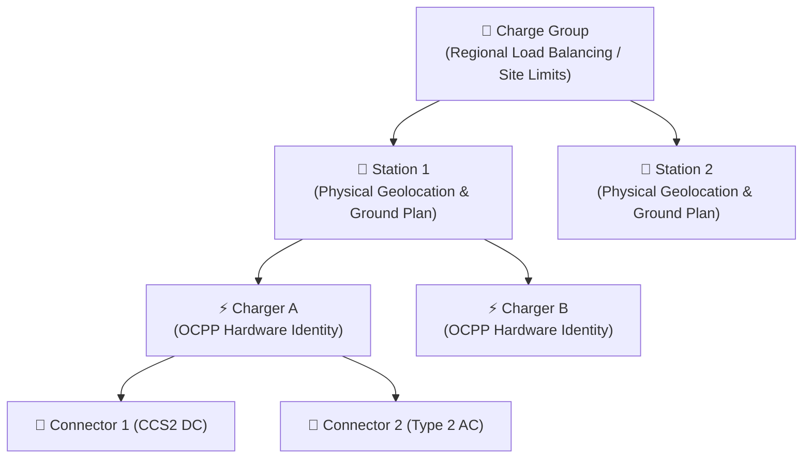
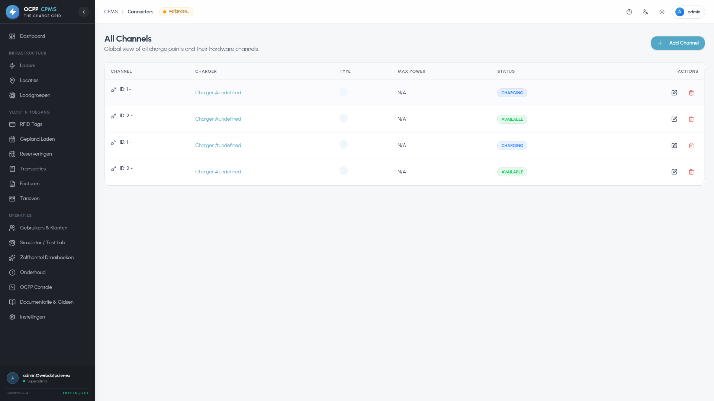

# Core Operations Manual

Welcome to the **Core Operations Manual** for the OCPP Charge Point Management System (CPMS). This guide is specifically designed for Charge Point Operators (CPOs), station managers, and field technicians who interact with the system on a daily basis. It provides detailed, step-by-step procedures for managing physical charging infrastructure, deploying ground plans with electrical topologies, pairing combined dual-socket chargers, issuing remote commands, monitoring live diagnostics, and controlling driver access.

---

## 1. Asset & Hierarchy Management

The CPMS organizes charging infrastructure into a four-tier logical hierarchy: **Charge Groups** → **Stations** → **Chargers** → **Connectors (EVSEs)**.

### Hierarchy Overview
* **Charge Groups:** High-level clusters of stations (e.g., "Main Corporate Campus" or "Rotterdam Logistics Depot"). Used to establish global capacity limits (kW / Amperage) across multiple chargers and coordinate dynamic load balancing.
* **Stations:** Physical facilities with specific geolocations (latitude/longitude), address details, opening hours, electrical connection limits, and interactive 2D ground plans.
* **Chargers:** Physical OCPP charging units (e.g., Alfen, ABB, Delta, Kempower). Each charger is identified by a unique `chargerId` that strictly matches the hardware identity string configured in its firmware.
* **Connectors:** Physical charging sockets/cables on a charger (e.g., Connector 1 = CCS2 150kW, Connector 2 = Type2 22kW), reporting distinct OCPP EVSE statuses (`Available`, `Preparing`, `Charging`, `SuspendedEVSE`, `Finishing`, `Faulted`).

---

### Step-by-Step Asset Procedures

#### 1. Managing Charge Groups
1. Navigate to **Charge Groups** (`/charge-groups`) in the sidebar navigation.
2. Click **Add Charge Group** (`/charge-groups/new`).
3. Enter the group name, description, and configure the **Maximum Group Capacity** (in kW or Amps) for active load management.
4. Assign stations to this group.

#### Charge Group Load Allocation & Phase Detail (`/charge-groups/[id]`)
Open any individual charge group to inspect real-time phase balance ($L1, L2, L3$), aggregated site demand, active solar contributions, and the assigned charge points:

* **Current & Power Limits:** Configure maximum site capacity (e.g. 250A / 172.5 kW).
* **Phase Unbalance Threshold:** Enforces dynamic curtailment when the difference between any two phases exceeds the configured threshold (e.g. 32A).
* **Fail-Safe Amperage:** The default safe current limit (e.g. 16A per socket) assigned if communication with the CPMS is interrupted.

---

#### 2. Managing Charging Stations
1. Navigate to **Stations** (`/stations`). The directory displays all facilities with live charger counts and interactive map clustering.
2. Click **Add Station** (`/stations/new`).
3. Fill in the **Station Name**, **Full Address**, **Postal Code**, **City**, and **Country**.
4. Set exact **Latitude** and **Longitude** coordinates (used for map rendering and driver routing).
5. Specify any facility-specific maximum power caps.
6. Toggle **Enable Ground Plan** if an interactive parking bay layout is required.
7. Click **Save**.

---

#### 3. Registering Chargers & Handling Unrecognized Hardware
1. Navigate to **Chargers** (`/chargers`).
2. Click **Register Charger** (`/chargers/new`).
3. Enter the exact **Charger ID** configured on the physical station.
4. Select the parent **Station**, input **Manufacturer**, **Model**, **Serial Number**, and **Total Power Capacity (kW)**.
5. Save the configuration.

> [!TIP]
> **Unrecognized Chargers Queue:** If a new physical charger boots up and connects to `ws://<host>:9220/OCPP/1.6/<id>` before being registered in the database, the CPMS captures its connection and places it in the **Unrecognized Queue** (`/chargers/unrecognized`). Operators can review the pending hardware identity, assign it to a station, and approve it in one click.

---

#### 4. Dual-Socket Charger Combiner Pairing
To combine two single-socket chargers (e.g., two Alfen Eve Single Pro units) into a single dual-channel virtual charger:
1. Open the primary charger in the fleet directory.
2. Click **Combine Charger** and select the secondary charger from the dropdown (must be the same manufacturer and model).
3. The system designates the primary unit as **Channel 1** and secondary unit as **Channel 2**.
4. All connector 2 operations and load balancing commands are transparently routed to connector 1 on the secondary hardware.
5. To separate them, open the combined charger and click **Uncombine Charger**.

---

#### 5. Configuring Connectors (EVSE Plugs)
1. Open the specific charger from the fleet directory and navigate to the **Connectors** tab (or via `/connectors`).
2. For each physical socket, define the **Connector ID** (1, 2, etc.), **Plug Type** (`Type2`, `CCS2`, `CHAdeMO`), **Current Type** (`AC_single_phase`, `AC_three_phase`, `DC`), **Max Voltage (V)**, and **Max Power (kW)**.
3. Save the connectors to enable socket-level live status monitoring and ground plan linkage.

---

## 2. Interactive 2D Ground Plan Builder & Floor Monitor

The **Charge Grid Ground Plan** module enables facility managers and CPOs to create high-precision 2D floor plans of parking bays, link physical charger connectors to spots, map electrical topologies, and monitor live charging telemetry in real-time.

### Building Station Ground Plans

1. Navigate to **Stations** (`/stations`) and open a station with Ground Plan enabled.
2. Click **Edit Ground Plan Layout** to open the 2D visual editor canvas (`/stations/[id]/ground-plan`).
3. **Add Parking Spots:** Click **Add Spot** to place draggable parking bays on the grid.
4. **Draw Structures:** Use **Draw Area** and **Draw Line** to outline walkways, station shelters, driving lanes, or electrical cable routing from distribution panels.
5. **Drag, Resize & Rotate:** Click and drag elements into position. Use the circular handle to rotate parking spots in 45-degree increments to mirror physical angled bays.
6. **Assign Connector Sockets:** Open the spot properties and bind an available physical socket (e.g., `Charger-01 / Connector 1`) to the parking bay.
7. **Custom Styling:** Hover over elements to customize line thickness, border color, and area fill color.
8. Click **Save Layout**.

### Real-Time Ground Plan Live Monitor

Navigate to the station's **Live View** (`/stations/[id]/live`). The canvas renders with dynamic glassmorphism indicators reflecting live OCPP socket telemetry:

* 🟢 **Available (Green/Blue glow):** Socket is operative, cable disconnected, ready for charging.
* ⚡ **Charging (Pulsing Green):** Vehicle connected and actively drawing energy. Displays live kW rate, delivered session kWh, phase balance (L1/L2/L3), and active driver tag.
* 🔴 **Faulted / Unavailable (Red):** Socket hardware fault, emergency stop engaged, or charger offline.
* ⚪ **Unassigned (Dashed border):** Parking spot created without an associated charger socket.

---

## 3. Real-Time Operations & Remote Control

The CPMS provides comprehensive remote control capabilities over the OCPP WebSocket channel. Commands are executed asynchronously with real-time `CALLRESULT` feedback.

### Remote Control Actions

Open any charger detail page (`/chargers/[id]`) and access the **Overview** and **Remote Control** panels.

| Command | Action Description | Operator Guidance |
| :--- | :--- | :--- |
| **Remote Start Transaction** | Dispatches an OCPP `RemoteStartTransaction` request with a specified `connectorId` and authorized `idTag`. | Use when a customer cannot scan their RFID card or initiates ad-hoc payment. |
| **Remote Stop Transaction** | Sends an OCPP `RemoteStopTransaction` matching the active `transactionId`. | Gracefully finishes the session, finalizes meter reading, and releases cable lock. |
| **Unlock Connector** | Dispatches `UnlockConnector` for a specific EVSE socket. | Resolves stuck charging cables without physical hardware intervention. |
| **Soft Reset** | Issues an OCPP `Reset(type: "Soft")`. | Reboots the charger controller gracefully after finishing active sessions. |
| **Hard Reset** | Issues an OCPP `Reset(type: "Hard")`. | Forces an immediate hardware power cycle. *(Use with caution during active sessions).* |
| **Change Availability** | Sets a connector or whole unit to `Operative` or `Inoperative`. | Temporarily disables a damaged socket while keeping other sockets operative. |
| **Clear Cache** | Commands the charger to wipe its internal authorization cache. | Forces the charger to re-verify RFID tags with the central whitelist on next swipe. |
| **Trigger Message** | Dispatches `TriggerMessage` requesting `StatusNotification`, `Heartbeat`, or `MeterValues`. | Forces an immediate telemetry update when verifying charger responsiveness. |

---

### Hardware Configuration & Profile Management

The **Configuration** tab allows operators to inspect and update standard OCPP key-value parameters directly on the physical hardware:

* Query parameters such as `HeartbeatInterval`, `MeterValueSampleInterval`, `ConnectionTimeOut`, `AuthorizeRemoteTxRequests`.
* Push standardized configuration templates created in **Config Profiles** (`/config-profiles`).

---

## 4. Live Packet Inspector & Diagnostics

Located at `/ocpp`, the **Live Packet Inspector** connects to the real-time WebSocket broadcast to inspect unbuffered protocol exchanges:
* Stream live JSON-RPC frames (`CALL`, `CALLRESULT`, `CALLERROR`).
* Filter by Charger ID, Action type (e.g., `StartTransaction`, `MeterValues`, `StatusNotification`), or message direction.
* Expandable JSON tree view for debugging raw payload properties and OCPP schema compliance.

---

## 5. Hardware Reliability, Auto-Heal & Playbooks

Operating large-scale EVSE networks requires automated detection and recovery for mechanical and communication anomalies.

### Automated Fault Mitigation (`/hardware-at-risk`)
The CPMS background engine continuously inspects hardware health flags:
* **Connector Lock Failures:** Automatically detects when an EVSE actuator fails to lock or release.
* **Heartbeat Drift:** Identifies connection latency or silent socket drops.
* **Emergency Stop Flags:** Flags physical button activations for rapid technician inspection.

| Hardware-at-Risk Fleet Monitor | Automated Recovery Playbooks |
| :---: | :---: |
|  |  |

### Recovery Playbooks (`/auto-heal-playbooks`)
Configure multi-stage autonomous recovery workflows:
1. **Trigger Condition:** E.g., `CONNECTOR_LOCK_FAILED`.
2. **Action 1:** Send `UnlockConnector` RPC.
3. **Action 2:** If fault status persists after 60s, dispatch `Reset(type: "Soft")`.
4. **Action 3:** If hardware does not reboot within 5 minutes, trigger automated SMS/email alert to on-duty technician.