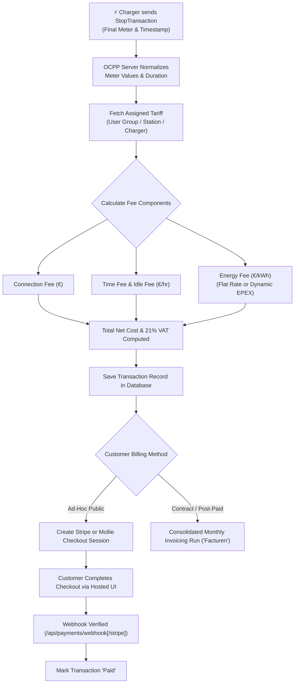
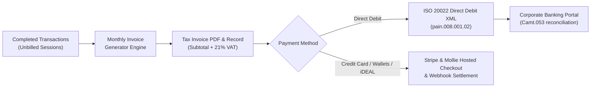
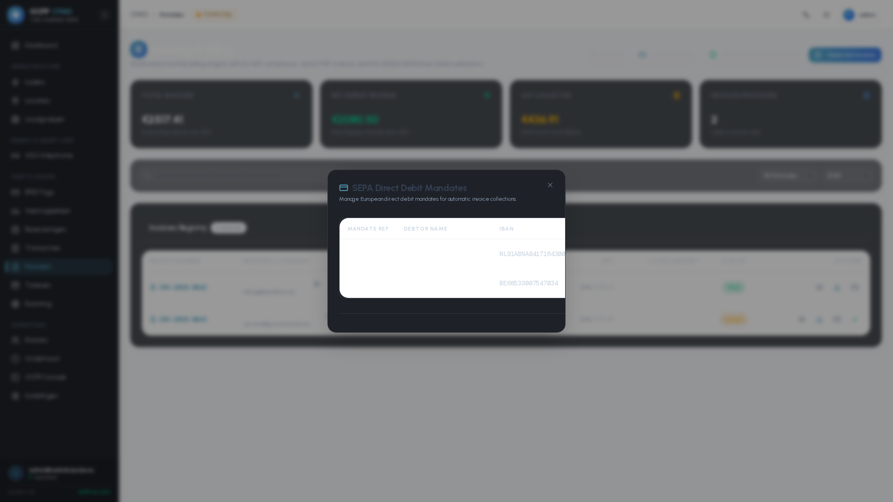
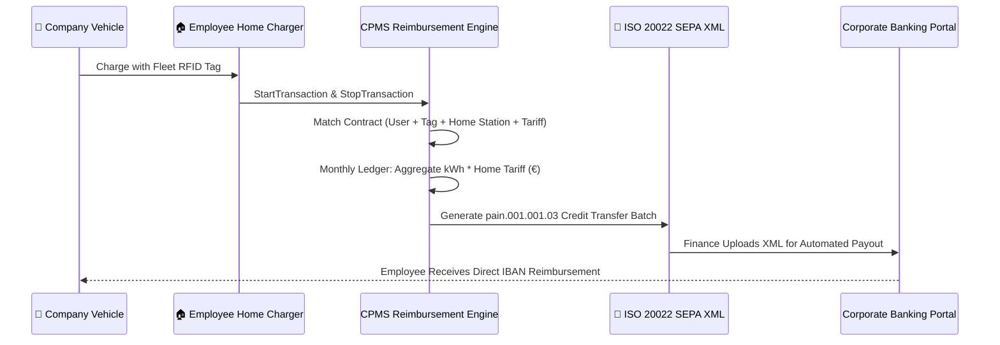

# Financial & Roaming Operations Manual

Welcome to the **Financial & Roaming Operations Manual** for the OCPP Central Processing Management System (CPMS). This guide is designed for Chief Financial Officers (CFOs), billing accountants, roaming managers, and business administrators to navigate the platform's core billing systems, banking exports, payment gateways, and roaming settlement workflows.

---

## 1. Billing, Invoicing ("Facturen") & Payment Gateways

The CPMS billing engine computes the financial cost of charging sessions in real-time and provides an enterprise-grade invoicing ledger supporting both contract subscription billing and walk-in ad-hoc payments.

### End-to-End Billing Cycle

---

### Invoicing & Automated Billing Suite ("Facturen")

The platform provides a complete enterprise invoicing subsystem located under `/invoices` (localized in Dutch as **Facturen** and French as **Factures**), supporting both B2B corporate billing and private subscriber accounting.

#### Key Capabilities of the Invoicing Suite:

#### 1. Billing Ledger Overview (`/invoices`)
The centralized billing ledger tracks all corporate and driver invoices with real-time financial KPI summary widgets:
* **Gross Turnover, Subtotal & 21% VAT:** Immediate aggregated view across billing periods.
* **Status Filtering:** Filter by `Draft`, `Sent`, `Paid`, `Overdue`, `Cancelled`.
* **Payment Methods:** Distinguish between SEPA Direct Debit, Credit Card, and Manual Bank Wire.

---

#### 2. Detailed Itemized Invoice View
Opening any invoice record provides a line-item breakdown of all aggregated charging sessions:
* Meter start/stop timestamps, consumed kWh, duration, energy tariff rates, and idle fee penalties.
* Real-time PDF generation and direct email dispatch to the customer's billing contact.

---

#### 3. Batch Generation Wizard
The **Generate Invoices Wizard** consolidates all unbilled completed transactions across a selected calendar month into formalized client invoices.

---

#### 4. SEPA Direct Debit Mandate Management
Manage formal B2B and CORE Direct Debit mandates:
* Unique Mandate Identifier (UMR).
* Debtor IBAN, BIC, and account holder name.
* Electronic signature date and active authorization state.

---

#### 5. ISO 20022 SEPA Direct Debit XML Export (`pain.008`)
Compile all pending unpaid invoices into a banking-compliant ISO 20022 `pain.008.001.02` XML direct debit batch file:
* Creditor Identifier (CI) and creditor bank details.
* Batch sequence type (`FRST` for first collection, `RCUR` for recurring collections).
* Configurable execution date ready for direct upload to banking portals (ABN AMRO, ING, Rabobank, BNP Paribas, KBC).

---

### Stripe & Mollie Ad-Hoc Public Payments & Gateway Settings

For walk-in drivers without an RFID subscription card, the CPMS offers instant ad-hoc checkout via dual payment processors:

* **Stripe Gateway (`/settings/payments`):**
  * **Global Payment Methods:** Settle charging sessions using Visa, MasterCard, American Express, Apple Pay, Google Pay, and SEPA Credit.
  * **Webhook Integration:** Automated status synchronization via `/api/payments/webhook/stripe` listening to `checkout.session.completed`, `payment_intent.succeeded`, and `charge.refunded`.
  * **PCI-DSS Level 1 Hosted Checkout:** Secure tokenization without exposing sensitive card credentials to CPMS servers.
* **Mollie Gateway (`/settings/payments`):**
  * **European Direct Banking:** Optimized for Benelux and European markets supporting iDEAL 2.0, Bancontact, EPS, KBC/CBC, and Belfius.
  * **Webhook Verification:** Instant server-to-server callback processing via `/api/payments/webhook`.
* **Public Checkout Portal (`/payments`):**
  * Drivers scan a station QR code or visit the checkout portal to select their preferred payment provider and complete 256-bit encrypted checkout.

| Public Payments Checkout | Payment Gateways Settings (Stripe & Mollie) |
| :---: | :---: |
|  |  |

---

## 2. Employee Home Reimbursements & Split-Billing

The **Reimbursements** module (`/reimbursements`) is built for corporate fleet split-billing, designed specifically to reimburse employees for electricity consumed when charging company fleet vehicles at their residential home chargers.

### Reimbursement Workflow

1. **Reimbursement Contracts:** An administrator creates a contract linking a `userId` (employee), `rfidUserId` (company car RFID tag), `stationId` (home charger), `tariffId` (employee's residential electricity rate), and the employee's payout `IBAN`.
2. **Monthly Expense Ledger:** The system automatically aggregates all home charging sessions for the contract, computing exact `totalKwh` and `totalAmount` due.
3. **ISO 20022 SEPA Credit Transfer Export:** Finance officers click **Export SEPA** to generate a validated `pain.001.001.03` XML file for single-batch corporate bank transfers.

---

## 3. Roaming Hubs (OCPI 2.2.1 & OICP Hubject)

To maximize charger utilization and allow contracted drivers to charge on external networks, the CPMS acts as both a **Charge Point Operator (CPO)** and an **e-Mobility Service Provider (eMSP)**.

### 3.1 OCPI 2.2.1 Implementation
* **Credentials:** Secure handshake and token exchange with roaming partners.
* **Locations & EVSEs:** Automated publishing of station geolocations, connector specs, and live availability.
* **Tariffs:** Export 4-component pricing structures to roaming hubs.
* **Sessions & CDRs:** Real-time push of active roaming sessions and finalized Charge Detail Records.

### 3.2 Hubject OICP 2.3 Integration
* Automated EVSE status synchronization with Hubject's Open InterCharge Protocol.
* Asynchronous Charge Detail Record (CDR) submission processed through BullMQ background event queues.

### 3.3 Roaming Settlement Visualizer & Clearinghouse Export
The **Settlement Visualizer** (`/roaming`) breaks down roaming economics:
* Compare wholesale partner energy costs against retail MSP driver billing.
* Calculate net margin, gross revenue, and volume per roaming partner.
* Export standardized clearinghouse CSV reconciliation files.

