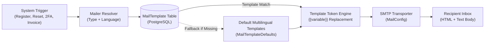

# OCPP-CPMS Mail Templates & Email Notification Guide

This technical guide documents the email notification engine in **OCPP-CPMS**, including template types, multi-language support (English, Dutch, French), dynamic placeholder variables, and customization via the web UI and REST API.

---

## 1. Architecture & Email Workflow

The CPMS email notification subsystem utilizes `nodemailer` configured via SMTP settings in the database (`MailConfig`). When an automated trigger occurs (e.g. driver registration, password reset, 2FA challenge, or monthly fiscal invoice generation), the `sendEmail` utility parses the appropriate template matching the user's preferred language and substitutes dynamic tokens before dispatch.



---

## 2. Supported Languages

Every template is keyed by a unique compound index: `[type, language]`.

| Language Code | Language | Flag |
| :--- | :--- | :--- |
| `en` | English (Default fallback) | 🇬🇧 |
| `nl` | Dutch (Nederlands) | 🇳🇱 |
| `fr` | French (Français) | 🇫🇷 |

---

## 3. Template Types & Trigger Events

| Template Key (`type`) | Trigger Scenario | Default Subject (EN) | Attachments |
| :--- | :--- | :--- | :--- |
| **`admin_welcome`** | Created by an administrator in User Management | *Welcome to OCPP CPMS - Your Account Details* | None |
| **`registration`** | Self-service driver / operator signup | *Welcome to OCPP CPMS - Account Registered* | None |
| **`verification`** | Email verification required on registration | *Verify your OCPP CPMS account email* | None |
| **`password_reset`** | Forgot password request initiated | *Reset your OCPP CPMS Password* | None |
| **`2fa_login`** | Two-factor authentication required on login | *Your OCPP CPMS Two-Factor Login Code* | None |
| **`2fa_setup`** | Two-factor email authentication setup confirmation | *Your OCPP CPMS 2FA Setup Code* | None |
| **`invoice`** | Monthly billing engine execution / invoice dispatch | *Your OCPP CPMS Charging Invoice #{{invoiceNumber}}* | Fiscal PDF invoice |

---

## 4. Dynamic Placeholder Variables Reference

You can insert dynamic placeholders inside both the **Subject Line**, **HTML Body** (`bodyHtml`), and **Plain Text Body** (`bodyText`) using double curly braces: `{{variable}}`.

| Variable | Description | Available In |
| :--- | :--- | :--- |
| `{{name}}` | Full name or company name of the recipient | `admin_welcome`, `registration`, `verification`, `password_reset` |
| `{{userEmail}}` | Recipient email address | All templates |
| `{{loginUrl}}` | URL link to the CPMS login portal | `admin_welcome`, `registration` |
| `{{verificationUrl}}` | One-click email verification token link (valid 24 hours) | `registration`, `verification` |
| `{{resetUrl}}` | Password reset URL containing one-time crypto token (valid 1 hour) | `password_reset` |
| `{{twoFactorCode}}` | 6-digit numeric security OTP code (valid 10 minutes) | `2fa_login`, `2fa_setup` |
| `{{password}}` | Generated temporary password for admin-created accounts | `admin_welcome` |
| `{{invoiceNumber}}` | Official invoice reference (e.g., `INV-2026-0801`) | `invoice` |
| `{{totalAmount}}` | Total amount billed formatted as decimal (e.g., `48.50`) | `invoice` |
| `{{currency}}` | Currency code (e.g., `EUR`, `USD`, `GBP`) | `invoice` |
| `{{dueDate}}` | Payment due date (e.g., `2026-09-15`) | `invoice` |

---

## 5. HTML Template Structure & Customization

The CPMS supports full standard HTML with inline CSS. For optimal rendering across email clients (Gmail, Outlook, Apple Mail, Thunderbird), follow these best practices:

### Recommended Email Container Layout
```html
<!DOCTYPE html>
<html>
<head>
  <meta charset="UTF-8">
  <style>
    body { font-family: -apple-system, BlinkMacSystemFont, 'Segoe UI', Roboto, Arial, sans-serif; background-color: #f4f6f8; margin: 0; padding: 0; }
    .email-container { max-width: 600px; margin: 30px auto; background-color: #ffffff; border-radius: 12px; overflow: hidden; border: 1px solid #e2e8f0; }
    .email-header { background: #1e2228; padding: 24px; text-align: center; border-bottom: 3px solid #54a8c7; }
    .email-logo { color: #ffffff; font-size: 22px; font-weight: 800; }
    .email-logo span { color: #54a8c7; }
    .email-body { padding: 32px; color: #334155; line-height: 1.6; font-size: 15px; }
    .btn-primary { display: inline-block; background-color: #3f78e0; color: #ffffff !important; text-decoration: none; padding: 12px 28px; border-radius: 8px; font-weight: 600; }
    .code-box { background: #f1f5f9; border: 2px dashed #cbd5e1; border-radius: 8px; padding: 16px; text-align: center; font-size: 28px; font-weight: bold; }
    .email-footer { background-color: #f8fafc; padding: 20px; text-align: center; font-size: 12px; color: #64748b; }
  </style>
</head>
<body>
  <div class="email-container">
    <div class="email-header">
      <div class="email-logo">GRID <span>OCPP-CPMS</span></div>
    </div>
    <div class="email-body">
      <h2>Welcome, {{name}}!</h2>
      <p>Your account ({{userEmail}}) is ready.</p>
      <div style="text-align: center; margin: 24px 0;">
        <a href="{{loginUrl}}" class="btn-primary">Log In to Dashboard</a>
      </div>
    </div>
    <div class="email-footer">
      <p>© 2026 OCPP-CPMS Smart Charging System</p>
    </div>
  </div>
</body>
</html>
```

---

## 6. How to Edit & Manage Templates

### Option A: Via the Web Dashboard
1. Log into the CPMS as an **Administrator** or **Superadmin**.
2. Navigate to **Settings** -> **Mail Templates** (`/settings/templates`).
3. Filter templates by language (🇬🇧 English, 🇳🇱 Nederlands, 🇫🇷 Français).
4. Click **Edit** on the desired template.
5. Switch between **Source Code** (editing HTML / Text) and **Live Preview** (renders simulated variables in real time).
6. Click **Save Template**. Changes take effect immediately without requiring a server restart.

### Option B: Via the REST API

#### 1. List all templates
```bash
GET /api/mail/templates
Authorization: Bearer <ADMIN_JWT_TOKEN>
```

#### 2. Get a single template
```bash
GET /api/mail/templates/:id
Authorization: Bearer <ADMIN_JWT_TOKEN>
```

#### 3. Update an existing template
```bash
PUT /api/mail/templates/:id
Authorization: Bearer <ADMIN_JWT_TOKEN>
Content-Type: application/json

{
  "name": "Custom Welcome Email",
  "type": "admin_welcome",
  "language": "en",
  "subject": "Your New OCPP-CPMS Account is Ready",
  "bodyHtml": "<h2>Hello {{name}}</h2><p>Credentials: {{userEmail}} / {{password}}</p><a href=\"{{loginUrl}}\">Login</a>",
  "bodyText": "Hello {{name}}\nCredentials: {{userEmail}} / {{password}}\nLogin: {{loginUrl}}"
}
```

#### 4. Create a new custom template
```bash
POST /api/mail/templates
Authorization: Bearer <ADMIN_JWT_TOKEN>
Content-Type: application/json

{
  "name": "French 2FA Notification",
  "type": "2fa_login",
  "language": "fr",
  "subject": "Votre code 2FA OCPP CPMS",
  "bodyHtml": "<p>Votre code est : <strong>{{twoFactorCode}}</strong></p>",
  "bodyText": "Votre code est : {{twoFactorCode}}"
}
```

---

*Manual maintained for OCPP-CPMS Operations & Support.*
