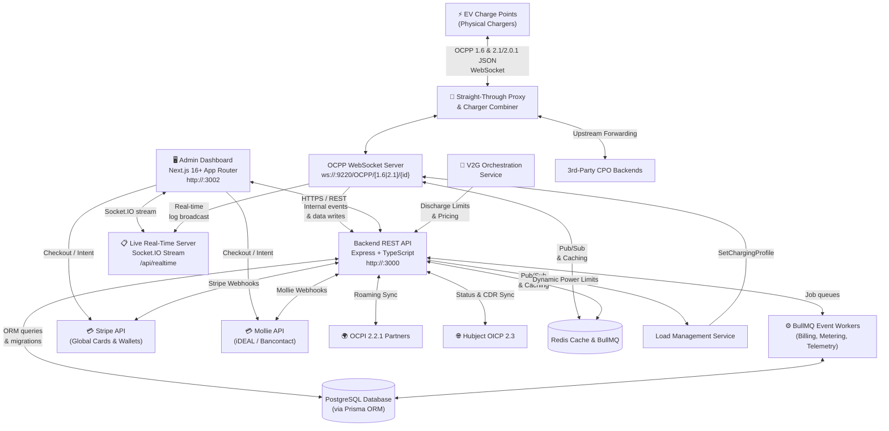
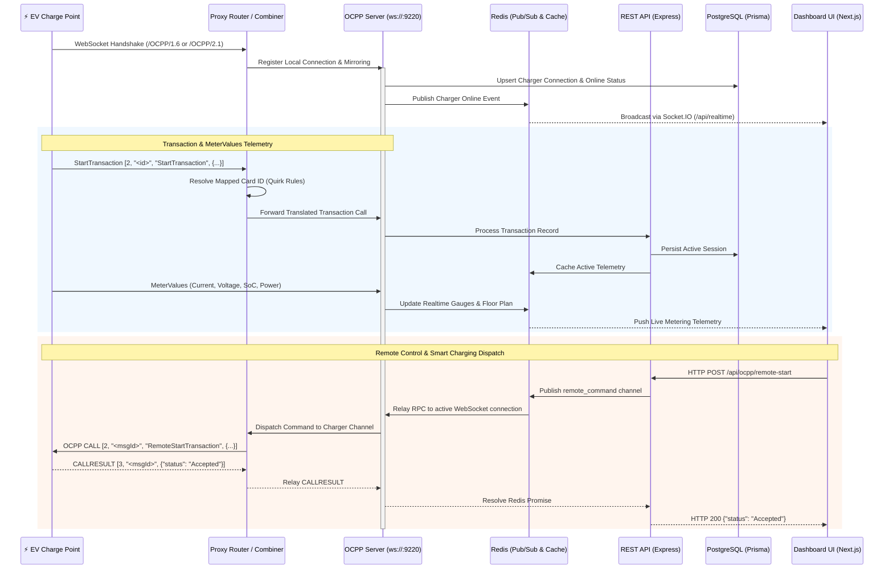

# Platform Overview & System Architecture

## 1. Executive Summary

The **OCPP Central Processing Management System (CPMS)** is an enterprise-grade platform engineered to manage, monitor, and optimize Electric Vehicle (EV) charging infrastructure at scale. Built for high concurrency, multi-protocol interoperability, and operational resilience, the system leverages a modern, decoupled technology stack:

* **Backend Runtime:** Node.js 24+ (ESM) with TypeScript 5.9 and Express 5.
* **Database & ORM:** PostgreSQL 15+ managed with Prisma ORM 7.8.
* **Caching & Broker:** Redis 7 (`ioredis`) for multi-pod WebSocket pub/sub clustering, telemetry caching, and rate limiting.
* **Asynchronous Workers:** BullMQ queue workers handling decoupled background billing calculations, meter value batch ingestion, and event synchronization.
* **Frontend Dashboard:** Next.js 16+ App Router (React 19) with TailwindCSS and Radix UI (shadcn/ui).
* **Dual-Protocol WebSocket Engine:** Native `ws` engine handling both **OCPP 1.6-J** and **OCPP 2.0.1/2.1** on port `9220`.
* **Straight-Through Proxy & Combiner:** Intelligent proxying between chargers and 3rd-party CPO backends, plus virtual pairing of single-socket chargers into dual-socket combined units.

---

## 2. Real-Time Telemetry & Proxy Sequence

The following sequence illustrates the flow of real-time telemetry, proxy forwarding, transaction persistence, and remote control RPCs between hardware units, proxy routers, backend services, and administrative interfaces:

---

## 3. Straight-Through Proxy & Dual-Socket Charger Combiner

The platform incorporates an intelligent proxy router (`proxyRouter.ts`) enabling advanced network topologies:

### 3.1 Straight-Through Proxy Mode
Chargers can be configured with an upstream proxy URL. The CPMS maintains a transparent bidirectional WebSocket proxy to 3rd-party CPO backends while simultaneously:
* Logging every unbuffered JSON-RPC frame in the local **Packet Inspector** (`/ocpp`).
* Maintaining real-time connector state and telemetry cache in Redis for the dashboard.
* Dynamic RFID Card Tag rewriting based on Quirk Profiles before forwarding upstream.

### 3.2 Dual-Socket Charger Combiner Logic
Operators with separate single-socket physical charge points (e.g., two Alfen Eve Single Pro units) can virtually combine them into a single dual-channel charger:
* **Primary Unit (Channel 1):** Acts as the primary network identity.
* **Secondary Unit (Channel 2):** Connects to the primary; all connector 2 messages are transparently translated to connector 1 on the secondary hardware.
* **Synchronized Heartbeats & Availability:** Both sockets report synchronized status notifications under a unified charger entity.
* **Integrated Dynamic Load Balancing:** Slices site power limits evenly across both physical units.

---

## 4. Hardware Interoperability, Auto-Heal & Quirks Engine

Due to fragmentation across charging station manufacturers, various brands implement OCPP specifications with minor non-conformances. The platform addresses hardware reliability through three core subsystems:

### 4.1 The Quirk Normalizer Engine (`quirkNormalizer.ts`)
Located at `Backend/src/ocpp/quirkNormalizer.ts`, this service intercepts incoming `MeterValues` payloads before persistence. It applies brand-specific rules configured in **Quirk Profiles** (`/quirk-profiles`):

* **Power Calculation:** If a charger fails to report active power (`powerValue`), the engine computes it using 3-phase $(V_{L1} \cdot I_{L1} + V_{L2} \cdot I_{L2} + V_{L3} \cdot I_{L3})$ or single-phase $(V \cdot I)$ formulas.
* **Energy Unit Scaling:** Automatically scales Wh to kWh or applies integer scaling factors if hardware sends raw counters.
* **Energy Integration:** If hardware streams instantaneous Power (W) but fails to aggregate total Energy (Wh), Redis tracks time deltas to integrate energy numerically ($P \cdot \Delta t$).
* **Dynamic Card Tag Mapping:** Rewrites RFID tag strings according to vendor prefix or regex translation tables.

### 4.2 Hardware-at-Risk & Auto-Heal (`/hardware-at-risk`)
A background heuristic worker continually evaluates charger health metrics (e.g. repeated transaction rejections, cable lock timeouts, silent heartbeats):
* Automatically classifies chargers as **Healthy**, **Warning**, or **Critical Risk**.
* Triggers automated recovery sequences (e.g., automated Soft Reset, connector unlock, and availability toggles).

### 4.3 Live Packet Inspector Console (`/ocpp`)
Engineers can inspect live unbuffered WebSocket frames to debug protocol exchanges in real-time, complete with JSON syntax highlighting, schema validation, and payload filtering.

