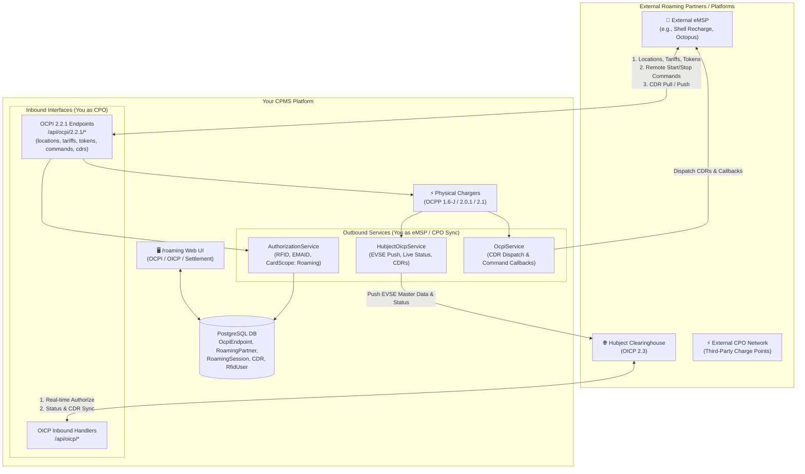
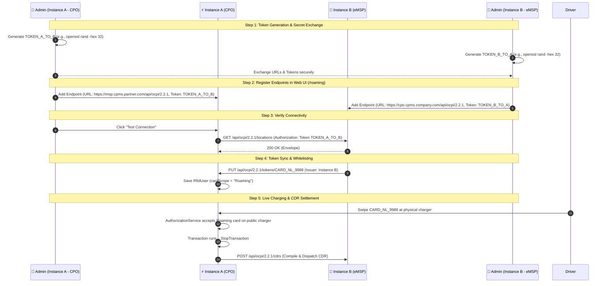

# Roaming & Interoperability Operations Manual (OCPI & OICP)

Welcome to the **Roaming & Interoperability Operations Manual** for the Centralized Charging Station Management System (GRID-OCPP-CPMS). This guide explains the architecture, security, token creation, bilateral connection procedures, Hubject clearinghouse setup, and how to connect two CPMS instances.

---

## 1. Overview & Dual-Role Architecture

The CPMS operates in a **dual-role architecture** supporting both **OCPI 2.2.1** (Open Charge Point Interface) and **Hubject OICP 2.3** (Open InterCharge Protocol):



### Role Definitions
1. **Charge Point Operator (CPO):** You own or operate physical chargers. Foreign drivers (from other eMSPs) charge on your network. You invoice the foreign eMSP for wholesale energy.
2. **e-Mobility Service Provider (eMSP):** You manage drivers and RFID cards. Your contracted drivers charge on external CPO networks. The external CPO invoices you wholesale.

---

## 2. Understanding Roaming Authorization Tokens

In roaming standards (OCPI & OICP), communication is **Server-to-Server (S2S)** and secured using shared cryptographic authorization tokens rather than interactive user login credentials.

### What is a Roaming Authorization Token?
- A roaming authorization token is a cryptographically strong, high-entropy secret string (typically 32 to 64 hex characters or UUIDv4) agreed between the two servers.
- In **OCPI 2.2.1**, all HTTP requests include the standard header:
  ```http
  Authorization: Token <YOUR_AUTHORIZATION_TOKEN>
  ```
- In **OICP 2.3 / Hubject**, requests use Bearer authentication or mutual TLS:
  ```http
  Authorization: Bearer <YOUR_AUTHORIZATION_TOKEN>
  ```

---

## 3. How to Create and Generate Authorization Tokens

You can generate authorization tokens using any of the following standard methods:

### Method 1: OpenSSL Command Line (Recommended)
Generate a secure 256-bit (32-byte) hex string:
```bash
openssl rand -hex 32
# Output example:
# 9f8a7b6c5d4e3f2a1b0c9d8e7f6a5b4c3d2e1f0a9b8c7d6e5f4a3b2c1d0e9f8a
```

### Method 2: Node.js Crypto One-Liner
```bash
node -e "console.log(require('crypto').randomBytes(32).toString('hex'))"
# Output example:
# e3b0c44298fc1c149afbf4c8996fb92427ae41e4649b934ca495991b7852b855
```

### Method 3: UUID v4 Generator
```bash
uuidgen
# Output example:
# a3e57f12-98c4-4a2e-8519-7ef6b7d59821
```

> [!TIP]
> Generate a distinct, dedicated token for **each** roaming partner. Do not reuse the same token across multiple partners.

---

## 4. Connecting Two Copies of this CPMS (Step-by-Step Tutorial)

This section demonstrates how to connect **Instance A** (acting as CPO with physical chargers) and **Instance B** (acting as eMSP with registered drivers and RFID cards).

### Scenario Overview
* **Instance A (CPO):** Hosted at `https://cpo.cpms.company.com`
* **Instance B (eMSP):** Hosted at `https://msp.cpms.partner.com`



---

### Step 1: Prepare Instance A (CPO Stations)
1. Log in to **Instance A** (`https://cpo.cpms.company.com`) as `admin` or `superadmin`.
2. Go to **Chargers** (`/chargers`) and **Stations** (`/stations`).
3. Ensure the chargers you want to make available for roaming have:
   - **`isPublic: true`** (enabled in charger settings).
   - Valid geo-coordinates (Latitude & Longitude).
   - Configured connectors (EVSE ID, Max kW Power, Type: `CCS2` or `Type2`).
4. Ensure a base Tariff is assigned under **Tariffs** (`/tariffs`).

---

### Step 2: Generate Two Shared Authorization Tokens
Generate two secure tokens:
- **`TOKEN_B_TO_A`**: Secret used by Instance B when calling Instance A.
- **`TOKEN_A_TO_B`**: Secret used by Instance A when calling Instance B.

Example:
```bash
# Token for Instance B -> Instance A:
TOKEN_B_TO_A="cpo_auth_7a9f82d16c4e0b5f2134a8e9d0c2b1a3"

# Token for Instance A -> Instance B:
TOKEN_A_TO_B="msp_auth_4e1a0b3f8d7c2a5e9b6f10c3d4e8a7b9"
```

---

### Step 3: Register Instance B on Instance A
1. In **Instance A Dashboard**, navigate to **Roaming** (`/roaming`).
2. Select the **OCPI 2.2.1** tab.
3. Click **Add Endpoint**.
4. Fill in the modal fields:
   - **Name:** `Instance B - eMSP Partner`
   - **Base URL:** `https://msp.cpms.partner.com/api/ocpi/2.2.1`
   - **Token (CREDENTIALS):** `TOKEN_A_TO_B`
   - **Version:** `2.2.1`
5. Click **Add Endpoint**.
6. In the endpoints table, click the **Test Connection** button (refresh icon) to verify the handshake.

---

### Step 4: Register Instance A on Instance B
1. In **Instance B Dashboard**, navigate to **Roaming** (`/roaming`).
2. Select the **OCPI 2.2.1** tab.
3. Click **Add Endpoint**.
4. Fill in the modal fields:
   - **Name:** `Instance A - CPO Network`
   - **Base URL:** `https://cpo.cpms.company.com/api/ocpi/2.2.1`
   - **Token (CREDENTIALS):** `TOKEN_B_TO_A`
   - **Version:** `2.2.1`
5. Click **Add Endpoint**.
6. Click **Test Connection** to confirm connectivity.

---

### Step 5: Synchronize RFID Tokens (Allow Instance B Drivers on Instance A)
When Instance B provisions a new driver RFID card (e.g. `CARD_NL_9988`), Instance B sends a standard OCPI token sync request to Instance A:

```http
PUT https://cpo.cpms.company.com/api/ocpi/2.2.1/tokens/CARD_NL_9988
Authorization: Token TOKEN_B_TO_A
Content-Type: application/json

{
  "country_code": "NL",
  "party_id": "MSP2",
  "uid": "CARD_NL_9988",
  "type": "RFID",
  "contract_id": "NL-MSP2-CTR-9988",
  "visual_number": "CARD_NL_9988",
  "issuer": "Instance B Mobility",
  "valid": true,
  "whitelist": "ALWAYS"
}
```

**Instance A Backend Behavior:**
- Instance A's `putToken` controller automatically creates or updates a record in `RfidUser`.
- Sets `cardScope: "Roaming"`.
- Marks `active: true`.
- When the driver taps `CARD_NL_9988` at Instance A's physical charger, `AuthorizationService.validateAuthorization` accepts the card immediately.

---

### Step 6: Trigger Remote Charging via API / Mobile App
Drivers using Instance B's mobile app can start a charging session on Instance A's station remotely:

```http
POST https://cpo.cpms.company.com/api/ocpi/2.2.1/commands/START_SESSION
Authorization: Token TOKEN_B_TO_A
Content-Type: application/json

{
  "response_url": "https://msp.cpms.partner.com/api/ocpi/2.2.1/commands/callback",
  "token": {
    "uid": "CARD_NL_9988",
    "type": "RFID"
  },
  "location_id": "1",
  "evse_uid": "NL-CPO-E1",
  "connector_id": "1"
}
```

**Instance A Processing:**
1. Looks up `ChargingStation` with ID `1`.
2. Issues an OCPP `RemoteStartTransaction` command to the charger.
3. Creates a `RoamingSession` in PostgreSQL.
4. Returns `{ result: "ACCEPTED" }` and notifies Instance B's `response_url`.

---

### Step 7: Completed Sessions, CDR Generation & Financial Settlement
When the vehicle disconnects or the session stops:
1. Physical charger sends `StopTransaction` to Instance A.
2. Instance A calculates total consumed energy (`kWh`), duration, and cost.
3. `OcpiService.compileCdrForTransaction` generates a formal Charge Detail Record (CDR).
4. `OcpiService.dispatchCdrToPartner` posts the CDR to Instance B's endpoint (`POST /api/ocpi/2.2.1/cdrs`).
5. In the **Settlement Visualizer** (`/roaming` -> **Settlement Tab**):
   - Instance A sees wholesale revenue and net margin (`wholesaleCost - baseCost = netMargin`).
   - Finance teams export monthly reconciliation files via **Export CSV** or **Export JSON**.

---

## 5. Hubject OICP 2.3 Clearinghouse Operations

To connect with the European Hubject eRoaming clearinghouse:

1. Open **Roaming** (`/roaming`) -> **OICP (Hubject)** tab.
2. Enter the Hubject HBS credentials:
   - **Base URL:** `https://hubject.com/api/oicp` (or test sandbox)
   - **Token / Certificate:** Hubject client certificate / Bearer authorization token.
   - **Version:** `2.3.0`.
3. The platform automatically coordinates the following OICP operations via `HubjectOicpService`:

| OICP Operation | Method | Action in CPMS |
| :--- | :--- | :--- |
| **`eRoamingPushEvseData`** | `pushEvseData(stationId)` | Compiles and uploads station address, GPS coordinates, power ratings, and plugs to Hubject. |
| **`eRoamingPushEvseStatus`** | `pushEvseStatus(chargerId, connectorId, status)` | Background event worker broadcasts real-time plug states (`Available`, `Occupied`, `OutOfService`) when OCPP `StatusNotification` events arrive. |
| **`eRoamingAuthorizeStart`** | `authorizeStart(idTag, evseId)` | Validates foreign driver RFID tags in real time against Hubject's European database. |
| **`eRoamingChargeDetailRecord`** | `sendChargeDetailRecord(transactionId)` | Submits finalized meter readings and kWh totals to Hubject upon session completion. |

---

## 6. Security & Safe URL Validation (SSRF Protection)

All outbound connections to roaming partners and clearinghouses pass through `isSafeExternalUrl` validation in `oicp.controller.ts`:

- **Forbidden Protocols:** Only `http:` and `https:` are permitted (no `file:`, `gopher:`, or internal schemes).
- **SSRF Loopback Block:** Rejects connections to `localhost`, `127.0.0.1`, `0.0.0.0`, `::1`.
- **Private RFC 1918 Address Block:** Rejects connections to internal corporate networks (`10.0.0.0/8`, `172.16.0.0/12`, `192.168.0.0/16`).
- **Cloud Metadata Protection:** Rejects AWS/GCP/Azure link-local metadata endpoints (`169.254.169.254`, `metadata.google.internal`).

---

## 7. Verification & Troubleshooting Checklist

- [ ] **Charger Public Flag:** Verify `isPublic: true` on chargers you want to make discoverable.
- [ ] **HTTP Headers:** Ensure your external reverse proxy (e.g. Nginx, Traefik, Cloudflare) preserves the `Authorization` header without stripping tokens.
- [ ] **Test Handshake:** Use the **Test Connection** button on `/roaming` to verify latency and HTTP 200 response codes.
- [ ] **Settlement Ledger:** Verify completed roaming transactions appear in `RoamingSession` and `CDR` tables and export clearinghouse CSV reports for financial reconciliation.
