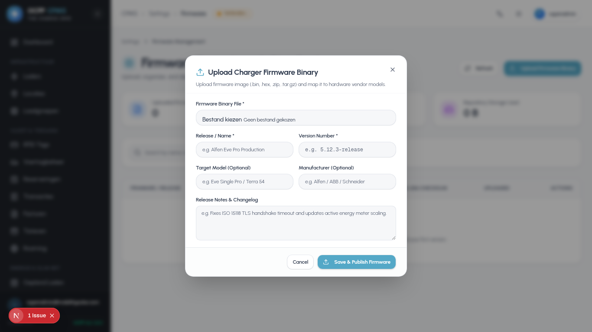

# OCPP Charge Point Management System (CPMS)
# Comprehensive Application Update & Maintenance Manual

Welcome to the **OCPP-CPMS Update & Maintenance Manual**. This guide provides end-to-end instructions for updating the platform across production servers, development workstations, and containerized environments. It includes step-by-step procedures, automated 1-command update scripts, database schema migration guidelines, permission troubleshooting, and zero-downtime deployment strategies.

---

## Table of Contents

1. [Update Lifecycle & Architecture](#1-update-lifecycle--architecture)
2. [Quick 1-Command Automated Update](#2-quick-1-command-automated-update)
3. [Step-by-Step Production Server Update](#3-step-by-step-production-server-update)
4. [Fixing Permission & EACCES Errors](#4-fixing-permission--eacces-errors)
5. [Database Migrations & Prisma Schema Synchronization](#5-database-migrations--prisma-schema-synchronization)
6. [Database Backup & Rollback Strategy](#6-database-backup--rollback-strategy)
7. [Zero-Downtime Reloading with PM2](#7-zero-downtime-reloading-with-pm2)
8. [Local Development Update Workflow](#8-local-development-update-workflow)
9. [Updating Charger Firmware Over OCPP (Remote OTA)](#9-updating-charger-firmware-over-ocpp-remote-ota)
10. [Troubleshooting & Health Verification](#10-troubleshooting--health-verification)

---

## 1. Update Lifecycle & Architecture

The CPMS consists of three interconnected layers that need coordination during an update:

```text
┌────────────────────────────────────────────────────────────────────────────────┐
│ 1. Git Repository (origin/main)                                                │
│    └── Code updates, bug fixes, features, UI enhancements, migrations         │
└──────────────────────────────────────┬─────────────────────────────────────────┘
                                       │ git pull
                                       ▼
┌────────────────────────────────────────────────────────────────────────────────┐
│ 2. Backend & Database Layer (Backend/)                                         │
│    ├── Dependencies: npm install                                               │
│    ├── Prisma Client: npx prisma generate                                      │
│    └── PostgreSQL Schema: npx prisma db push --accept-data-loss                 │
└──────────────────────────────────────┬─────────────────────────────────────────┘
                                       │
                                       ▼
┌────────────────────────────────────────────────────────────────────────────────┐
│ 3. Frontend Dashboard Layer (Frontend/)                                       │
│    ├── Dependencies: npm install                                               │
│    └── Next.js 16+ Production Bundle: npm run build                            │
└──────────────────────────────────────┬─────────────────────────────────────────┘
                                       │
                                       ▼
┌────────────────────────────────────────────────────────────────────────────────┐
│ 4. Process Manager (PM2 Ecosystem)                                             │
│    └── Restart/Reload: pm2 restart ecosystem.config.cjs                        │
│        ├── ocpp-backend (Port 3000 REST & Port 9220 OCPP WSS)                  │
│        └── ocpp-frontend (Port 3002 Next.js Server)                            │
└────────────────────────────────────────────────────────────────────────────────┘
```

---

## 2. Quick 1-Command Automated Update

The repository includes an automated update script (`update.sh`) that automates code pulling, dependency installation, database migration, frontend compilation, and PM2 process restarting.

### Running the Update Script

Navigate to the project root directory (typically `/var/www/ocpp-cms`) and execute:

```bash
cd /var/www/ocpp-cms
bash update.sh
```

Or with `sudo` if directory ownership needs adjustment:

```bash
sudo bash update.sh
```

The script automatically:
1. Verifies Git repository status and pulls the latest commits from `origin/main`.
2. Validates Node.js runtime and directory permissions.
3. Updates Backend dependencies and compiles Prisma schema clients.
4. Synchronizes PostgreSQL tables with Prisma ORM.
5. Installs Frontend dependencies and compiles the optimized Next.js production build.
6. Gracefully restarts the PM2 process manager daemons.
7. Performs an automated health check against `http://localhost:3000/health`.

---

## 3. Step-by-Step Production Server Update

If you prefer to perform each step manually or want full control over each stage:

### Step 3.1: Navigate and Pull Latest Source

```bash
cd /var/www/ocpp-cms
git pull origin main
```

### Step 3.2: Update Backend & Database Schema

```bash
cd /var/www/ocpp-cms/Backend

# 1. Install or update npm packages
npm install

# 2. Re-generate Prisma Client types
npx prisma generate

# 3. Synchronize schema changes with PostgreSQL database
npx prisma db push --accept-data-loss
```

### Step 3.3: Update & Build Frontend Next.js Dashboard

```bash
cd /var/www/ocpp-cms/Frontend

# 1. Install or update frontend dependencies
npm install

# 2. Compile Next.js production bundle
npm run build
```

### Step 3.4: Restart PM2 Daemons

```bash
cd /var/www/ocpp-cms

# Restart both Backend and Frontend processes
pm2 restart ecosystem.config.cjs

# Or restart individually:
# pm2 restart ocpp-backend
# pm2 restart ocpp-frontend
```

### Step 3.5: Verify Deployment Status

```bash
# Check PM2 process table
pm2 status

# Inspect live logs for errors
pm2 logs --lines 50
```

---

## 4. Fixing Permission & EACCES Errors

### Root Cause
If the initial installation script (`install.sh`) or previous builds were run with `sudo` (as `root`), folders such as `node_modules`, `.next`, and `.prisma` become owned by `root`. When you subsequently run `npm install` or `next build` as a standard user (e.g., `koen_aelbrecht`), Linux returns:

```text
npm error code EACCES
npm error syscall unlink
npm error path /var/www/ocpp-cms/Backend/node_modules/.package-lock.json
npm error [Error: EACCES: permission denied, unlink '...']
uncaughtException [Error: EACCES: permission denied, open '/var/www/ocpp-cms/Frontend/.next/trace-build']
```

### Permanent Solution: Reassign Ownership to Current User

Run the following command once to assign full ownership of the project folder to your current user:

```bash
sudo chown -R $USER:$USER /var/www/ocpp-cms
```

After executing this command, you can run all `git pull`, `npm install`, `npx prisma`, `npm run build`, and `pm2 restart` commands without `sudo` and without encountering permission issues.

---

## 5. Database Migrations & Prisma Schema Synchronization

When an update contains schema additions (such as new models, columns, indexes, or relations):

### Preferred Safe Method (Non-interactive)
```bash
cd /var/www/ocpp-cms/Backend
npx prisma generate
npx prisma db push --accept-data-loss
```

> **Why `prisma db push --accept-data-loss`?**  
> In automated server updates and production environments, standard `prisma migrate dev` attempts to prompt for interactive input, which can hang terminal sessions. `npx prisma db push --accept-data-loss` synchronizes schema definitions safely while allowing non-destructive column additions.

### Verifying Schema Synchronization
You can verify the database connection and schema state at any time:
```bash
cd /var/www/ocpp-cms/Backend
npx prisma db pull --print
```

---

## 6. Database Backup & Rollback Strategy

Before applying major updates or database schema modifications, it is recommended to create a database snapshot.

### 6.1 Creating a Database Backup
```bash
# Create timestamped SQL dump
pg_dump -U cms_user -d ocpp_cms -h localhost -F c -b -v -f "/var/backups/ocpp_cms_$(date +%Y%m%d_%H%M%S).dump"
```

Or a plain SQL text dump:
```bash
pg_dump -U cms_user -d ocpp_cms > /var/backups/ocpp_cms_backup.sql
```

### 6.2 Restoring from Backup (Rollback)
If an update fails and you need to restore the previous state:
```bash
# 1. Stop PM2 processes
pm2 stop ecosystem.config.cjs

# 2. Restore PostgreSQL database
psql -U cms_user -d ocpp_cms < /var/backups/ocpp_cms_backup.sql

# 3. Checkout previous Git commit/tag
cd /var/www/ocpp-cms
git checkout <PREVIOUS_STABLE_COMMIT_HASH>

# 4. Rebuild Backend and Frontend
cd Backend && npm install && npx prisma generate
cd ../Frontend && npm install && npm run build

# 5. Restart services
cd ..
pm2 start ecosystem.config.cjs
```

---

## 7. Zero-Downtime Reloading with PM2

For production systems managing active EV charging sessions where minimal interruption is desired:

```bash
# Gracefully reload the Frontend dashboard without dropping requests
pm2 reload ocpp-frontend --update-env

# Gracefully reload the Backend REST API
pm2 reload ocpp-backend --update-env
```

> **Note on OCPP WebSocket Connections:**  
> When `ocpp-backend` restarts, connected physical EV chargers will temporarily lose WebSocket connectivity and reconnect automatically within 5–30 seconds according to their configured `HeartbeatInterval` or offline retry policy. Active transactions in progress are preserved in the PostgreSQL database.

---

## 8. Local Development Update Workflow

When updating your local development workstation:

```bash
# 1. Pull the latest commits
git pull

# 2. Update Backend dependencies & database schema
cd Backend
npm install
npx prisma generate
npx prisma db push --accept-data-loss

# 3. Update Frontend dependencies
cd ../Frontend
npm install

# 4. Run TypeScript checks to verify zero compilation errors
npx tsc --noEmit
cd ../Backend
npx tsc --noEmit

# 5. Run Backend Unit Tests (optional)
npm test
```

### Starting Development Servers
* **Backend:** `cd Backend && npm run dev` (`http://localhost:3000` & `ws://localhost:9220`)
* **Frontend:** `cd Frontend && npm run dev` (`http://localhost:3002`)

---

## 9. Updating Charger Firmware Over OCPP (Remote OTA)

If you need to update firmware on physical EV charging stations connected to the CPMS:

### 9.1 Using the Web Dashboard
1. Open the Admin Dashboard and navigate to **Chargers** (`/chargers`).
2. Select the target charger and click **Remote Actions** > **Update Firmware** (or configure global binaries under `/settings/firmware`).
3. Enter the public HTTPS URL hosting the vendor firmware binary (`.bin`/`.tar.gz`) and the scheduled retrieval timestamp.
4. Click **Dispatch Firmware Update**.

| Firmware Management Modal | Charger Detail Remote Control |
| :---: | :---: |
|  |  |

### 9.2 Using the REST API
Send an authenticated `POST` request to the backend:

```bash
curl -X POST https://ocpp.yourdomain.com/api/ocpp/update-firmware \
  -H "Authorization: Bearer <ADMIN_JWT_TOKEN>" \
  -H "Content-Type: application/json" \
  -d '{
    "chargerId": "CP-ALFEN-01",
    "location": "https://firmware-repo.mobilitypulse.com/releases/alfen-eve-single-v6.4.1.bin",
    "retrieveDate": "2026-09-01T04:00:00.000Z",
    "retries": 3,
    "retryInterval": 60
  }'
```

The CPMS will dispatch the standard OCPP `UpdateFirmware` packet and monitor the progress via `FirmwareStatusNotification` frames (`Downloaded`, `InstallationFailed`, `Installed`).

---

## 10. Troubleshooting & Health Verification

### 10.1 System Health Endpoints
Verify all subsystems are operational after an update:

```bash
# REST API & Database & Redis Health Check
curl -s http://localhost:3000/health | jq .
```
**Expected Response:**
```json
{
  "status": "ok",
  "database": "connected",
  "redis": "connected",
  "uptime": 120.45
}
```

### 10.2 Checking PM2 Process Logs
```bash
# View aggregated real-time logs
pm2 logs

# View only Backend errors
pm2 logs ocpp-backend --err --lines 50

# View only Frontend errors
pm2 logs ocpp-frontend --err --lines 50
```

### 10.3 Common Update Issues & Solutions

| Issue | Cause | Solution |
| :--- | :--- | :--- |
| **`EACCES: permission denied`** | Files owned by `root` instead of user | Run `sudo chown -R $USER:$USER /var/www/ocpp-cms`. |
| **`502 Bad Gateway` on Nginx** | PM2 app crashed or not running on port 3000/3002 | Check `pm2 status` and inspect logs with `pm2 logs`. |
| **Prisma Schema Discrepancy** | `prisma generate` not run after schema update | Run `cd Backend && npx prisma generate && npx prisma db push --accept-data-loss`. |
| **Next.js Build Failure (`.next` error)** | Stale build cache or missing dependencies | Run `rm -rf Frontend/.next && cd Frontend && npm install && npm run build`. |
| **Port Conflict (`EADDRINUSE: 3000` / `9220`)** | Orphaned node processes running | Run `npx kill-port 3000 3002 9220` or `pm2 delete all && pm2 start ecosystem.config.cjs`. |

---

*Manual maintained for OCPP-CPMS Operations, DevOps & Field Engineering.*
