# OCPP Charge Point Management System - Comprehensive User Manual

Welcome to the **OCPP-CPMS User Manual**. This manual serves as the primary operational reference for Charge Point Operators (CPOs), station managers, facility supervisors, and administrative personnel managing the EV charging network via the Next.js Admin Dashboard.

---

## Table of Contents
1. [Getting Started & Authentication](#1-getting-started--authentication)
2. [Executive Dashboard & Network KPIs](#2-executive-dashboard--network-kpis)
3. [Charging Stations & 2D Ground Plans](#3-charging-stations--2d-ground-plans)
4. [Chargers, Connectors & Combiner Mode](#4-chargers-connectors--combiner-mode)
5. [User Accounts, Corporate Clients & RBAC](#5-user-accounts-corporate-clients--rbac)
6. [Active Sessions & Transaction History](#6-active-sessions--transaction-history)
7. [Reservations Manager](#7-reservations-manager)
8. [Tariffs & Dynamic Pricing](#8-tariffs--dynamic-pricing)
9. [Invoicing ("Facturen") & SEPA Banking](#9-invoicing-facturen--sepa-banking)
10. [Home Reimbursements & Split-Billing](#10-home-reimbursements--split-billing)
11. [Public Payments: Stripe & Mollie](#11-public-payments-stripe--mollie)
12. [Roaming Hubs (OCPI & OICP) & Settlements](#12-roaming-hubs-ocpi--oicp--settlements)
13. [Hardware Reliability, Quirks & Auto-Heal](#13-hardware-reliability-quirks--auto-heal)
14. [Media Screen Campaigns](#14-media-screen-campaigns)
15. [Mobile Driver Companion App](#15-mobile-driver-companion-app)
16. [Platform Settings, PKI & Enterprise Audit](#16-platform-settings-pki--enterprise-audit)

---

## 1. Getting Started & Authentication

### 1.1 Logging In & Account Security
Navigate to the CPMS dashboard URL (e.g., `https://ui.mobilitypulse.com` or `http://localhost:3002`).

* **Login (`/login`):** Enter your registered email address and password.
* **Two-Factor Authentication (2FA TOTP):** If 2FA is enabled in your security settings, you will be prompted for a 6-digit TOTP code generated by Google Authenticator, 1Password, or Authy.
* **Account Recovery & Verification:** Use `/forgot-password`, `/reset-password`, and `/verify-email` for self-service password recovery and email validation flows.

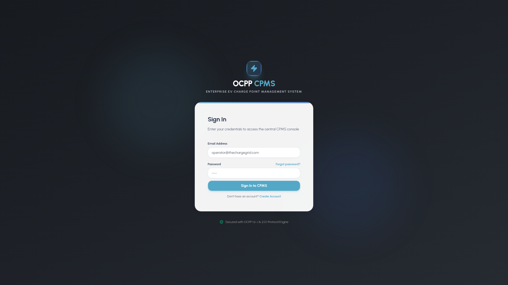

---

## 2. Executive Dashboard & Network KPIs

The **Dashboard** (`/dashboard`) provides a real-time command center summarizing charging fleet performance:

* **Key Performance Indicators (KPIs):** Instant metrics for Total Energy Delivered (kWh), Active Charging Sessions, Fleet Online Status, and Gross Revenue.
* **Geospatial Fleet Map:** Interactive Leaflet map displaying station pins color-coded by real-time status (`Online`, `In-Use`, `Faulted`, `Offline`).
* **Active Session Live Stream:** Real-time list of current charging sessions with continuous duration counters, instantaneous power draw (kW), and accumulated energy.
* **Fleet Power & Utilization Charts:** Hourly load profiles visualizing energy trends across stations.

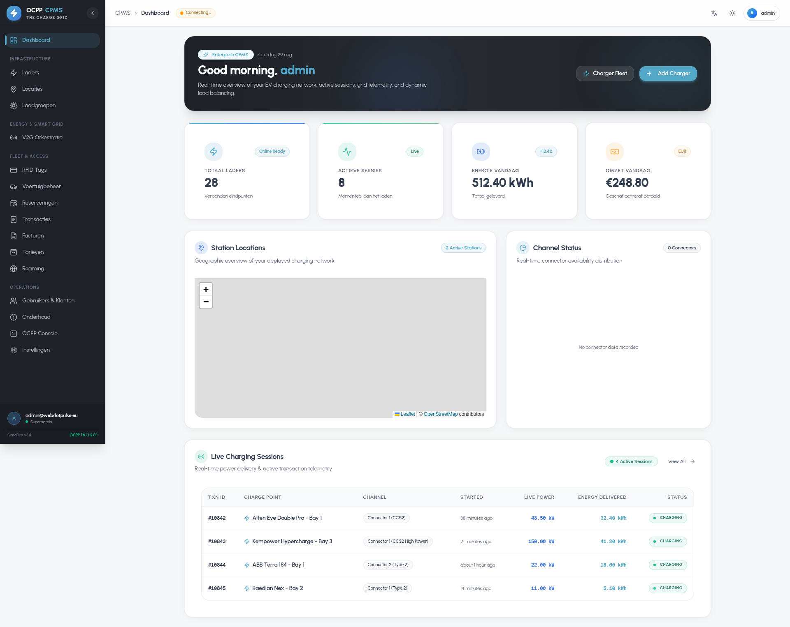

---

## 3. Charging Stations & 2D Ground Plans

A **Station** represents a physical charging location containing one or more chargers.

### 3.1 Managing Stations (`/stations`)
* View all stations in an interactive directory with map integration.
* Add or edit stations with street address, coordinates, opening hours, electrical connection limits, and emergency contact details.

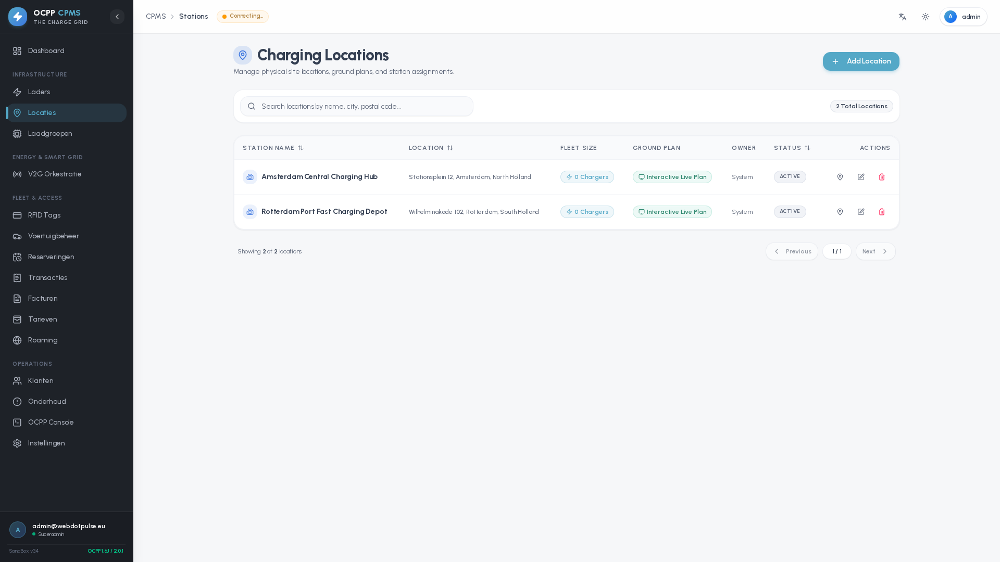

### 3.2 2D Ground Plan Layout Builder & Live Floor Monitor
Enable Ground Plan on any station to build an interactive 2D parking layout:

1. Click **Edit Ground Plan Layout** to open the drag-and-drop canvas.
2. Add parking bays, rotate spots by 45 degrees, draw walkways or shelter areas, and link physical charger sockets to spots.
3. Draw electrical grid topology lines to map physical cabling from substation panels to EVSEs.
4. Open the **Live Floor Monitor** (`/stations/[id]/live`) to observe real-time bay occupancy, active charging telemetry (kW/kWh), phase currents (L1/L2/L3), and driver ID tags displayed in glowing glassmorphism tiles.

| Ground Plan 2D Builder | Live Floor Plan Monitor |
| :---: | :---: |
| 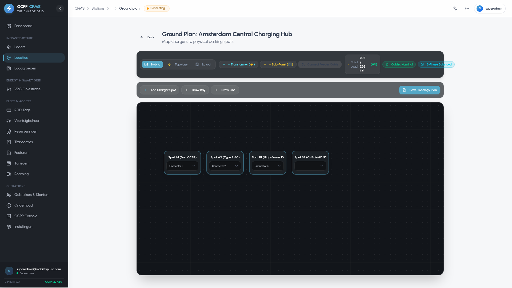 | 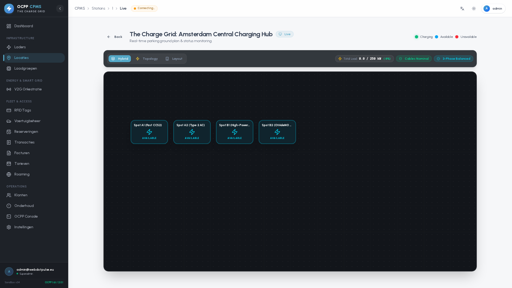 |

---

## 4. Chargers, Connectors & Combiner Mode

### 4.1 Fleet Directory (`/chargers`)
The Chargers directory tracks all physical charging hardware connected to the central system:
* Real-time OCPP connection state, firmware version, model, serial number, and assigned station.
* Quick filters for charger status: `Available`, `Charging`, `SuspendedEVSE`, `Faulted`, `Offline`.

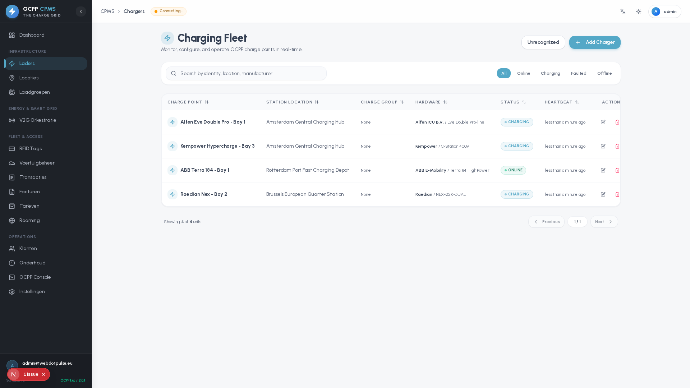

### 4.2 Charger Detail & Remote Control (`/chargers/[id]`)
Opening a charger's detail page provides full telemetry tabs:
* **Overview:** High-level metrics, active connector status, and immediate remote control actions (Remote Start/Stop, Soft/Hard Reset, Unlock Connector, Change Availability).
* **Connectors:** Detailed plug configuration (Type 2, CCS2, CHAdeMO, AC/DC, max voltage/power).
* **Transactions:** Complete history of sessions initiated on this charger.
* **Configuration:** Standard OCPP parameter inspector and editor.
* **Profiles:** Active charging schedules and smart load profiles (IDs 100, 101, 200, 300).
* **Predictive Load:** Rolling 24-hour solar balancing forecast.

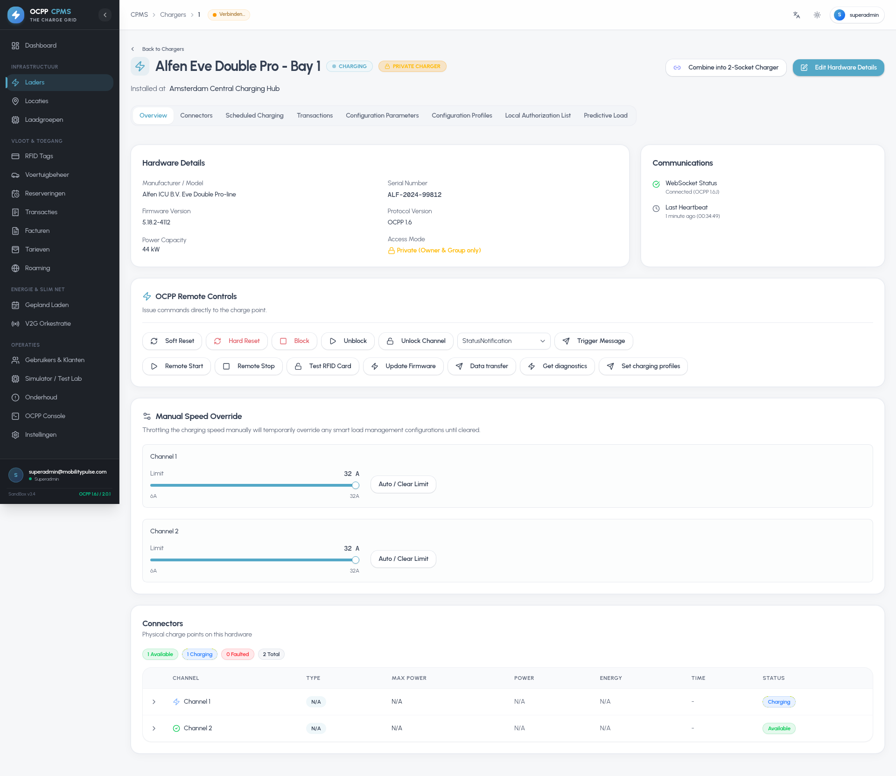

### 4.3 Straight-Through Proxy & Dual-Socket Combiner Mode
* **Straight-Through Proxy:** Configure chargers to forward all OCPP traffic to an external upstream CPO backend while maintaining local logging, card mapping, and real-time monitoring.
* **Charger Combiner:** Combine two single-socket physical charge points of identical model into a unified dual-channel virtual charger (Primary = Channel 1, Secondary = Channel 2), handling connector ID translation automatically.

---

## 5. User Accounts, Corporate Clients & RBAC

### 5.1 Users, Clients & Role Management (`/users`)
The **Users & Clients Admin Hub** provides comprehensive multi-tenant management:

* **Distinction between Clients and Users**:
  * **🏢 Corporate B2B Clients (`Clients`):** Legal business entities, fleet accounts, and billing organizations. Holds company name, client ID (e.g. `CLI-0042`), Tax/VAT number, Chamber of Commerce (KvK) number, billing address/email, SEPA mandates, assigned charging stations & chargers, and multiple associated employee drivers.
  * **👥 Users (Individual Accounts):** Human accounts with login credentials (email/password), security keys (2FA TOTP, email verification), an assigned system role, personal RFID cards, and vehicle profiles.
* **5-Tier Role Hierarchy (RBAC):**
  * `👑 Superadmin`: Full unrestricted access across all client organizations, hardware endpoints, roaming hubs, audit logs, and system settings.
  * `⚙️ Admin`: Platform / CPO Administrator managing charging networks, site locations, dynamic tariffs, billing & SEPA, client accounts, and user permissions.
  * `🔧 Operator / Technician`: Operations & hardware maintenance role (diagnostics, live monitoring, firmware updates, reset & unlock commands; restricted from financial accounts).
  * `👔 Client Admin`: Corporate Fleet Administrator managing their company's assigned chargers, employee drivers, RFID cards, and monthly invoices.
  * `🚗 User / EV Driver`: End-user EV driver initiating charging sessions, managing personal RFID cards, vehicle battery profiles, and receipts.
* **Interactive Roles & Capabilities Matrix:** Visual breakdown of granular permissions across Infrastructure, Energy & Smart Grid, Fleet & Access, Invoices & Finance, Operations & Logs, and Administration.

| Users Directory | Corporate B2B Clients | Roles & Permissions Matrix |
| :---: | :---: | :---: |
| 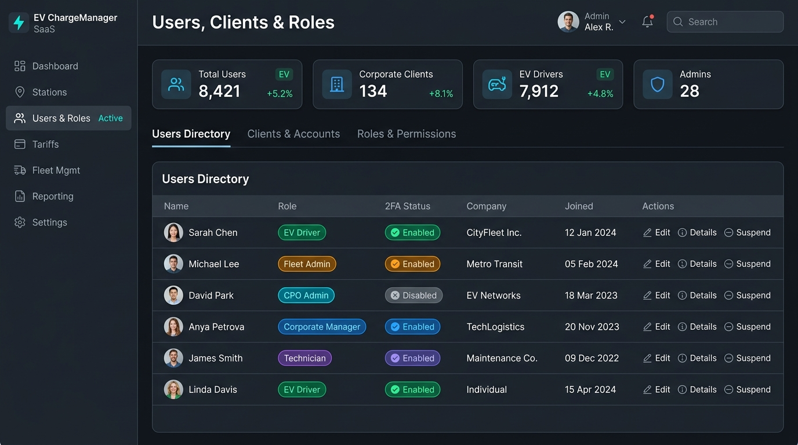 | 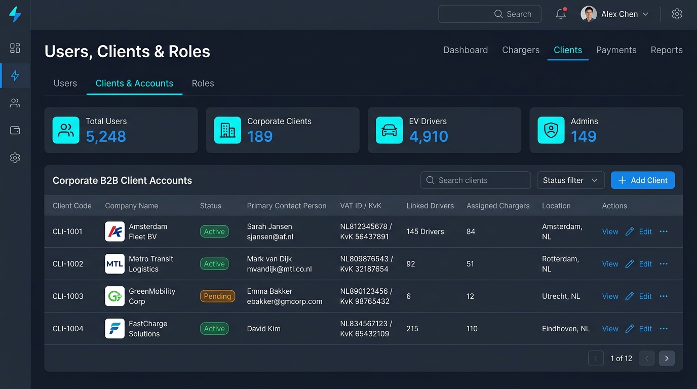 | 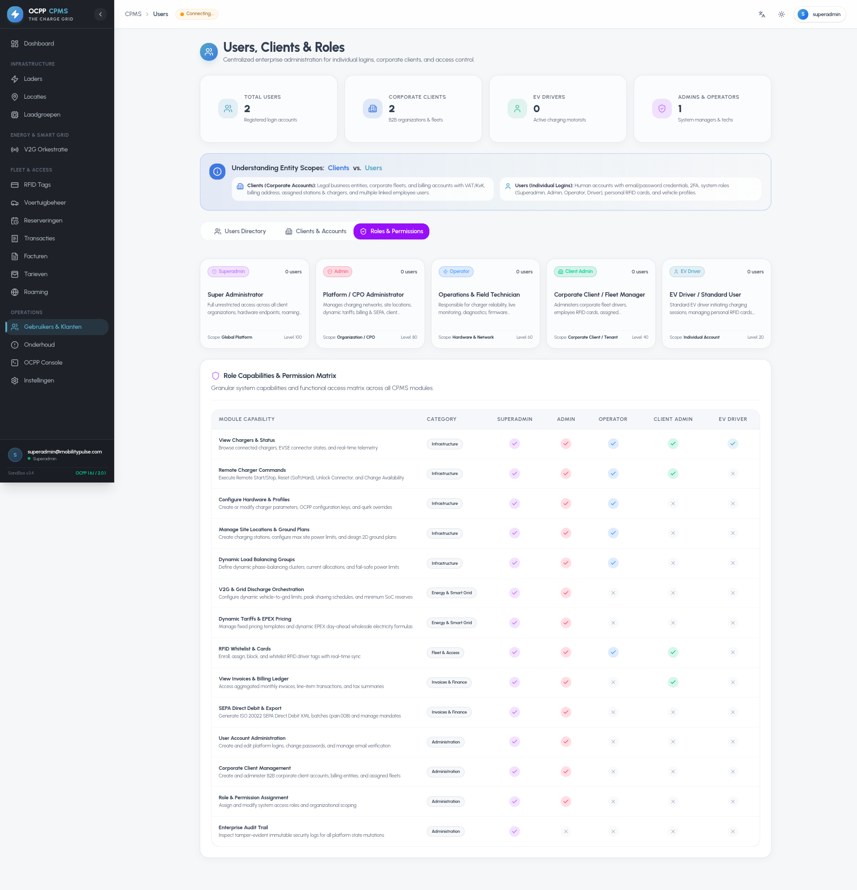 |

### 5.2 RFID Whitelist Management (`/rfid`)
* Register RFID cards by **idTag** number.
* Map cards to user accounts, corporate clients, and vehicle energy profiles.
* Enable or disable cards instantly with real-time hardware cache invalidation.

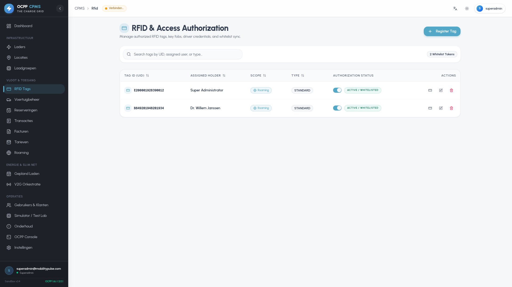

### 5.3 ISO 15118 Plug & Charge (`/vehicle-identity-management`)
* Manage vehicle contract certificates (EMAID), OEM provisioning certificates, and root CA trust stores.
* Automatically authorize charging sessions as soon as the ISO 15118-compatible vehicle is plugged in.

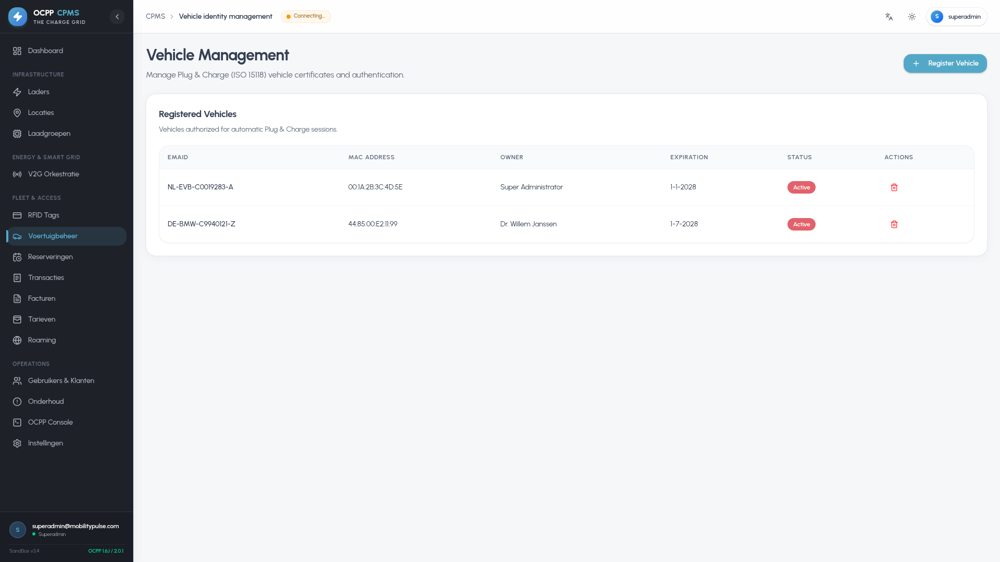

---

## 6. Active Sessions & Transaction History

* **Active Sessions (`/transactions`):** Live view of all active charging sessions across the network with elapsed duration, current wattage, delivered energy (kWh), and real-time cost accumulation.
* **Completed Transactions:** Historical ledger with filtering by date range, station, charger, user, and payment status.
* **Detailed Receipts:** Itemized breakdown of energy rates, connection fees, time/idle penalties, and VAT.

| Live Active Sessions | Transaction History Ledger |
| :---: | :---: |
| 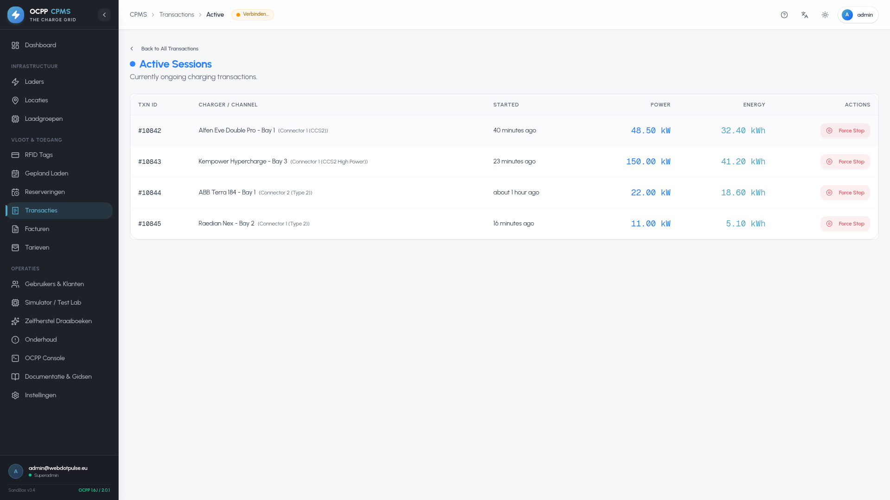 | 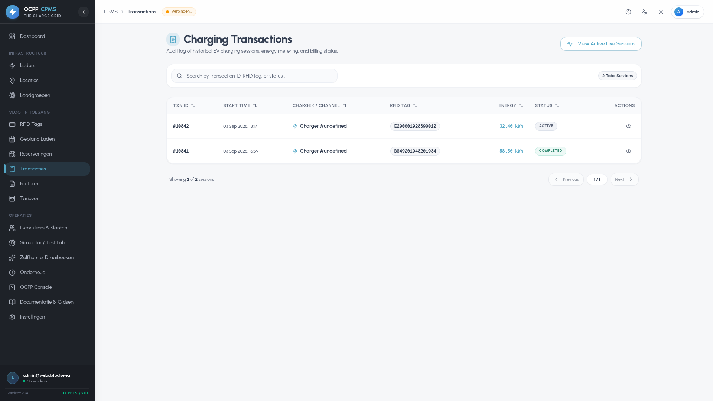 |

---

## 7. Reservations Manager

The **Reservations Manager** (`/reservations`) allows operators and drivers to schedule exclusive charging windows:
* Reserve specific EVSE connectors for scheduled arrival times.
* Configurable reservation expiry windows and automatic cancellation on no-show.
* Real-time connector state transition to `Reserved` via OCPP `ReserveNow` RPCs.

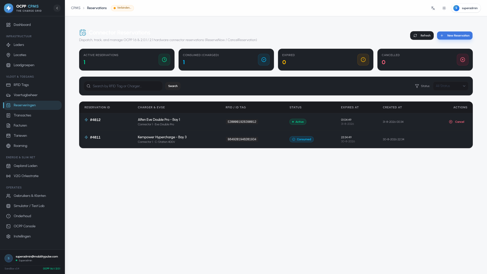

---

## 8. Tariffs & Dynamic Pricing

### 8.1 Tariff Structures (`/tariffs`)
Define flexible 4-part pricing matrices:
1. **Connection Fee (€):** One-time starting fee applied when charging commences.
2. **Energy Fee (€/kWh):** Flat price per kWh consumed or linked to dynamic wholesale rates.
3. **Time Fee (€/hour):** Surcharge based on active plug duration.
4. **Idle Fee (€/hour):** Penalty fee applied after charging is complete but cable remains connected.

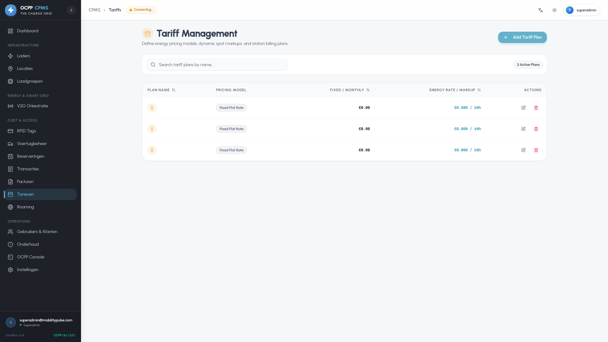

### 8.2 Dynamic EPEX Spot Tariffs (`/settings/tariffs`)
* Ingests Day-Ahead hourly wholesale electricity prices from EnergyZero, ENTSO-E, and Energy-Charts.
* Applies configurable CPO markup formulas (`Base Spot * Multiplier + Surcharge + VAT`).
* Slices transaction energy consumption into exact hourly buckets for transparent billing.

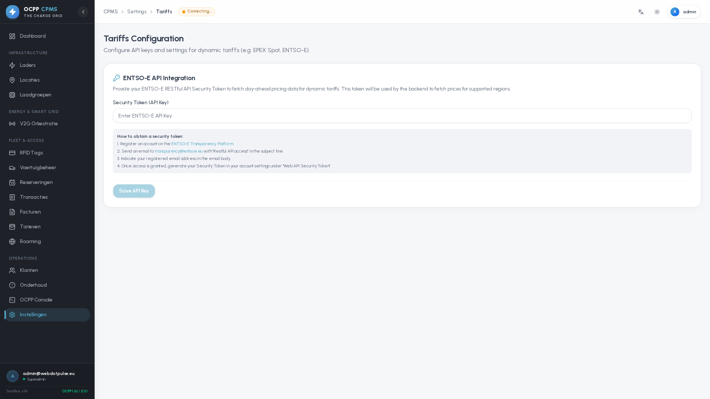

---

## 9. Invoicing ("Facturen") & SEPA Banking

The platform provides a complete enterprise billing suite under `/invoices` (localized as **Facturen**):

* **Billing Ledger (`/invoices`):** Aggregated turnover, subtotal, and 21% VAT metrics across billing cycles.
* **Batch Generation Wizard:** Consolidates unbilled completed sessions across a selected month into formalized corporate tax invoices.
* **Itemized Invoice View:** Line-item session breakdowns with PDF export and direct email dispatch.
* **SEPA Direct Debit Mandates:** Track B2B and CORE Direct Debit mandates (UMR, debtor IBAN/BIC, signature validation).
* **ISO 20022 SEPA Direct Debit XML Export (`pain.008.001.02`):** Generate banking direct debit batch files for direct upload to banking portals (ABN AMRO, ING, Rabobank, BNP Paribas).

| Invoicing Ledger | Batch Generate Wizard | SEPA Direct Debit Export |
| :---: | :---: | :---: |
|  | 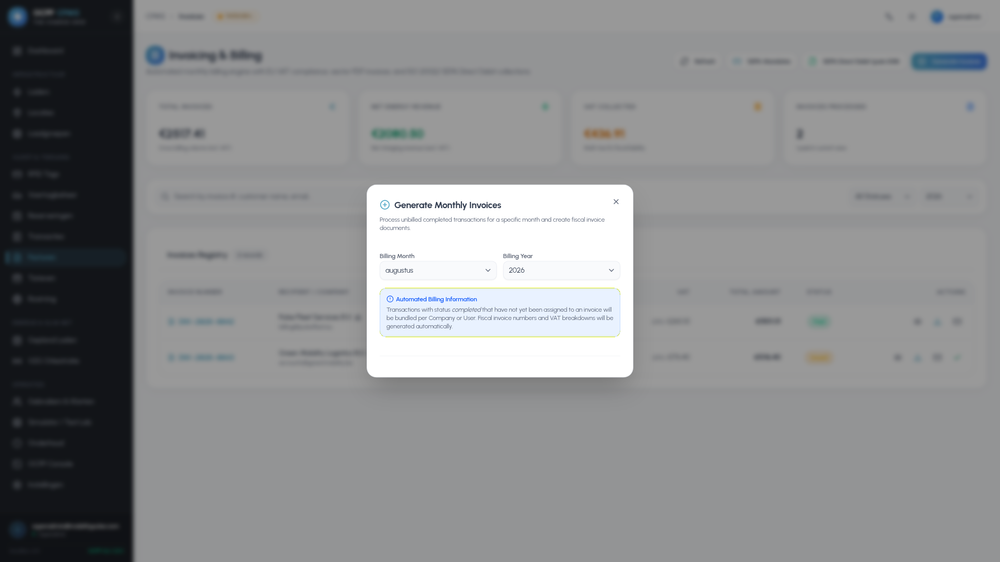 | 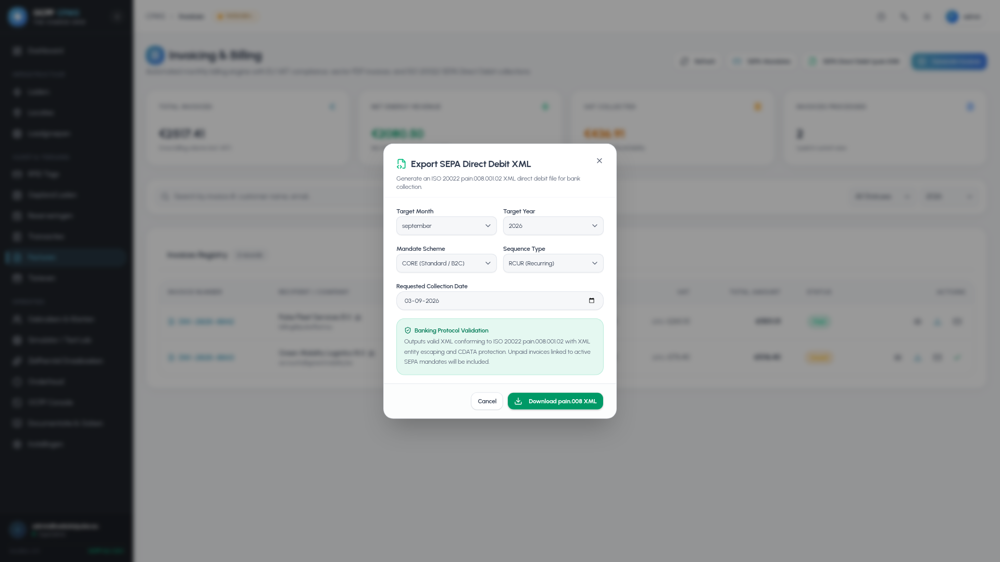 |

---

## 10. Home Reimbursements & Split-Billing

The **Reimbursements** module (`/reimbursements`) calculates employee home charging expenses:
* Links employee drivers, home chargers, residential electricity tariffs, and payout IBANs.
* Aggregates monthly home kWh and calculates net reimbursement amounts due.
* Exports banking-compliant **ISO 20022 SEPA Credit Transfer XML** (`pain.001.001.03`) for single-batch corporate payouts.

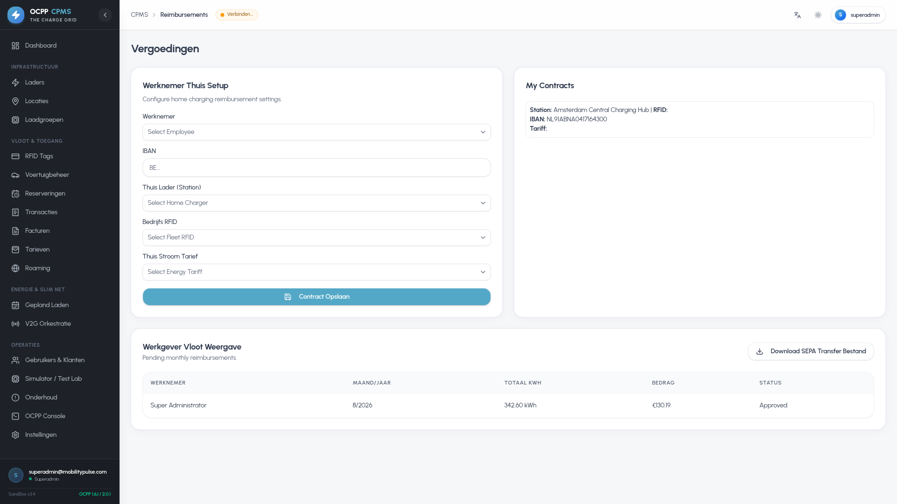

---

## 11. Public Payments: Stripe & Mollie

For walk-in drivers without subscriptions, the CPMS provides instant ad-hoc checkout:
* **Stripe Integration:** Settle via Credit/Debit Cards (Visa, Mastercard, Amex), Apple Pay, Google Pay, and SEPA Credit.
* **Mollie Integration:** European local payment methods including iDEAL 2.0, Bancontact, EPS, KBC/CBC, and Belfius.
* **Public Checkout Portal (`/payments`):** Scan station QR code to select payment provider and authorize charging.
* **Gateway Settings (`/settings/payments`):** Manage live/test API keys, webhook signing secrets, and sandbox toggles.

| Public Payments Checkout | Payment Gateways Settings |
| :---: | :---: |
| 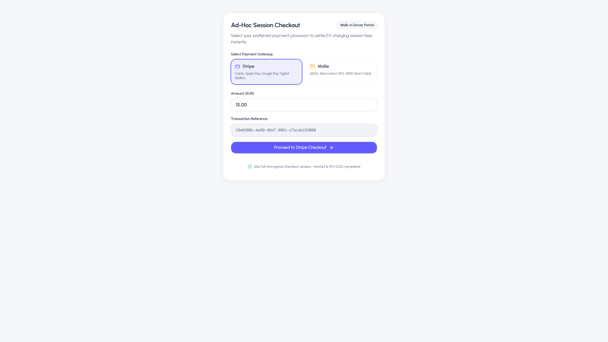 | 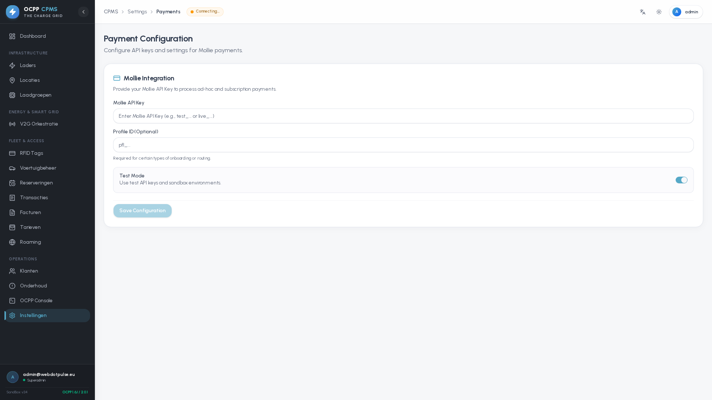 |

---

## 12. Roaming Hubs (OCPI & OICP) & Settlements

* **OCPI 2.2.1 (`/roaming`):** Full bidirectional roaming for Locations, Tariffs, Sessions, Tokens, and CDRs.
* **Hubject OICP 2.3:** Real-time EVSE status synchronization and Charge Detail Record (CDR) submission via BullMQ event workers.
* **Roaming Settlement Visualizer:** Track wholesale roaming costs vs retail revenue and export clearinghouse reports.

| OCPI Roaming Hubs | Hubject OICP Roaming | Roaming Settlement Visualizer |
| :---: | :---: | :---: |
| 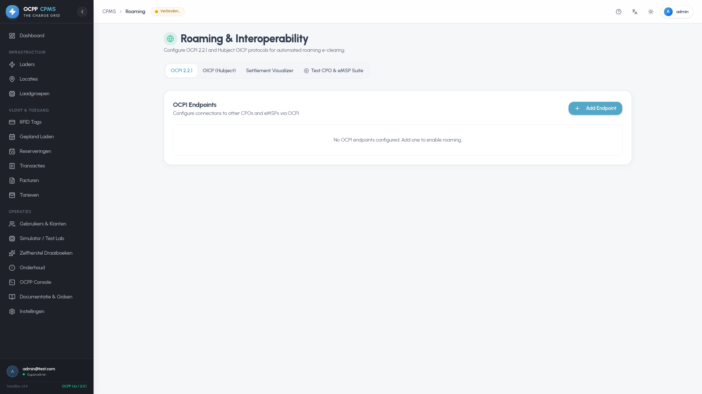 | 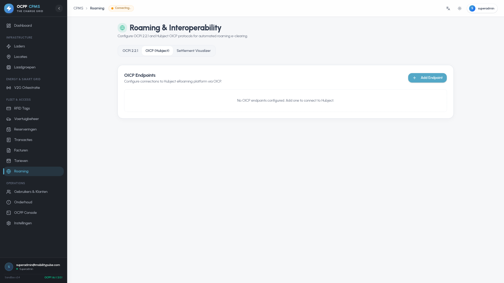 | 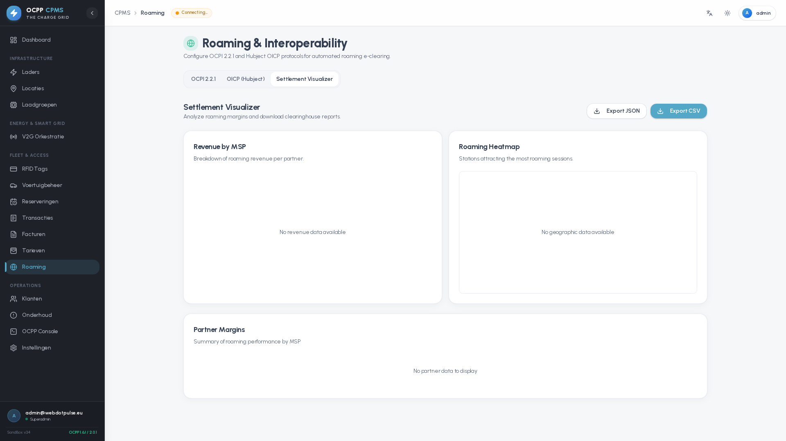 |

---

## 13. Hardware Reliability, Quirks & Auto-Heal

* **Quirk Profiles (`/quirk-profiles`):** Correct hardware-specific non-compliances (missing active power, raw multiplier scaling, energy integration, card ID rewriting).
* **Hardware-at-Risk (`/hardware-at-risk`):** Automated scanner detecting silent failures with auto-heal recovery sequences.
* **Live Packet Inspector (`/ocpp`):** Real-time JSON-RPC frame debugger with schema validation and payload inspection.

| Quirk Profiles | Hardware at Risk | Packet Inspector Console |
| :---: | :---: | :---: |
| 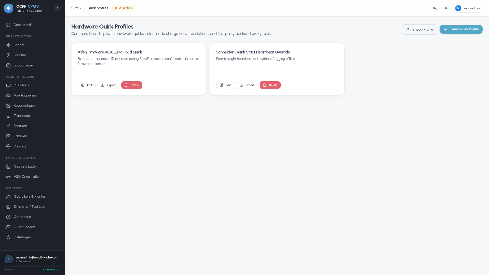 | 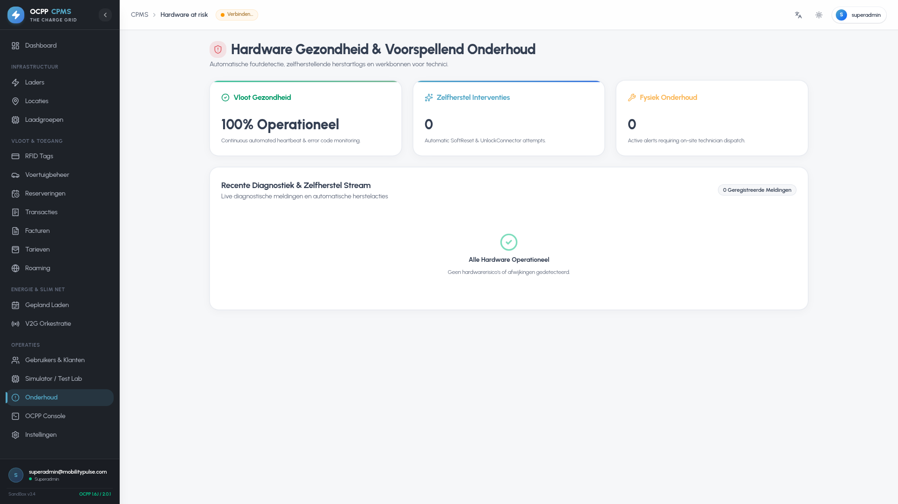 | 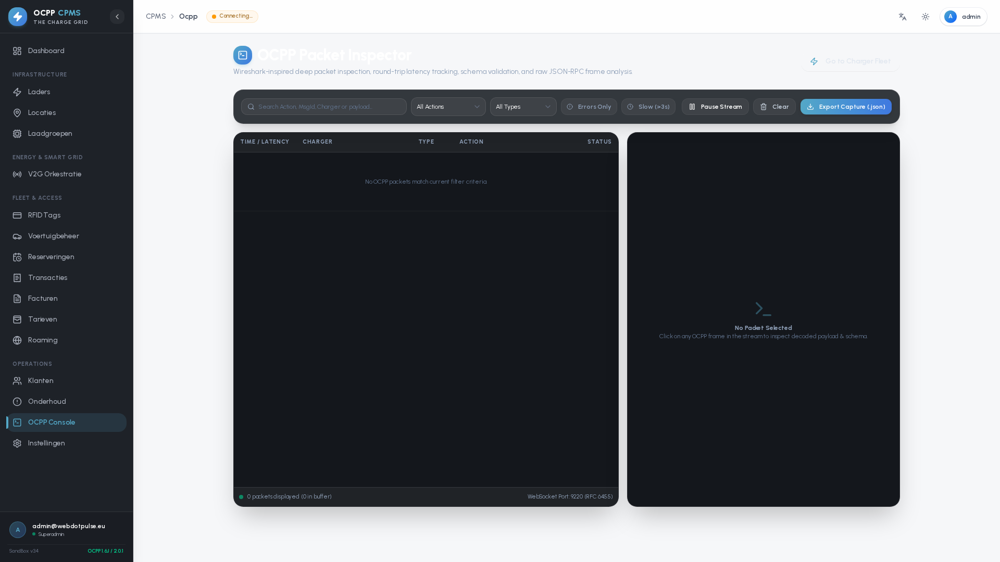 |

---

## 14. Media Screen Campaigns

The **Media Campaigns** scheduler (`/media-campaigns` and `/settings/ad-manager`) distributes multimedia advertisements to chargers equipped with digital displays:
* Upload promotional images and video assets.
* Target campaigns by station, charge group, or geographic region.
* Define start/end dates and daily broadcast time windows.

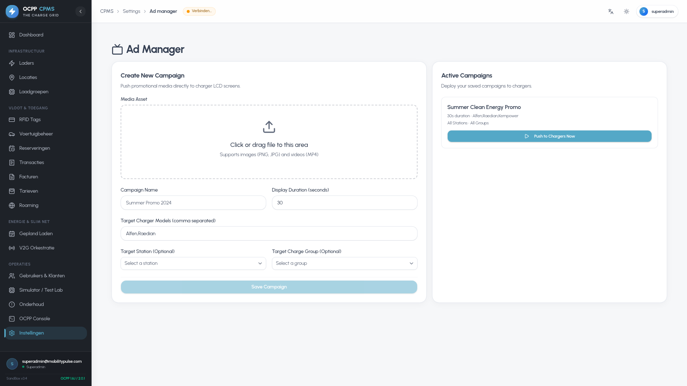

---

## 15. Mobile Driver Companion App

A responsive mobile web experience (`/mobile`) tailored for smartphone browsers:
* **Mobile Dashboard (`/mobile/dashboard`):** Active session widget, quick station finder, and recent charging receipts.
* **Fleet Directory (`/mobile/chargers`):** List of available chargers with connector plug types and live status badges.
* **Remote Controller (`/mobile/chargers/[id]`):** Start and stop charging sessions directly from the smartphone.
* **Geospatial Map (`/mobile/map`):** Interactive GPS navigation and route guidance to nearby charging hubs.
* **Driver Settings (`/mobile/settings`):** Account preferences, payment methods, and vehicle profiles.

| Mobile Dashboard | Mobile Fleet Directory | Mobile Remote Controller | Mobile Station Map |
| :---: | :---: | :---: | :---: |
| 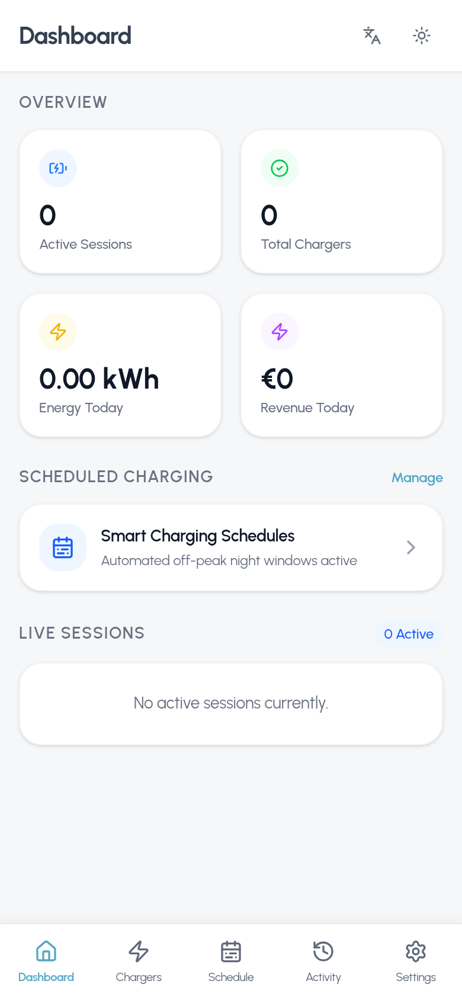 | 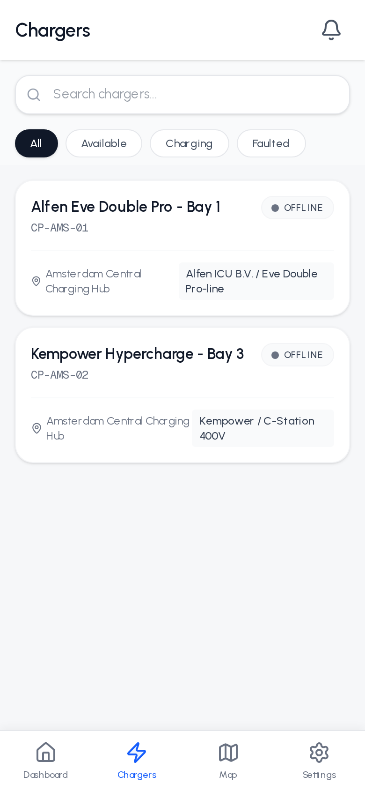 | 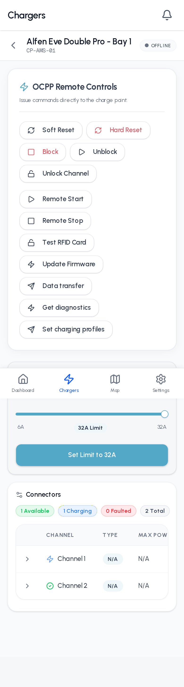 | 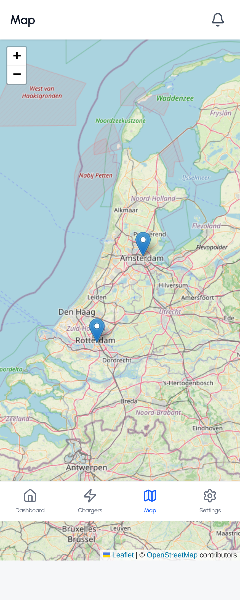 |

---

## 16. Platform Settings, PKI & Enterprise Audit

* **Account & Security (`/settings`):** Profile details, 2FA TOTP setup, password management, and company information.
* **PKI Security Profiles (`/settings/security`):** X.509 server/client certificates for OCPP 1.6 Security Profile 3 (mTLS) and ISO 15118 Plug & Charge.
* **Enterprise Audit Trail (`/settings/audit`):** Immutable logging of administrative actions, remote control invocations, and authentication events.
* **SMTP Server & Email Templates (`/settings/mail`, `/settings/templates`):** Configure transactional mail delivery and customize HTML templates.

| Account & 2FA Security | PKI Security Profiles | Enterprise Audit Trail | SMTP Server Settings |
| :---: | :---: | :---: | :---: |
| 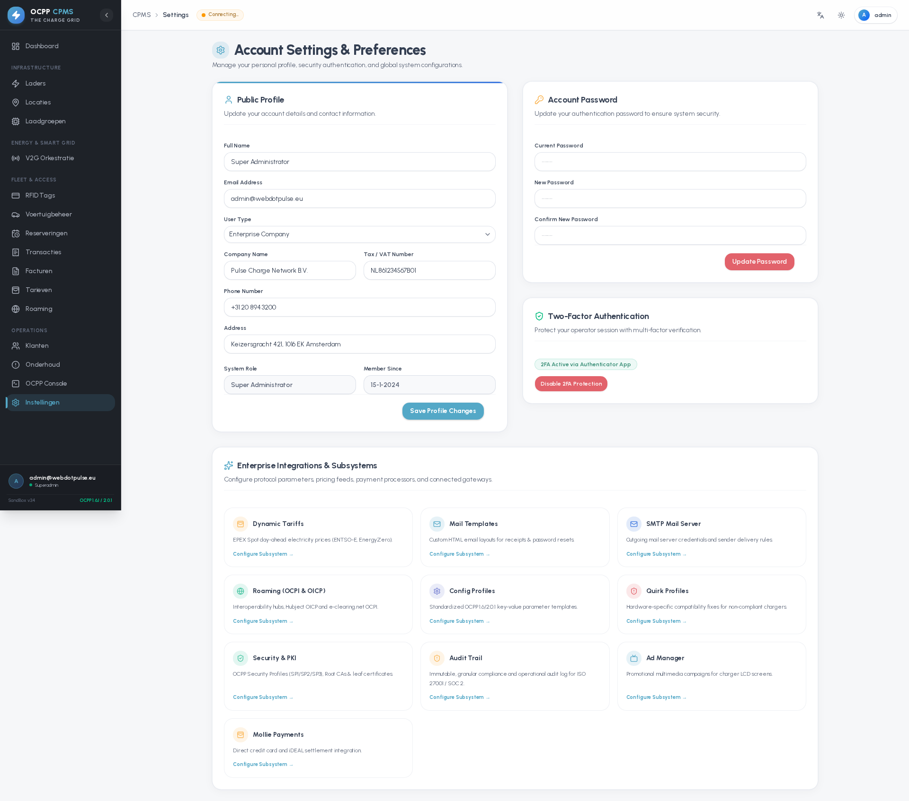 | 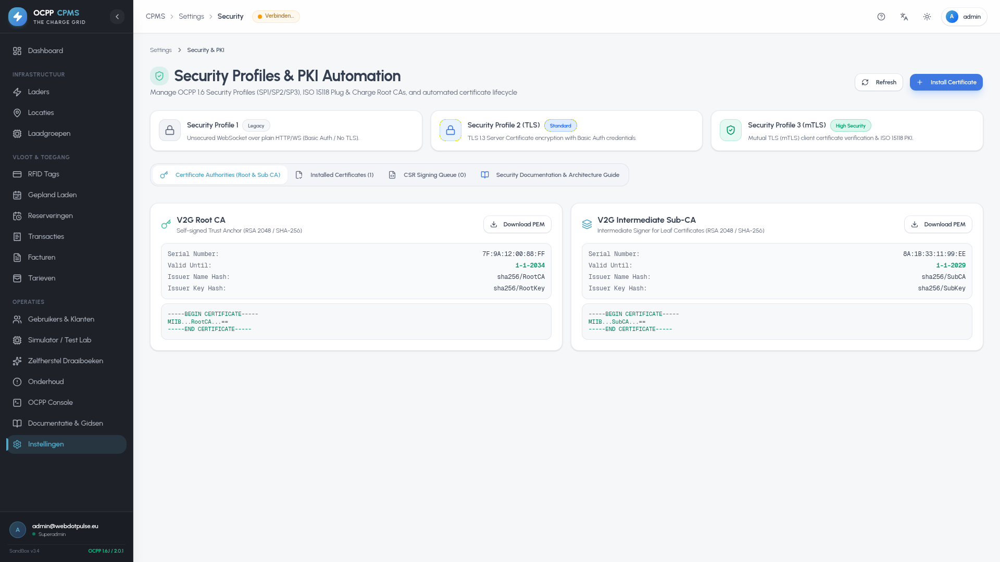 | 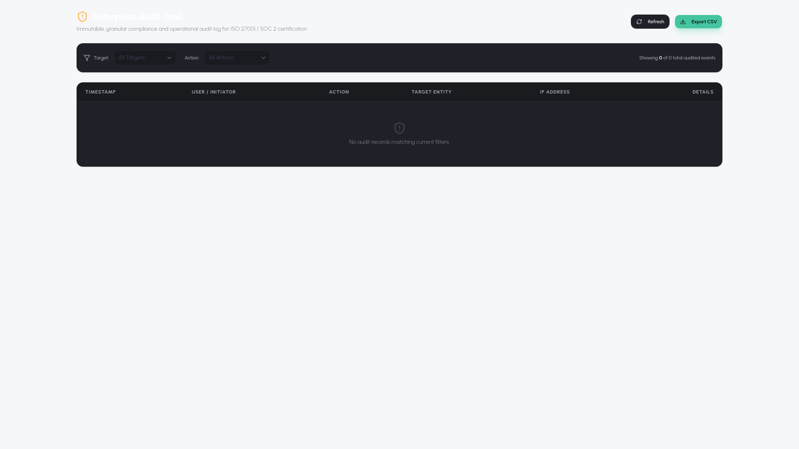 | 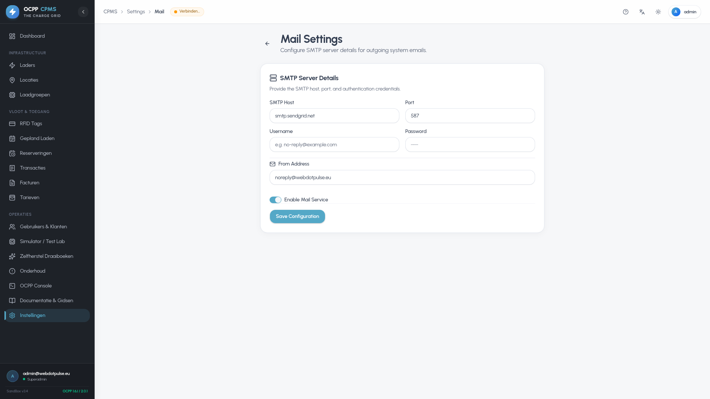 |
