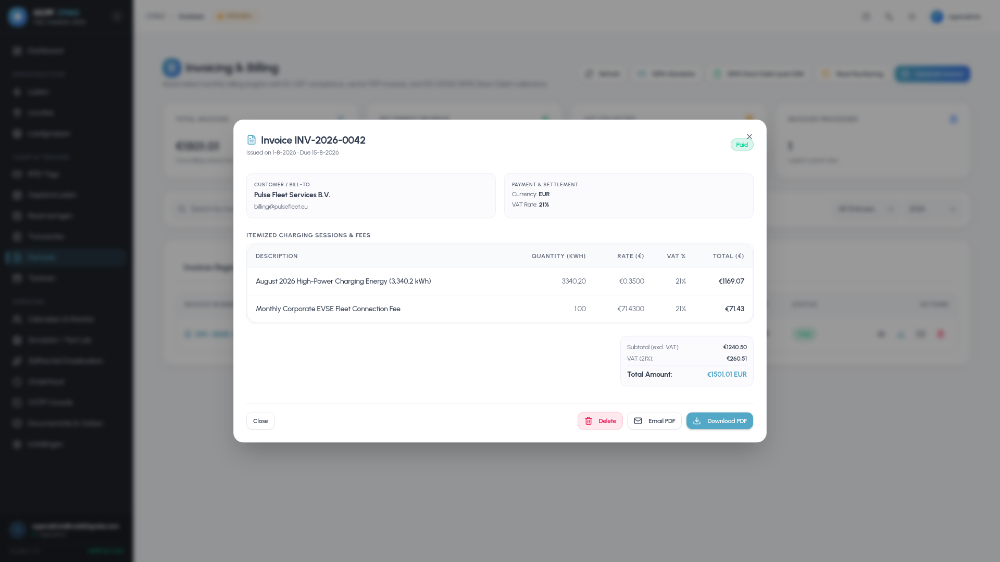

# OCPP Charge Point Management System - Comprehensive User Manual

Welcome to the **OCPP-CPMS User Manual**. This manual serves as the primary operational reference for Charge Point Operators (CPOs), station managers, facility supervisors, and administrative personnel managing the EV charging network via the Next.js Admin Dashboard.

---

## Table of Contents
1. [Getting Started & Authentication](#1-getting-started--authentication)
2. [Executive Dashboard & Network KPIs](#2-executive-dashboard--network-kpis)
3. [Charging Stations & 2D Ground Plans](#3-charging-stations--2d-ground-plans)
4. [Chargers & EVSE Connectors](#4-chargers--evse-connectors)
5. [User Accounts, RFID Whitelist & ISO 15118](#5-user-accounts-rfid-whitelist--iso-15118)
6. [Active Sessions & Transaction History](#6-active-sessions--transaction-history)
7. [Reservations Manager](#7-reservations-manager)
8. [Tariffs & Dynamic Pricing](#8-tariffs--dynamic-pricing)
9. [Invoicing ("Facturen") & SEPA Banking](#9-invoicing-facturen--sepa-banking)
10. [Home Reimbursements & Split-Billing](#10-home-reimbursements--split-billing)
11. [Roaming Hubs (OCPI & OICP) & Settlements](#11-roaming-hubs-ocpi--oicp--settlements)
12. [Hardware Reliability & Auto-Heal](#12-hardware-reliability--auto-heal)
13. [Media Screen Campaigns](#13-media-screen-campaigns)
14. [Mobile Driver Companion App](#14-mobile-driver-companion-app)
15. [Platform Settings & Enterprise Audit](#15-platform-settings--enterprise-audit)

---

## 1. Getting Started & Authentication

### 1.1 Logging In & Account Security
Navigate to the CPMS dashboard URL (e.g., `https://ui.mobilitypulse.com` or `http://localhost:3002`).

* **Login (`/login`):** Enter your verified email address and password.
* **Two-Factor Authentication (2FA TOTP):** If 2FA is enabled in your security settings, you will be prompted for a 6-digit TOTP code generated by Google Authenticator, 1Password, or Authy.
* **Account Recovery & Verification:** Use `/forgot-password`, `/reset-password`, and `/verify-email` for self-service password recovery and email validation flows.

---

## 2. Executive Dashboard & Network KPIs

The **Dashboard** (`/dashboard`) provides a real-time command center summarizing charging fleet performance:

* **Key Performance Indicators (KPIs):** Instant metrics for Total Energy Delivered (kWh), Active Charging Sessions, Network Uptime, and Gross Revenue.
* **Geospatial Fleet Map:** Interactive Leaflet map displaying station pins color-coded by real-time status (`Online`, `In-Use`, `Faulted`, `Offline`).
* **Active Session Live Stream:** Real-time list of current charging sessions with continuous duration counters, instantaneous power draw (kW), and accumulated energy.
* **Fleet Power & Utilization Charts:** Hourly load profiles visualizing energy trends across stations.

---

## 3. Charging Stations & 2D Ground Plans

A **Station** represents a physical charging location containing one or more chargers.

### 3.1 Managing Stations (`/stations`)
* View all stations in an interactive directory with map integration.
* Add or edit stations with street address, coordinates, opening hours, and maximum electrical power capacity.

### 3.2 2D Ground Plan Layout Builder & Live Floor Monitor
Enable Ground Plan on any station to build an interactive 2D parking layout:

1. Click **Edit Ground Plan Layout** to open the drag-and-drop canvas.
2. Add parking bays, rotate spots by 45 degrees, draw walkways or shelter areas, and link physical charger sockets to spots.
3. Open the **Live Floor Monitor** (`/stations/[id]/live`) to observe real-time bay occupancy, active charging telemetry (kW/kWh), and driver ID tags displayed in glowing glassmorphism tiles.

| Ground Plan 2D Builder | Live Floor Plan Monitor |
| :---: | :---: |
|  |  |

---

## 4. Chargers & EVSE Connectors

### 4.1 Fleet Directory (`/chargers`)
The Chargers directory tracks all physical charging hardware connected to the central system:
* Real-time OCPP connection state, firmware version, model, serial number, and assigned station.
* Quick filters for charger status: `Available`, `Charging`, `SuspendedEVSE`, `Faulted`, `Offline`.

### 4.2 Charger Detail & Remote Control (`/chargers/[id]`)
Opening a charger's detail page provides full telemetry tabs:
* **Overview:** High-level metrics, active connector status, and immediate remote control actions (Remote Start/Stop, Soft/Hard Reset, Unlock Connector, Change Availability).
* **Connectors:** Detailed plug configuration (Type 2, CCS2, CHAdeMO, AC/DC, max voltage/power).
* **Transactions:** Complete history of sessions initiated on this charger.
* **Configuration:** Standard OCPP parameter inspector and editor.
* **Profiles:** Active charging schedules and smart load profiles (IDs 100, 101, 200, 300).
* **Predictive Load:** Rolling 24-hour solar balancing forecast.

---

## 5. User Accounts, RFID Whitelist & ISO 15118

### 5.1 Users, Clients & Role Management (`/users`)
The **Users & Clients Admin Hub** provides comprehensive multi-tenant management:

* **Distinction between Clients and Users**:
  * **🏢 Clients (Corporate Accounts / B2B Entities):** Legal business entities, fleet accounts, and billing organizations. Holds company name, client ID (e.g. `CLI-0042`), Tax/VAT number, Chamber of Commerce (KvK) number, billing address/email, SEPA mandates, assigned charging stations & chargers, and multiple associated employee drivers.
  * **👥 Users (Individual Login Accounts):** Human accounts with login credentials (email/password), security keys (2FA TOTP, email verification), an assigned system role, personal RFID cards, and vehicle profiles. Users can belong to a corporate Client or be independent private drivers.
* **Role-Based Access Control (RBAC):**
  * `👑 Superadmin`: Full unrestricted access across all client organizations, hardware endpoints, roaming hubs, audit logs, and system settings.
  * `⚙️ Admin`: Platform / CPO Administrator managing charging networks, site locations, dynamic tariffs, billing & SEPA, client accounts, and user permissions.
  * `🔧 Operator / Technician`: Operations & hardware maintenance role (diagnostics, live monitoring, firmware updates, reset & unlock commands; restricted from billing and financial accounts).
  * `👔 Client Admin`: Corporate Fleet Administrator managing their company's assigned chargers, employee drivers, RFID cards, and monthly invoices.
  * `🚗 User / EV Driver`: End-user EV driver initiating charging sessions, managing personal RFID cards, vehicle battery profiles, and receipts.
* **Interactive Roles & Capabilities Matrix:** Visual breakdown of granular permissions across Infrastructure, Energy & Smart Grid, Fleet & Access, Invoices & Finance, Operations & Logs, and Administration.

### 5.2 RFID Whitelist Management (`/rfid`)
* Register RFID cards by **idTag** number.
* Map cards to user accounts and vehicle energy profiles.
* Enable or disable cards instantly with real-time hardware cache invalidation.

### 5.3 ISO 15118 Plug & Charge (`/vehicle-identity-management`)
* Authorize drivers seamlessly without RFID cards using ISO 15118 contract certificates (eMAID).
* Configure vehicle battery capacities and reserve thresholds for smart charging and V2G discharging.

---

## 6. Active Sessions & Transaction History

* **Transaction Records (`/transactions`):** Complete searchable archive of all historical charging sessions with total kWh, duration, calculated total cost, start/stop meter readings, and driver ID.
* **Live Active Sessions (`/transactions/active`):** Real-time monitoring of all active vehicles plugged in across the fleet.
* **Receipt & Itemized Summary:** Detailed modal displaying line-item tariff breakdowns, dynamic spot pricing calculations, and tax amounts.

| Transaction History | Live Active Sessions |
| :---: | :---: |
|  |  |

---

## 7. Reservations Manager

The **Reservations Manager** (`/reservations`) allows drivers or station operators to reserve specific charging connectors ahead of time:
* Schedule arrival windows and reservation durations.
* Automatically set the target EVSE connector to `Reserved` status via OCPP to prevent unauthorized use before the driver arrives.

---

## 8. Tariffs & Dynamic Pricing

### 8.1 Tariff Structures (`/tariffs`)
Define flexible pricing matrices composed of up to four fee components:
1. **Energy Fee (€/kWh):** Base electricity price (fixed rate or dynamic spot price).
2. **Connection Fee (€):** One-time fee charged upon session initiation.
3. **Time Fee (€/hour):** Duration-based parking/charging fee.
4. **Idle Fee (€/hour):** Grace-period penalty applied when a fully charged vehicle remains plugged in.

### 8.2 Dynamic EPEX Spot Pricing (`/settings/tariffs`)
Integrate dynamic Day-Ahead wholesale electricity rates. The system ingests spot market data daily from EnergyZero and ENTSO-E, applying configurable CPO markup formulas.

---

## 9. Invoicing ("Facturen") & SEPA Banking

The CPMS includes an enterprise-grade billing and invoicing suite (`/invoices`):

* **Billing Ledger:** Centralized dashboard tracking monthly billing runs, subtotal revenue, 21% VAT, and payment statuses (`Draft`, `Sent`, `Paid`, `Overdue`).
* **Detailed Invoice Modal:** View itemized transaction records, energy rates, idle penalties, and generate PDF invoices.
* **Batch Generation Wizard:** Consolidate unbilled completed transactions into monthly customer invoices in one click.
* **SEPA Mandates:** Manage B2B / CORE Direct Debit mandates with Unique Mandate References (UMR) and debtor IBANs.
* **ISO 20022 Direct Debit Export:** Compile unpaid invoices into bank-compliant `pain.008.001.02` XML files for direct upload to corporate banking portals.

| Invoicing Ledger Overview | Detailed Invoice Line-Items |
| :---: | :---: |
|  |  |

---

## 10. Home Reimbursements & Split-Billing

The **Reimbursements** module (`/reimbursements`) enables automated split-billing for employees who charge company fleet vehicles at their residential home chargers:

* Map employee home chargers, fleet RFID cards, home electricity tariffs, and employee bank IBANs.
* Monthly ledgers automatically aggregate kWh consumed by company vehicles.
* Export banking-grade ISO 20022 SEPA Credit Transfer XML files (`pain.001.001.03`) for automated batch expense payouts.

---

## 11. Roaming Hubs (OCPI & OICP) & Settlements

Connect your charging network to global e-Mobility roaming networks:

* **OCPI 2.2.1 Hubs (`/roaming`):** Sync Locations, Tariffs, Sessions, Tokens, and CDRs with peer-to-peer partners and hubs (e.g., Gireve).
* **OICP 2.3 (Hubject):** Configure Hubject e-Roaming credentials and endpoint synchronization.
* **Settlement Visualizer:** Reconcile wholesale vs. retail margins and export monthly clearinghouse CSV reports.

| Roaming OCPI Hubs | Roaming Settlement Visualizer |
| :---: | :---: |
|  |  |

---

## 12. Hardware Reliability & Auto-Heal

Ensure maximum network uptime with automated resilience tools:

* **Hardware-at-Risk (`/hardware-at-risk`):** Monitors chargers exhibiting intermittent faults, connector lock failures, or dropped connections.
* **Auto-Heal Engine:** Configurable automated recovery sequences (e.g., automated Soft Reset, connector unlock, and availability toggles).
* **Quirk Profiles (`/quirk-profiles`):** Hardware overrides that normalize non-compliant vendor meter values in real-time.

| Hardware at Risk Auto-Heal | Quirk Profiles Hardware Overrides |
| :---: | :---: |
|  |  |

---

## 13. Media Screen Campaigns

For charging stations equipped with multimedia display screens, the **Media Campaigns** module (`/media-campaigns` / `/settings/screen-ad-manager`) allows marketing managers to:
* Upload high-resolution images (PNG/JPG) and video advertisements (MP4).
* Schedule display campaigns by date range, station location, or charge group.
* Distribute media assets directly to compatible OCPP EVSE screens.

---

## 14. Mobile Driver Companion App

The platform includes a dedicated, responsive mobile interface (`/mobile`) tailored for EV drivers on smartphones:

* **Mobile Dashboard (`/mobile`):** Overview of active sessions, nearby stations, and favorite chargers.
* **Station Discovery & Map (`/mobile/map`):** Interactive map showing real-time socket availability and navigation routing.
* **Remote Charger Controller (`/mobile/chargers/[id]`):** Start and stop charging directly from a smartphone browser.
* **Driver Settings (`/mobile/settings`):** Manage vehicle battery profiles, payment methods, and notification preferences.

| Mobile Dashboard | Mobile Station Map | Mobile Charger Controller |
| :---: | :---: | :---: |
|  |  |  |

---

## 15. Platform Settings & Enterprise Audit

Administrative settings (`/settings`) provide granular configuration over platform security, integrations, and communications:

* **Security & 2FA (`/settings/security`):** TOTP two-factor authentication and PKI cryptographic certificates.
* **Enterprise Audit Trail (`/settings/audit`):** Immutable log of all administrative actions, configuration changes, and remote commands.
* **Payment Gateways (`/settings/payments`):** Stripe and Mollie API credentials, webhook listeners, and sandbox settings for walk-in driver checkouts.
* **SMTP & Mail Templates (`/settings/mail`):** Custom SMTP server settings and visual HTML email template designer for customer receipts and notifications.

| Enterprise Audit Trail | PKI Security Profiles |
| :---: | :---: |
|  |  |
