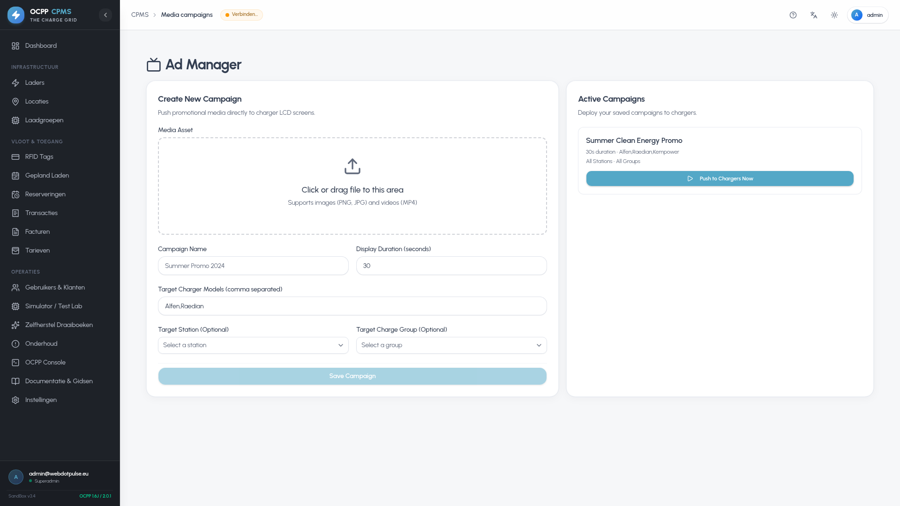

# OCPP Charge Point Management System (CPMS)
# Comprehensive User & Operator Manual

Welcome to the **OCPP-CPMS User & Operator Manual**. This manual serves as the primary operational reference for Charge Point Operators (CPOs), facility supervisors, station managers, fleet dispatchers, and administrative personnel managing the EV charging network via the Next.js Admin Dashboard and driver mobile interfaces.

---

## 📑 Table of Contents

1. [Getting Started & Authentication](#1-getting-started--authentication)
2. [Executive Dashboard & Network KPIs](#2-executive-dashboard--network-kpis)
3. [Charging Stations & 2D Ground Plan Canvas](#3-charging-stations--2d-ground-plan-canvas)
4. [Chargers, Connectors & Combiner Mode](#4-chargers-connectors--combiner-mode)
5. [User Accounts, Corporate Clients & RBAC](#5-user-accounts-corporate-clients--rbac)
6. [Active Charging Sessions & Transaction History](#6-active-charging-sessions--transaction-history)
7. [Reservations Manager](#7-reservations-manager)
8. [Tariffs & Dynamic EPEX Pricing](#8-tariffs--dynamic-epex-pricing)
9. [Invoicing ("Facturen") & SEPA Banking Exports](#9-invoicing-facturen--sepa-banking-exports)
10. [Home Reimbursements & Split-Billing](#10-home-reimbursements--split-billing)
11. [Public Walk-In Payments (Stripe & Mollie)](#11-public-walk-in-payments-stripe--mollie)
12. [Roaming Hubs: OCPI 2.2.1 & Hubject OICP](#12-roaming-hubs-ocpi-221--hubject-oicp)
13. [V2G Smart Grid & Battery Orchestration](#13-v2g-smart-grid--battery-orchestration)
14. [Hardware Reliability, Quirks & Auto-Heal](#14-hardware-reliability-quirks--auto-heal)
15. [Media Screen Campaigns](#15-media-screen-campaigns)
16. [Mobile Driver Companion Web App](#16-mobile-driver-companion-web-app)

---

## 1. Getting Started & Authentication

### 1.1 Logging In & Two-Factor Authentication (2FA)
Navigate to the CPMS dashboard URL (e.g. `https://ui.mobilitypulse.com` or `http://localhost:3002`).

* **Standard Login (`/login`):** Enter your registered corporate email and password.
* **Two-Factor Authentication (2FA TOTP):** If 2FA is active on your profile, enter the 6-digit verification code generated by Google Authenticator, Authy, or 1Password.
* **Account Recovery & Verification:** Use `/forgot-password`, `/reset-password`, and `/verify-email` for self-service credential recovery and email confirmation.

| Login Interface | User Registration | Password Reset |
| :---: | :---: | :---: |
|  |  |  |

---

## 2. Executive Dashboard & Network KPIs

The **Dashboard** (`/dashboard`) is the central operational command center for your EV charging network:

* **Executive KPI Widgets:** Instant aggregated metrics for Total Energy Delivered (kWh), Active Charging Sessions, Fleet Online Connectivity Rate, and Daily Revenue.
* **Geospatial Station Map:** Real-time Leaflet map displaying charging station locations with color-coded status pins (`Online`, `In-Use`, `Faulted`, `Offline`).
* **Active Session Live Stream:** Real-time monitor of active sessions showing elapsed duration, instantaneous charging power (kW), and delivered kWh.
* **Network Power & Load Profiles:** 24-hour visual charts tracking fleet power consumption and station utilization peaks.

---

## 3. Charging Stations & 2D Ground Plan Canvas

A **Station** represents a physical charging facility containing one or more physical charge points.

### 3.1 Managing Stations (`/stations`)
* **Station Directory:** Search stations by name, city, country, or power capacity.
* **Station Detail (`/stations/[id]`):** View site transformer limits, operating hours, linked charge points, and active session distribution.

| Stations Directory & Map | Station Detail View |
| :---: | :---: |
|  |  |

### 3.2 Interactive 2D Ground Plan Canvas
The **Ground Plan Canvas** transforms charging station oversight into an interactive digital twin:

* **Drag-and-Drop Bays:** Position parking bays, orientation angles (0° to 360°), and assign physical EVSE connectors to specific parking spots.
* **Live Bay Occupancy Monitor:** Color-coded vehicle occupancy showing whether a bay is Available (Emerald), Charging (Blue), Suspended (Amber), or Faulted (Red).

| 2D Ground Plan Builder | Live Floor Plan Monitor |
| :---: | :---: |
|  |  |

---

## 4. Chargers, Connectors & Combiner Mode

### 4.1 Fleet Directory & Unrecognized Queue
* **Fleet Directory (`/chargers`):** Full inventory of deployed charge points with live online status, active power draw, firmware version, and communication protocol (`ocpp1.6` or `ocpp2.0.1`/`ocpp2.1`).
* **Unrecognized Queue (`/chargers/unrecognized`):** Captures unauthorized or newly plugged chargers attempting to connect to the CPMS, allowing one-click onboarding and assignment.

| Chargers Fleet Directory | Unrecognized Chargers Queue |
| :---: | :---: |
|  |  |

### 4.2 Charger Detail & Remote Controls (`/chargers/[id]`)
Each charger provides granular tabs:
1. **Overview:** Connection state, last heartbeat, IP address, firmware, vendor model, and power rating.
2. **Connectors:** Individual socket status, max current, and one-click remote commands (`UnlockConnector`, `ChangeAvailability`).
3. **Transactions:** Session log for this specific hardware unit.
4. **Configuration:** Read/Write access to internal OCPP configuration keys (e.g., `MeterValueSampleInterval`, `HeartbeatInterval`).
5. **Smart Profiles:** Active charging profiles and current limits sent by the Load Management Service.
6. **Predictive Load:** Forecasted 24-hour solar absorption and EPEX cost-minimization curves.

| Charger Overview Tab | Connectors & Remote RPC |
| :---: | :---: |
|  |  |

| OCPP Configuration Tab | Predictive Load Tab |
| :---: | :---: |
|  |  |

---

## 5. User Accounts, Corporate Clients & RBAC

The **Users & Clients Hub** (`/users`) provides centralized identity and access control:

* **Users Directory:** Search across platform administrators, operators, corporate fleet managers, and individual EV drivers.
* **Corporate B2B Clients:** Manage commercial accounts with legal business registration (KvK / BCE), VAT numbers, and assigned fleet assets.
* **Roles & Capabilities Matrix:** Visual Role-Based Access Control (RBAC) defining granular capability sets.

| Users Directory | Corporate Clients Directory |
| :---: | :---: |
|  |  |

| Roles & Capabilities Matrix | RFID Driver Whitelist |
| :---: | :---: |
|  |  |

---

## 6. Active Charging Sessions & Transaction History

* **Active Live Sessions (`/transactions` - Active tab):** Real-time monitoring of all concurrent sessions across the entire network. Shows instantaneous power (kW), total consumed energy (kWh), current battery SoC (%), and running cost.
* **Historical Records (`/transactions`):** Complete searchable archive with filterable date ranges, RFID card identities, total energy delivered, and download to CSV.
* **Transaction Detail & Digital Receipt:** Itemized breakdown of energy fees, connection charges, parking duration, and applicable VAT.

| Historical Transaction Records | Live Active Sessions |
| :---: | :---: |
|  |  |

---

## 7. Reservations Manager

The **Reservations Manager** (`/reservations`) enables EV drivers and fleet operators to pre-book specific charging connectors:

* **Scheduled Windows:** Drivers select station, connector, start time, and reservation expiry.
* **OCPP Status Enforcement:** Automatically transitions the target connector to `Reserved` state, rejecting walk-in RFID attempts from unauthorized cards.
* **Automated Expiry & Cancellation:** If the driver fails to plug in within the grace window (e.g., 15 minutes), the reservation is automatically cancelled and the connector returns to `Available`.

---

## 8. Tariffs & Dynamic EPEX Pricing

The CPMS supports both structured static tariffs and dynamic spot-market pricing:

* **Pricing Components:**
  - **Energy Fee (€/kWh):** Base electricity price.
  - **Connection Fee (€):** One-off charge per initiated session.
  - **Time Fee (€/hour):** Duration-based rate applied during active charging.
  - **Idle Fee (€/minute):** Parking penalty rate applied after the vehicle battery reaches 100% SoC.
* **Dynamic EPEX Spot Pricing:** Connects directly to European day-ahead wholesale electricity markets. Hourly rates automatically adjust, allowing CPOs to pass through cheap off-peak electricity or penalize peak hours.

| Tariffs Pricing Structures | Tariff Creation Form |
| :---: | :---: |
|  |  |

---

## 9. Invoicing ("Facturen") & SEPA Banking Exports

The **Invoicing Ledger** (`/invoices`) provides a full-featured automated billing system for corporate clients and fleet drivers:

* **Monthly Billing Runs:** Automatically aggregates all completed sessions within a calendar month per corporate client.
* **Vector PDF Facturen:** One-click generation and download of professional, tax-compliant invoice PDFs with itemized transaction receipts.
* **ISO 20022 SEPA Direct Debit (`pain.008`):** Export customer collections into standardized banking XML batch files for automated debiting through European banks (ABN AMRO, ING, Rabobank, BNP Paribas).
* **SEPA Mandate Tracking:** Electronic mandate registration ensuring compliance with European Payment Council (EPC) regulations.

| Invoices Billing Ledger | SEPA Direct Debit Export Dialog |
| :---: | :---: |
|  |  |

---

## 10. Home Reimbursements & Split-Billing

The **Reimbursements Ledger** (`/reimbursements`) calculates exact financial compensation for employees who charge company lease vehicles at their private residence:

* **Split-Billing Engine:** The employee's home charger communicates session telemetry with the employer's CPMS.
* **Energy Rate Matching:** The system matches home kWh consumption against the employee's documented residential utility tariff.
* **SEPA Credit Transfer (`pain.001`):** Generates payroll reimbursement XML files for automated direct bank deposit into employee accounts.

---

## 11. Public Walk-In Payments (Stripe & Mollie)

For ad-hoc drivers without an RFID card or roaming subscription, the CPMS provides instant web-based mobile checkout (`/payments`):

* **QR Code Initiation:** The driver scans a QR code located on the charger housing to open the mobile checkout session.
* **Supported Payment Methods:**
  - **Stripe:** Global Visa, Mastercard, American Express, Apple Pay, Google Pay.
  - **Mollie:** Seamless Benelux payment methods (iDEAL, Bancontact, Belfius, KBC).
* **Pre-Authorization & Capture:** Holds an initial pre-authorization amount (e.g. €35) and captures the exact transaction cost upon session conclusion.

---

## 12. Roaming Hubs: OCPI 2.2.1 & Hubject OICP

The CPMS enables bi-directional cross-network roaming:

* **OCPI 2.2.1 Integration:** Native REST endpoints supporting `Locations`, `Sessions`, `CDRs`, and `Tokens` for automated e-clearing with platforms like e-clearing.net and Gireve.
* **Hubject Intercharge (OICP 2.3):** Full interoperability with the pan-European Hubject roaming network.
* **Roaming Test Suite (`/roaming/test-suite`):** Built-in conformance simulator to validate endpoint connectivity and token authorization before going live.

| Roaming OCPI & Hubject Hubs | Roaming Conformance Test Suite |
| :---: | :---: |
|  |  |

---

## 13. V2G Smart Grid & Battery Orchestration

The **V2G Dashboard** (`/v2g`) controls bidirectional energy flow between electric vehicles and the facility power grid:

* **Grid Peak Shaving:** Automatically commands connected V2G-capable vehicles (ISO 15118-20) to discharge power back into the facility when building consumption approaches peak capacity.
* **Minimum SoC Floor Guard:** Enforces a driver-defined minimum battery reserve (e.g., 60%) to guarantee departure range.
* **Fleet Battery Virtual Power Plant (VPP):** Aggregates connected battery storage capacity across all active V2G bays.

---

## 14. Hardware Reliability, Quirks & Auto-Heal

### 14.1 Hardware-at-Risk & Auto-Heal (`/hardware-at-risk`)
* **Anomaly Detection:** Tracks communication dropouts, heartbeat jitter, and recurring connector lock actuator failures.
* **Self-Healing Playbooks (`/auto-heal-playbooks`):** Visual workflows that trigger automated remediation (Unlock connector pin -> Soft reboot -> Hard reset -> Technician alert).

| Hardware-at-Risk Monitor | Automated Recovery Playbooks |
| :---: | :---: |
|  |  |

### 14.2 Hardware Quirk Profiles & Simulator Studio
* **Quirk Profiles (`/quirk-profiles`):** Fine-tune hardware timing rules for specific manufacturer models (Alfen, ABB, EVBox, Mennekes).
* **Simulator Studio (`/simulator`):** Digital twin simulator to test multi-protocol OCPP workflows under load without physical hardware.

| Hardware Quirk Profiles | Charger Simulator Studio |
| :---: | :---: |
|  |  |

---

## 15. Media Screen Campaigns

The **Media Screen Scheduler** (`/media-campaigns` & `/settings/ad-manager`) allows CPOs to monetize high-definition multimedia displays on modern fast chargers (Alfen Eve Double Pro, Kempower, Delta):

* **Multimedia Playlists:** Schedule promotional video clips, image banners, and station instructions.
* **Targeting Rules:** Target specific stations, charger models, or time-of-day slots.
* **OCPP DataTransfer Delivery:** Automatically bundles and dispatches media assets to charger firmware via OCPP `DataTransfer` payloads.

| Screen Ad Manager | Media Campaigns Scheduler |
| :---: | :---: |
|  |  |

---

## 16. Mobile Driver Companion Web App

The **Driver Companion** is a responsive web application (PWA) optimized for mobile smartphones (`/mobile/dashboard`):

* **Personal Driver Dashboard:** View active session status, delivered kWh, and recent receipts.
* **Live Charger Remote Controller:** Start/stop sessions directly from a smartphone screen and unlock the cable socket upon completion.
* **Interactive Station Finder:** Search nearby charging hubs, check live socket availability, and navigate with one tap.

| Mobile Dashboard | Mobile Controller | Station Live Map |
| :---: | :---: | :---: |
|  |  |  |

---

*Authored for enterprise EV charging operations — webdotpulse/GRID-OCPP-CPMS.*
