# OCPP Charge Point Management System (CPMS)
# Comprehensive User & Operator Manual

Welcome to the **OCPP-CPMS User & Operator Manual**. This manual serves as the primary operational reference for Charge Point Operators (CPOs), facility supervisors, station managers, fleet dispatchers, and administrative personnel managing the EV charging network via the Next.js Admin Dashboard and driver mobile interfaces.

---

## Table of Contents

1. [Getting Started & Authentication](#1-getting-started--authentication)
2. [Executive Dashboard & Network KPIs](#2-executive-dashboard--network-kpis)
3. [Charging Stations & 2D Ground Plan Canvas](#3-charging-stations--2d-ground-plan-canvas)
4. [Chargers, Connectors & Combiner Mode](#4-chargers-connectors--combiner-mode)
5. [User Accounts, Corporate Clients & RBAC](#5-user-accounts-corporate-clients--rbac)
6. [Active Charging Sessions & Transaction History](#6-active-charging-sessions--transaction-history)
7. [Reservations Manager](#7-reservations-manager)
8. [Tariffs & Dynamic EPEX Pricing](#8-tariffs--dynamic-epex-pricing)
9. [Invoicing ("Facturen") & SEPA Banking Exports](#9-invoicing-facturen--sepa-banking-exports)
10. [Home Reimbursements & Split-Billing](#10-home-reimbursements--split-billing)
11. [Public Walk-In Payments (Stripe & Mollie)](#11-public-walk-in-payments-stripe--mollie)
12. [Roaming Hubs: OCPI 2.2.1 & Hubject OICP](#12-roaming-hubs-ocpi-221--hubject-oicp)
13. [V2G Smart Grid & Battery Orchestration](#13-v2g-smart-grid--battery-orchestration)
14. [Hardware Reliability, Quirks & Auto-Heal](#14-hardware-reliability-quirks--auto-heal)
15. [Media Screen Campaigns](#15-media-screen-campaigns)
16. [Mobile Driver Companion Web App](#16-mobile-driver-companion-web-app)

---

## 1. Getting Started & Authentication

### 1.1 Logging In & Two-Factor Authentication (2FA)
Navigate to the CPMS dashboard URL (e.g. `https://ui.mobilitypulse.com` or `http://localhost:3002`).

* **Standard Login (`/login`):** Enter your registered corporate email and password.
* **Two-Factor Authentication (2FA TOTP):** If 2FA is active on your profile, enter the 6-digit verification code generated by Google Authenticator, Authy, or 1Password.
* **Account Recovery & Verification:** Use `/forgot-password`, `/reset-password`, and `/verify-email` for self-service credential recovery and email confirmation.

| Login Interface | User Registration | Password Reset |
| :---: | :---: | :---: |
|  | 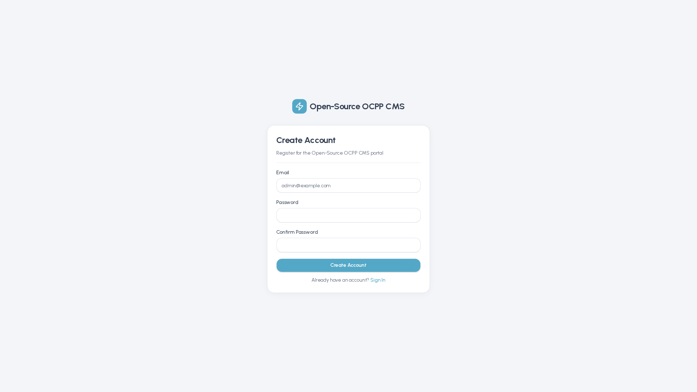 | 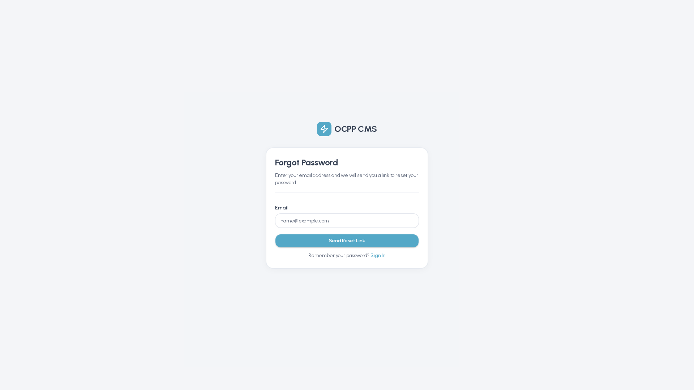 |

---

## 2. Executive Dashboard & Network KPIs

The **Dashboard** (`/dashboard`) is the central operational command center for your EV charging network:

* **Executive KPI Widgets:** Instant aggregated metrics for Total Energy Delivered (kWh), Active Charging Sessions, Fleet Online Connectivity Rate, and Daily Revenue.
* **Geospatial Station Map:** Real-time Leaflet map displaying charging station locations with color-coded status pins (`Online`, `In-Use`, `Faulted`, `Offline`).
* **Active Session Live Stream:** Real-time monitor of active sessions showing elapsed duration, instantaneous charging power (kW), and delivered kWh.
* **Network Power & Load Profiles:** 24-hour visual charts tracking fleet power consumption and station utilization peaks.

---

## 3. Charging Stations & 2D Ground Plan Canvas

A **Station** represents a physical charging facility containing one or more physical charge points.

### 3.1 Managing Stations (`/stations`)
* View all station locations in an interactive directory with map integration and instant search.
* Create or edit stations with full street address, GPS coordinates, opening hours, electrical connection limits, and emergency contact details.

| Stations Directory & Map | Create New Station Form | Station Details View |
| :---: | :---: | :---: |
|  | 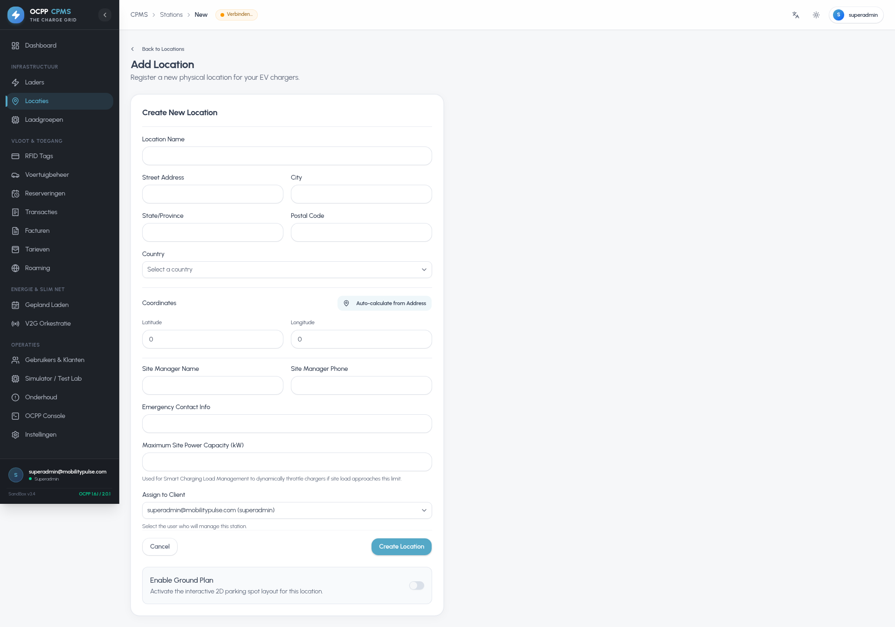 | 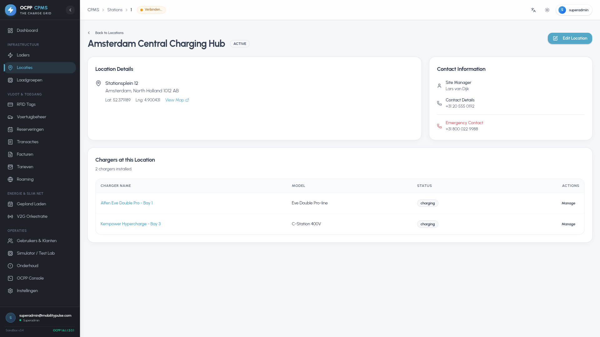 |

### 3.2 2D Ground Plan Layout Builder & Live Floor Monitor
Enable Ground Plan on any station to access the interactive 2D parking layout canvas:

1. **2D Layout Builder (`/stations/[id]/ground-plan`):** Drag and drop parking bays, rotate bays at 45° angles, draw pedestrian walkways and canopy shelters, link physical charger connectors to bays, and draw electrical grid topology cabling from main switchboards to EVSEs.
2. **Live Floor Monitor (`/stations/[id]/live`):** Observe live bay occupancy, active charging telemetry (kW / kWh), 3-phase currents (L1, L2, L3), and driver RFID tag IDs displayed in glowing glassmorphism tiles.

| Ground Plan 2D Builder | Live Floor Plan Monitor |
| :---: | :---: |
|  |  |

---

## 4. Chargers, Connectors & Combiner Mode

### 4.1 Fleet Directory (`/chargers`)
The Chargers directory tracks all physical charging hardware connected to the central system:
* Real-time OCPP connection state, firmware version, vendor, model, serial number, and assigned station.
* Quick filters for charger status: `Available`, `Charging`, `SuspendedEVSE`, `Faulted`, `Offline`.

| Fleet Directory | Register New Charger | Unrecognized Queue |
| :---: | :---: | :---: |
|  | 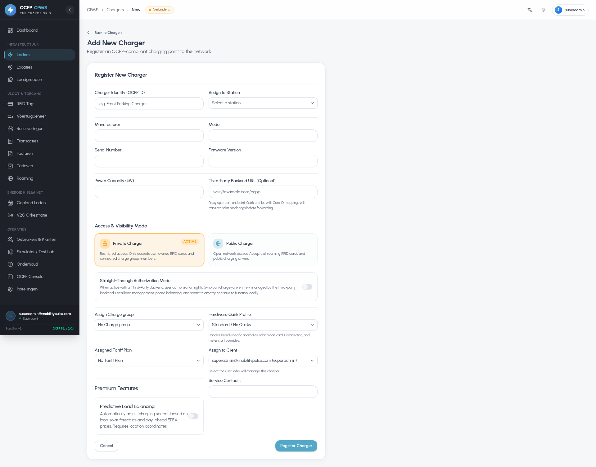 | 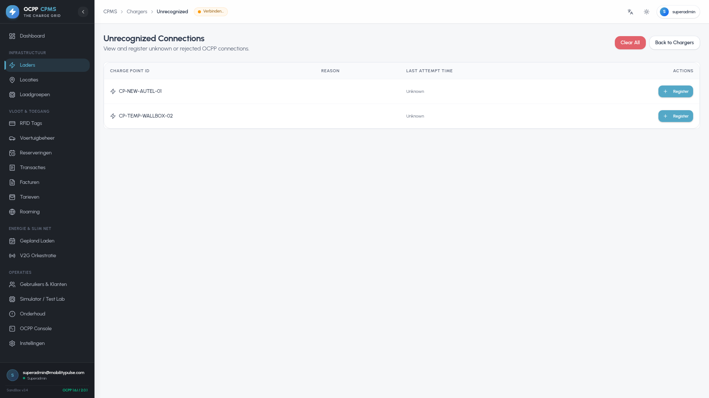 |

### 4.2 Charger Detail & Remote Control (`/chargers/[id]`)
Opening any charger record provides full telemetry tabs:
* **Overview:** Key metrics, active connector status, and immediate remote control actions (Remote Start/Stop, Soft/Hard Reset, Unlock Connector, Change Availability).
* **Connectors:** Detailed plug configuration (Type 2, CCS2, CHAdeMO, AC/DC, max voltage/power).
* **Transactions:** Complete history of sessions initiated on this charger.
* **Configuration:** Standard OCPP parameter inspector and editor.
* **Profiles:** Active charging schedules and smart load profiles (IDs 100, 101, 200, 300).
* **Predictive Load:** Rolling 24-hour solar balancing forecast.

| Charger Detail Overview | Connectors Tab | Predictive Load Tab |
| :---: | :---: | :---: |
|  | 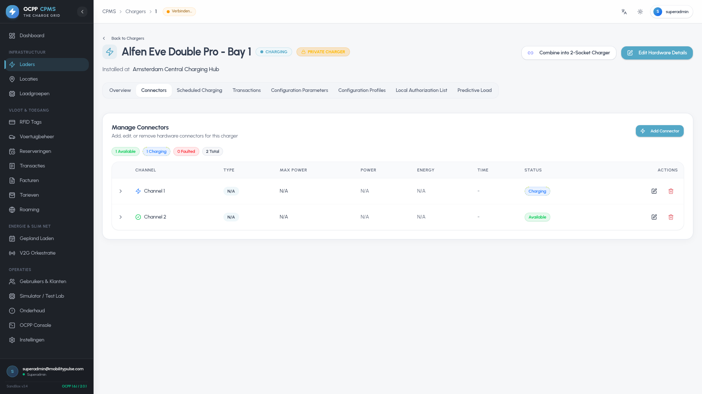 |  |

### 4.3 Straight-Through Proxy & Dual-Socket Combiner
* **Straight-Through Proxy:** Forward all OCPP traffic to an external upstream CPO backend while maintaining local logging, card mapping, and real-time monitoring.
* **Charger Combiner:** Combine two single-socket physical charge points into a unified dual-channel virtual charger (Primary = Channel 1, Secondary = Channel 2), handling connector ID translation transparently.

---

## 5. User Accounts, Corporate Clients & RBAC

### 5.1 Users, Clients & Role Management (`/users`)
* **🏢 Corporate B2B Clients:** Business entities, fleet accounts, VAT/KvK numbers, billing addresses, SEPA mandates, assigned stations/chargers, and linked drivers.
* **👥 Users (Individual Accounts):** Login credentials, 2FA security status, assigned role tier, personal RFID cards, and vehicle profiles.
* **5-Tier Role Hierarchy:** Superadmin, Admin, Operator / Technician, Client Admin, and User / EV Driver.

| Users Directory | Corporate B2B Clients | Roles & Permissions Matrix |
| :---: | :---: | :---: |
|  |  |  |

### 5.2 RFID Whitelist Management (`/rfid`)
* Register RFID cards by **idTag** number.
* Map cards to user accounts, corporate clients, and vehicle energy profiles.
* Enable or disable cards instantly with real-time hardware cache invalidation.

| RFID Whitelist Directory | Register New RFID Card | RFID Tag Details |
| :---: | :---: | :---: |
|  | 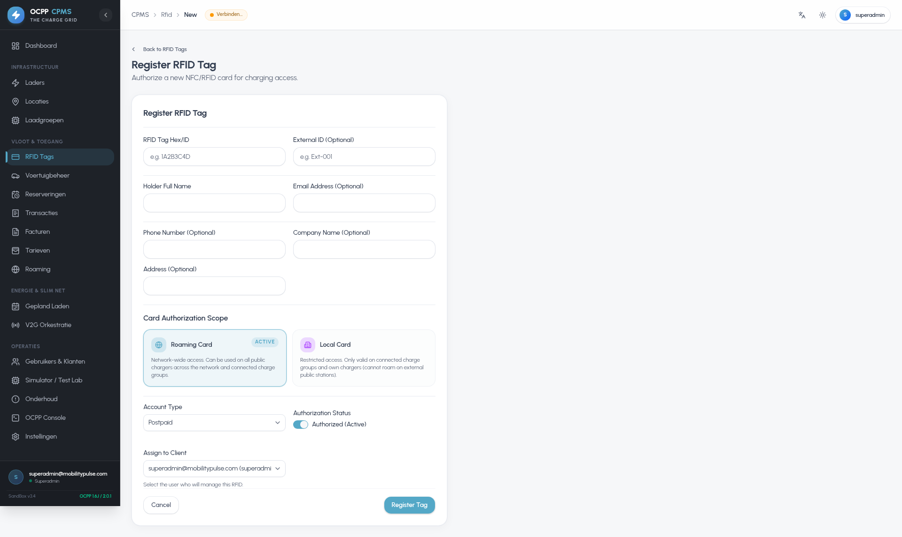 | 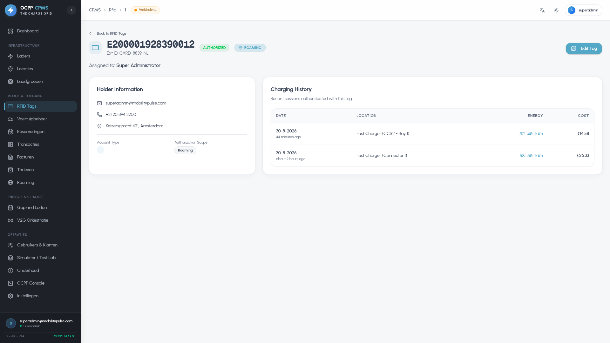 |

### 5.3 ISO 15118 Plug & Charge (`/vehicle-identity-management`)
* Manage vehicle contract certificates (EMAID), OEM provisioning certificates, and root CA trust stores.
* Automatically authorize charging sessions as soon as the ISO 15118-compatible vehicle is plugged in.

---

## 6. Active Charging Sessions & Transaction History

* **Active Sessions (`/transactions/active`):** Live view of all active charging sessions across the network with elapsed duration, current wattage, delivered energy (kWh), and real-time cost accumulation.
* **Completed Transactions (`/transactions`):** Historical ledger with filtering by date range, station, charger, user, and payment status.
* **Detailed Receipts:** Itemized breakdown of energy rates, connection fees, time/idle penalties, and VAT.

| Live Active Sessions | Transaction History Ledger | Detailed Session Receipt |
| :---: | :---: | :---: |
|  |  | 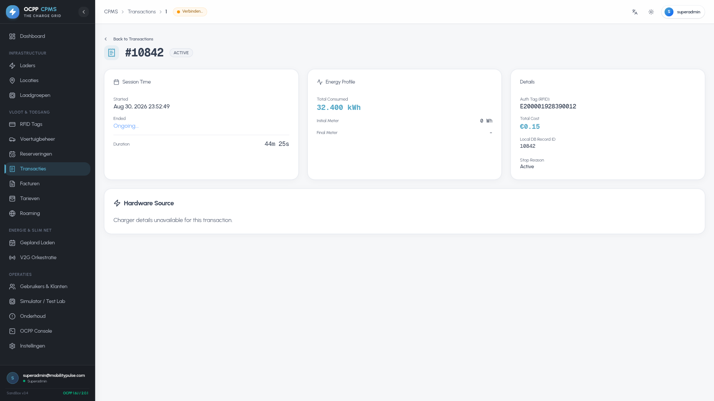 |

---

## 7. Reservations Manager

The **Reservations Manager** (`/reservations`) allows operators and drivers to schedule exclusive charging windows:
* Reserve specific EVSE connectors for scheduled arrival times.
* Configurable reservation expiry windows and automatic cancellation on no-show.
* Real-time connector state transition to `Reserved` via OCPP `ReserveNow` RPCs.

---

## 8. Tariffs & Dynamic EPEX Pricing

### 8.1 Tariff Structures (`/tariffs`)
Define flexible 4-part pricing matrices:
1. **Connection Fee (€):** One-time starting fee applied when charging commences.
2. **Energy Fee (€/kWh):** Flat price per kWh consumed or linked to dynamic wholesale rates.
3. **Time Fee (€/hour):** Surcharge based on active plug duration.
4. **Idle Fee (€/hour):** Penalty fee applied after charging is complete but cable remains connected.

| Tariffs Pricing Structures | Create New Tariff | Edit Tariff Form |
| :---: | :---: | :---: |
|  | 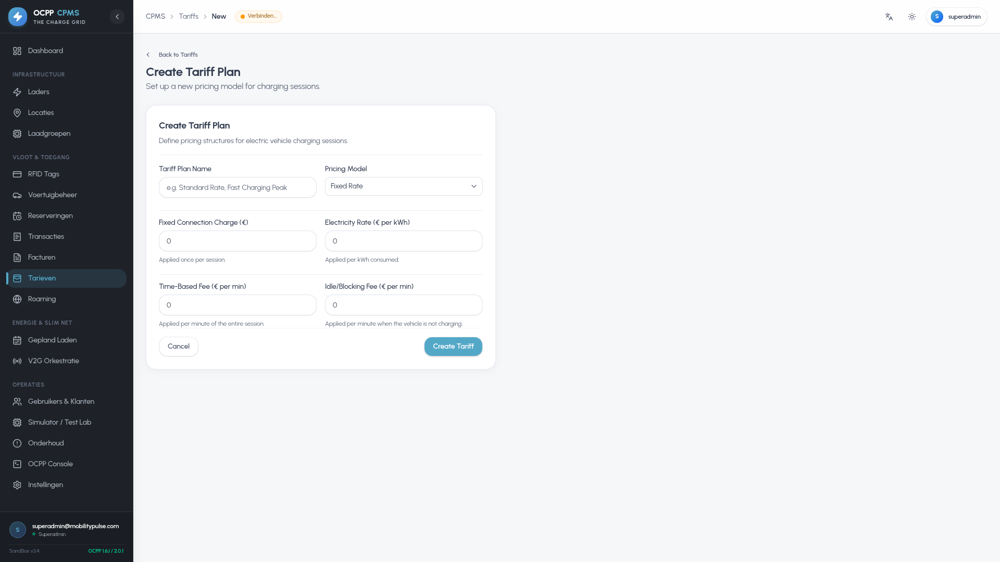 | 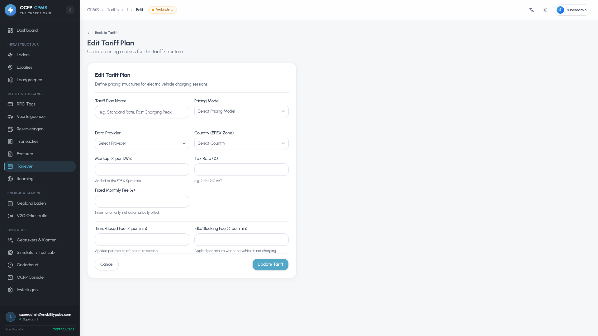 |

---

## 9. Invoicing ("Facturen") & SEPA Banking Exports

The platform provides a complete enterprise billing suite under `/invoices` (localized as **Facturen**):

* **Billing Ledger (`/invoices`):** Aggregated turnover, subtotal, and 21% VAT metrics across billing cycles.
* **Batch Generation Wizard:** Consolidates unbilled completed sessions across a selected month into formalized corporate tax invoices.
* **Itemized Invoice View:** Line-item session breakdowns with PDF export and direct email dispatch.
* **SEPA Direct Debit Mandates:** Track B2B and CORE Direct Debit mandates (UMR, debtor IBAN/BIC, signature validation).
* **ISO 20022 SEPA Direct Debit XML Export (`pain.008.001.02`):** Generate banking direct debit batch files for direct upload to banking portals (ABN AMRO, ING, Rabobank, BNP Paribas).

| Invoicing Ledger | Batch Generate Wizard | SEPA Direct Debit Export |
| :---: | :---: | :---: |
|  |  |  |

---

## 10. Home Reimbursements & Split-Billing

The **Reimbursements** module (`/reimbursements`) calculates employee home charging expenses:
* Links employee drivers, home chargers, residential electricity tariffs, and payout IBANs.
* Aggregates monthly home kWh and calculates net reimbursement amounts due.
* Exports banking-compliant **ISO 20022 SEPA Credit Transfer XML** (`pain.001.001.03`) for single-batch corporate payouts.

---

## 11. Public Walk-In Payments (Stripe & Mollie)

For walk-in drivers without subscriptions, the CPMS provides instant ad-hoc checkout:
* **Stripe Integration:** Settle via Credit/Debit Cards (Visa, Mastercard, Amex), Apple Pay, Google Pay, and SEPA Credit.
* **Mollie Integration:** European local payment methods including iDEAL 2.0, Bancontact, EPS, KBC/CBC, and Belfius.
* **Public Checkout Portal (`/payments`):** Scan station QR code to select payment provider and authorize charging.

---

## 12. Roaming Hubs: OCPI 2.2.1 & Hubject OICP

* **OCPI 2.2.1 (`/roaming`):** Full bidirectional roaming for Locations, Tariffs, Sessions, Tokens, and CDRs.
* **Hubject OICP 2.3:** Real-time EVSE status synchronization and Charge Detail Record (CDR) submission via BullMQ event workers.
* **Roaming Settlement Visualizer:** Track wholesale roaming costs vs retail revenue and export clearinghouse reports.

| OCPI Roaming Hubs | Hubject OICP Roaming | Roaming Settlement Visualizer |
| :---: | :---: | :---: |
|  |  |  |

---

## 13. V2G Smart Grid & Battery Orchestration

The **V2G Battery Orchestration** module (`/v2g`) allows bidirectional energy management:
* Configure minimum battery State-of-Charge (SoC) reserve levels to protect driver mobility.
* Coordinate vehicle-to-grid power discharge back into corporate facilities during peak grid tariff hours.
* Monitor fleet total storage capacity, active discharge rate, and arbitrage revenue.

---

## 14. Hardware Reliability, Quirks & Auto-Heal

* **Quirk Profiles (`/quirk-profiles`):** Correct hardware-specific non-compliances (missing active power, raw multiplier scaling, energy integration, card ID rewriting).
* **Hardware-at-Risk (`/hardware-at-risk`):** Automated scanner detecting silent failures with auto-heal recovery sequences.
* **Live Packet Inspector (`/ocpp`):** Real-time JSON-RPC frame debugger with schema validation and payload inspection.

| Quirk Profiles | Hardware at Risk | Packet Inspector Console |
| :---: | :---: | :---: |
|  |  |  |

---

## 15. Media Screen Campaigns

The **Media Campaigns** scheduler (`/media-campaigns`) distributes multimedia advertisements to chargers equipped with digital displays:
* Upload promotional images and video assets.
* Target campaigns by station, charge group, or geographic region.
* Define start/end dates and daily broadcast time windows.

---

## 16. Mobile Driver Companion Web App

A responsive mobile web experience (`/mobile`) tailored for smartphone browsers:
* **Mobile Dashboard (`/mobile/dashboard`):** Active session widget, quick station finder, and recent charging receipts.
* **Fleet Directory (`/mobile/chargers`):** List of available chargers with connector plug types and live status badges.
* **Remote Controller (`/mobile/chargers/[id]`):** Start and stop charging sessions directly from the smartphone.
* **Geospatial Map (`/mobile/map`):** Interactive GPS navigation and route guidance to nearby charging hubs.
* **Driver Settings (`/mobile/settings`):** Account preferences, payment methods, and vehicle profiles.

| Mobile Dashboard | Mobile Fleet Directory | Mobile Remote Controller | Mobile Station Map |
| :---: | :---: | :---: | :---: |
|  |  |  |  |

---
*Authored for EV Charging Operators & Fleet Managers — webdotpulse/GRID-OCPP-CPMS.*
