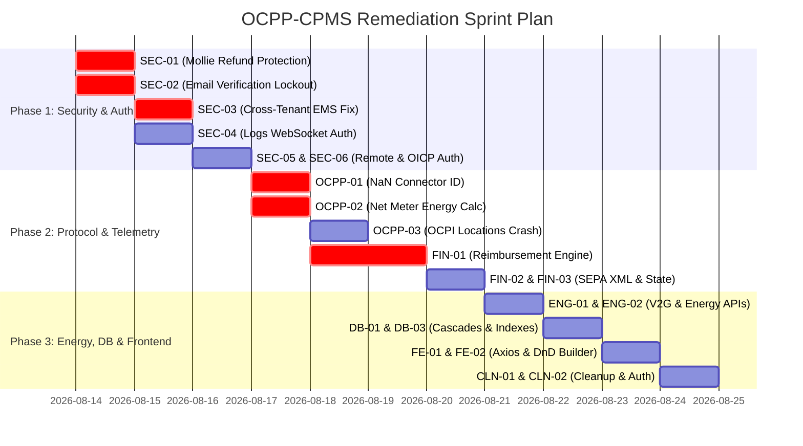

# Comprehensive System Audit & Remediation Plan: OCPP-CPMS

**Repository:** `webdotpulse/OCPP-CPMS`  
**Date:** August 13, 2026  
**Auditor:** Antigravity (Google DeepMind Advanced Agentic AI)  
**Scope:** Full-stack Architecture, OCPP 1.6-J / 2.0.1 / 2.1 Compliance, Database Integrity, Security & Tenant Isolation, Telemetry & Load Balancing, Financial Transactions (Mollie / SEPA), and Frontend UX/UI.

---

## Executive Summary & System Health Matrix

The OCPP-CPMS repository is an enterprise-grade Centralized Charging Point Management System featuring multi-protocol OCPP support (1.6-J, 2.0.1, and draft 2.1), real-time WebSockets, dynamic EPEX spot pricing, predictive solar load balancing, SEPA XML ISO 20022 export, Mollie payment processing, and interactive station ground plans.

While the foundational architecture and modular design are strong, several **critical security vulnerabilities, protocol logic flaws, telemetry corruptions, and missing background services** were uncovered that must be resolved prior to production deployment.

### System Health Matrix

| Domain | Status | Critical Issues | High Issues | Medium Issues | Health Rating |
| :--- | :---: | :---: | :---: | :---: | :---: |
| **Security & Authentication** | 🔴 Action Required | 2 | 3 | 2 | 4.5 / 10 |
| **OCPP Protocol & Sessions** | 🟠 Needs Attention | 1 | 3 | 2 | 6.0 / 10 |
| **Telemetry & Meter Values** | 🟠 Needs Attention | 1 | 2 | 1 | 6.5 / 10 |
| **Billing, SEPA & Mollie** | 🔴 Action Required | 1 | 2 | 1 | 5.0 / 10 |
| **Smart Charging, EPEX & V2G**| 🟡 Moderate Risk | 0 | 2 | 2 | 7.0 / 10 |
| **Database & Schema Integrity**| 🟡 Moderate Risk | 0 | 3 | 2 | 7.5 / 10 |
| **Frontend Architecture & UX**| 🟡 Moderate Risk | 0 | 3 | 3 | 7.5 / 10 |
| **Code Hygiene & Stray Files** | 🟢 Minor | 0 | 0 | 3 | 8.5 / 10 |

---

## Table of Contents

1. [Security & Authorization Vulnerabilities](#1-security--authorization-vulnerabilities)
   - [SEC-01: Publicly Exposed Mollie Refund API](#sec-01-publicly-exposed-mollie-refund-api)
   - [SEC-02: Permanent User Lockout on Registration](#sec-02-permanent-user-lockout-on-registration)
   - [SEC-03: Cross-Tenant EMS Hardware Token Authorization Bypass](#sec-03-cross-tenant-ems-hardware-token-authorization-bypass)
   - [SEC-04: Unauthenticated OCPP Live Logs WebSocket Stream](#sec-04-unauthenticated-ocpp-live-logs-websocket-stream)
   - [SEC-05: Missing Remote Command Ownership Authorization](#sec-05-missing-remote-command-ownership-authorization)
   - [SEC-06: Unauthenticated OICP Endpoint CRUD & SSRF Risk](#sec-06-unauthenticated-oicp-endpoint-crud--ssrf-risk)
2. [OCPP Protocol, Session Lifecycle & Telemetry Bugs](#2-ocpp-protocol-session-lifecycle--telemetry-bugs)
   - [OCPP-01: `NaN` Connector ID on StopTransaction in OCPP 1.6](#ocpp-01-nan-connector-id-on-stoptransaction-in-ocpp-16)
   - [OCPP-02: Cumulative Lifetime Meter Corruption in Active Sessions](#ocpp-02-cumulative-lifetime-meter-corruption-in-active-sessions)
   - [OCPP-03: OCPI 2.2.1 Locations Endpoint Fatal Property Access Crash](#ocpp-03-ocpi-221-locations-endpoint-fatal-property-access-crash)
   - [OCPP-04: Session Table Duplication (Transaction vs RfidSession)](#ocpp-04-session-table-duplication-transaction-vs-rfidsession)
   - [OCPP-05: Blocking Redis `KEYS` Pattern in Multi-Pod Charger Registry](#ocpp-05-blocking-redis-keys-pattern-in-multi-pod-charger-registry)
3. [Billing, Tariffs & Financial Operations (Mollie / SEPA)](#3-billing-tariffs--financial-operations-mollie--sepa)
   - [FIN-01: Empty `reimbursementCron.ts` & Missing Monthly kWh Ledger Calculation](#fin-01-empty-reimbursementcronts--missing-monthly-kwh-ledger-calculation)
   - [FIN-02: XML Injection Risk & Missing Entity Escaping in SEPA ISO 20022 Generator](#fin-02-xml-injection-risk--missing-entity-escaping-in-sepa-iso-20022-generator)
   - [FIN-03: Non-Idempotent SEPA Export State Progression](#fin-03-non-idempotent-sepa-export-state-progression)
   - [FIN-04: Missing Dynamic EPEX Tariff Auto-Calculation on Session Termination](#fin-04-missing-dynamic-epex-tariff-auto-calculation-on-session-termination)
4. [Smart Charging, Energy Services & V2G Orchestration](#4-smart-charging-energy-services--v2g-orchestration)
   - [ENG-01: Orphaned V2G Orchestration Service & State-of-Charge Calculation Bug](#eng-01-orphaned-v2g-orchestration-service--state-of-charge-calculation-bug)
   - [ENG-02: Missing Frontend Energy Profile Endpoints for V2G SoC Slider](#eng-02-missing-frontend-energy-profile-endpoints-for-v2g-soc-slider)
   - [ENG-03: Daylight Savings Time & Timezone Handling in EPEX Spot Ingestion](#eng-03-daylight-savings-time--timezone-handling-in-epex-spot-ingestion)
5. [Database Schema & Data Integrity](#5-database-schema--data-integrity)
   - [DB-01: Foreign Key Cascade Constraints Blocking Charger & Station Deletion](#db-01-foreign-key-cascade-constraints-blocking-charger--station-deletion)
   - [DB-02: Duplicate Vehicle Certificate Controllers (`vehicles` vs `vcc`)](#db-02-duplicate-vehicle-certificate-controllers-vehicles-vs-vcc)
   - [DB-03: Missing Database Indexes on High-Volume Telemetry & Log Tables](#db-03-missing-database-indexes-on-high-volume-telemetry--log-tables)
6. [Frontend Architecture, State & UX Issues](#6-frontend-architecture-state--ux-issues)
   - [FE-01: Axios Response Interceptor Overwrites Pagination Metadata](#fe-01-axios-response-interceptor-overwrites-pagination-metadata)
   - [FE-02: Ground Plan DnD Kit Drag-Rotation CSS Overwrite Bug](#fe-02-ground-plan-dnd-kit-drag-rotation-css-overwrite-bug)
   - [FE-03: Hardcoded Analytics CSV Field Name & Inactive Charger Status Filter](#fe-03-hardcoded-analytics-csv-field-name--inactive-charger-status-filter)
7. [Code Quality, Stray Files & Tech Debt](#7-code-quality-stray-files--tech-debt)
   - [CLN-01: Leftover `.orig` Merge Artifacts in Source Tree](#cln-01-leftover-orig-merge-artifacts-in-source-tree)
   - [CLN-02: Unchecked Non-Admin Write Blanket Blocker in Auth Middleware](#cln-02-unchecked-non-admin-write-blanket-blocker-in-auth-middleware)

---

# 1. Security & Authorization Vulnerabilities

---

### SEC-01: Publicly Exposed Mollie Refund API
- **Severity**: 🔴 **CRITICAL** (CVSS 9.8)
- **Impacted Files**:
  - [`Backend/src/app.ts:L111`](file:///home/koenaelbrecht/NewGit/OCPP-CPMS/Backend/src/app.ts#L111)
  - [`Backend/src/api/payments/payments.routes.ts:L12`](file:///home/koenaelbrecht/NewGit/OCPP-CPMS/Backend/src/api/payments/payments.routes.ts#L12)
  - [`Backend/src/api/payments/payments.controller.ts:L54-L78`](file:///home/koenaelbrecht/NewGit/OCPP-CPMS/Backend/src/api/payments/payments.controller.ts#L54-L78)
- **Problem & Root Cause**:
  In `app.ts`, authentication middleware was explicitly stripped: `app.use("/api/payments", paymentsRoutes); // Removed auth for initial testing`. In `payments.routes.ts`, `router.post("/refund", handleRefund);` has no JWT or admin check. Any anonymous internet user can submit `POST /api/payments/refund` with an arbitrary `paymentId` and `amount` and drain the merchant's Mollie account through arbitrary refunds.
- **Proposed Solution**:
  1. Add `authenticateToken` and `requireAdmin` (or `requireSuperAdmin`) middleware to the `/refund` endpoint.
  2. Validate that the payment transaction belongs to an authorized tenant before invoking `MollieService.refundPayment`.

```markdown
#### 🤖 Ready-to-Use Antigravity Prompt (SEC-01)
```text
Fix the critical security vulnerability on the Mollie payments refund endpoint in the Backend.
1. In Backend/src/api/payments/payments.routes.ts, import authenticateToken and requireAdmin from ../../middleware/auth.js.
2. Protect the router.post("/refund", handleRefund) route with authenticateToken and requireAdmin so anonymous callers cannot issue refunds.
3. In Backend/src/api/payments/payments.controller.ts handleRefund function, verify that the caller is an authenticated admin/superadmin, and add input validation for paymentId (string) and amount (positive number string with 2 decimal places).
4. Verify in Backend/src/app.ts that payments routes are properly protected or routes requiring webhooks (e.g. POST /webhook) remain unauthenticated while all sensitive endpoints (create-payment-intent, refund) enforce authenticateToken.
```
```

---

### SEC-02: Permanent User Lockout on Registration
- **Severity**: 🔴 **CRITICAL** (Showstopper Authentication Bug)
- **Impacted Files**:
  - [`Backend/src/api/auth/auth.controller.ts:L47-L77`](file:///home/koenaelbrecht/NewGit/OCPP-CPMS/Backend/src/api/auth/auth.controller.ts#L47-L77)
  - [`Backend/src/api/auth/auth.controller.ts:L230-L235`](file:///home/koenaelbrecht/NewGit/OCPP-CPMS/Backend/src/api/auth/auth.controller.ts#L230-L235)
  - [`Backend/src/api/auth/auth.routes.ts`](file:///home/koenaelbrecht/NewGit/OCPP-CPMS/Backend/src/api/auth/auth.routes.ts)
- **Problem & Root Cause**:
  When a new user registers via `POST /api/auth/register`, their account is created with `emailVerified: false`. The API response instructs the user to *"Please verify your email before logging in"*. However:
  1. No verification token is generated or saved.
  2. No email verification link is dispatched.
  3. There is **no verification route or controller method** anywhere in the backend (`/api/auth/verify-email`).
  4. On login (`POST /api/auth/login`), `if (!user.emailVerified) return res.status(403).json({ error: "Email verification required" });`.
  Consequently, **100% of newly registered users are permanently locked out** of the system.
- **Proposed Solution**:
  1. Add `verificationToken` and `verificationExpires` to `schema.prisma` or generate a signed JWT verification token.
  2. Create a `/api/auth/verify-email` GET/POST endpoint to validate the token and set `emailVerified: true`.
  3. If email verification is optional or disabled in development, check `config.requireEmailVerification` (defaulting to `false` if no SMTP mailer is configured, or automatically verifying if disabled).

```markdown
#### 🤖 Ready-to-Use Antigravity Prompt (SEC-02)
```text
Fix the permanent user lockout bug in user registration and email verification:
1. In Backend/src/api/auth/auth.controller.ts and Backend/src/api/auth/auth.routes.ts:
   - Implement an email verification workflow: generate a secure email verification token (or signed JWT containing userId and purpose 'email-verification') upon registration.
   - Implement verifyEmail controller function and route GET /api/auth/verify-email (and POST /api/auth/resend-verification).
   - If an SMTP service is not configured (or in development environment), allow emailVerified to default to true or auto-verify, configurable via config.requireEmailVerification.
2. In Backend/src/api/auth/auth.controller.ts login function, ensure clear error messages and include a resendVerification option if email verification is enabled and unverified.
3. Update Frontend/lib/api.ts and authentication pages to support the verification link flow.
```
```

---

### SEC-03: Cross-Tenant EMS Hardware Token Authorization Bypass
- **Severity**: 🔴 **CRITICAL** (Broken Object Level Authorization / BOLA)
- **Impacted Files**:
  - [`Backend/src/api/ems-gateways/ems-gateways.controller.ts:L218-L255`](file:///home/koenaelbrecht/NewGit/OCPP-CPMS/Backend/src/api/ems-gateways/ems-gateways.controller.ts#L218-L255)
- **Problem & Root Cause**:
  The endpoint `POST /api/ems-gateways/set-profile` is authenticated with `x-gateway-token`. The controller looks up the gateway matching the token, but then reads `chargerId` from `req.body` and immediately calls `setChargingProfile` without verifying that the charger belongs to the user/client owning the EMS gateway (`gateway.client_id === charger.owner_id`). A malicious or misconfigured EMS device can throttle, disable, or alter charging profiles on any customer's charger across the platform.
- **Proposed Solution**:
  Query the `charger` table for `charger_id: req.body.chargerId` and verify `charger.owner_id === gateway.client_id` (or verify that the charger is linked to the same charge group or site). Reject with `403 Forbidden` if there is a tenant mismatch.

```markdown
#### 🤖 Ready-to-Use Antigravity Prompt (SEC-03)
```text
Fix the cross-tenant authorization bypass in Backend/src/api/ems-gateways/ems-gateways.controller.ts in setChargingProfileFromEms:
1. When an EMS gateway sends a request with x-gateway-token and chargerId, fetch the target charger from prisma.charger.findUnique.
2. Check that the charger exists and verify that charger.owner_id matches gateway.client_id (or belongs to the same chargeGroup/station managed by the gateway owner).
3. If the charger does not belong to the gateway owner, reject the request with HTTP 403 Forbidden and log an authorization warning.
4. Ensure appropriate unit tests cover this authorization check.
```
```

---

### SEC-04: Unauthenticated OCPP Live Logs WebSocket Stream
- **Severity**: 🟠 **HIGH** (Information Disclosure & Credential Leak)
- **Impacted Files**:
  - [`Backend/src/ocpp/logsWebSocket.ts:L16-L23`](file:///home/koenaelbrecht/NewGit/OCPP-CPMS/Backend/src/ocpp/logsWebSocket.ts#L16-L23)
  - [`Backend/src/ocpp/logsWebSocket.ts:L55-L76`](file:///home/koenaelbrecht/NewGit/OCPP-CPMS/Backend/src/ocpp/logsWebSocket.ts#L55-L76)
- **Problem & Root Cause**:
  The WebSocket server for live logs (`/api/ocpp-logs`) performs no authentication during the HTTP upgrade or handshake. Any unauthenticated client on the network can establish a WebSocket connection and immediately receive the last 50 OCPP messages and all live incoming messages across all chargers, exposing RFID idTags, credentials, serial numbers, and internal IP addresses.
- **Proposed Solution**:
  1. Extract the `token` from the query string (e.g. `/api/ocpp-logs?token=...`) or `Authorization` header during `server.on("upgrade")`.
  2. Verify the JWT token using `jwt.verify(token, config.jwtSecret)` and verify that the user has `admin` or `superadmin` role. If invalid, reject the upgrade with `HTTP 401/403`.

```markdown
#### 🤖 Ready-to-Use Antigravity Prompt (SEC-04)
```text
Secure the live OCPP logs WebSocket server in Backend/src/ocpp/logsWebSocket.ts:
1. In start(server: http.Server), inspect the HTTP upgrade request for request.url starting with "/api/ocpp-logs".
2. Parse the query parameters or Authorization header to extract the JWT token.
3. Validate the JWT token with jwt.verify using config.jwtSecret. Check that the decoded user role is 'admin' or 'superadmin'.
4. If unauthorized, reject the upgrade by writing an HTTP 401/403 response on socket and closing the socket immediately (socket.write('HTTP/1.1 401 Unauthorized\r\n\r\n'); socket.destroy()).
5. Update Frontend/app/ocpp/page.tsx to pass the stored auth token in the WebSocket connection URL.
```
```

---

### SEC-05: Missing Remote Command Ownership Authorization
- **Severity**: 🟠 **HIGH** (BOLA in Remote Control Actions)
- **Impacted Files**:
  - [`Backend/src/api/ocpp/ocpp.controller.ts:L22-L375`](file:///home/koenaelbrecht/NewGit/OCPP-CPMS/Backend/src/api/ocpp/ocpp.controller.ts#L22-L375)
- **Problem & Root Cause**:
  Endpoints in `ocpp.controller.ts` (`/remote-start`, `/remote-stop`, `/reset`, `/unlock`, `/set-charging-profile`, `/update-firmware`) take `chargerId` in `req.body`. While protected by `authenticateToken`, they **do not check whether the calling user owns the charger** if the user has role `user` or `admin`. An authenticated customer could remotely reset or stop transactions on chargers owned by other customers.
- **Proposed Solution**:
  Create an authorization helper function `verifyChargerAccess(chargerId, req.userId, req.userRole)` that checks `charger.owner_id === req.userId` unless the user is `superadmin`. Enforce this check in all remote control methods.

```markdown
#### 🤖 Ready-to-Use Antigravity Prompt (SEC-05)
```text
Add ownership authorization checks to all remote control actions in Backend/src/api/ocpp/ocpp.controller.ts:
1. Implement a helper verifyChargerOwnership(chargerId: number, userId: number, userRole: string): Promise<boolean>.
2. If userRole is 'superadmin', allow access. If userRole is 'admin' or 'user', verify that prisma.charger.findFirst({ where: { charger_id: chargerId, owner_id: userId } }) exists.
3. Apply this verification check across:
   - remoteStart
   - remoteStop
   - resetChargerController
   - unlockConnectorController
   - setChargingProfileController
   - clearChargingProfileController
   - setChargerConfiguration
   - changeAvailabilityController
   - updateFirmwareController
   - getDiagnosticsController
4. Return HTTP 403 Forbidden if the user does not own the charger.
```
```

---

### SEC-06: Unauthenticated OICP Endpoint CRUD & SSRF Risk
- **Severity**: 🟠 **HIGH** (Server-Side Request Forgery & Tampering)
- **Impacted Files**:
  - [`Backend/src/app.ts:L113`](file:///home/koenaelbrecht/NewGit/OCPP-CPMS/Backend/src/app.ts#L113)
  - [`Backend/src/api/oicp/oicp.routes.ts`](file:///home/koenaelbrecht/NewGit/OCPP-CPMS/Backend/src/api/oicp/oicp.routes.ts)
  - [`Backend/src/api/oicp/oicp.controller.ts:L66-L94`](file:///home/koenaelbrecht/NewGit/OCPP-CPMS/Backend/src/api/oicp/oicp.controller.ts#L66-L94)
- **Problem & Root Cause**:
  In `app.ts`, `app.use("/api/oicp", oicpRoutes);` is mounted without `authenticateToken`. In `oicp.controller.ts`, `createEndpoint`, `updateEndpoint`, and `testEndpoint` allow any unauthenticated user to register external roaming URLs and trigger arbitrary outbound HTTP GET requests (`testEndpoint`) through `axios.get(endpoint.url)` without SSRF IP filtering or URL validation.
- **Proposed Solution**:
  1. Protect `oicp.routes.ts` with `authenticateToken` and `requireAdmin`.
  2. Implement SSRF URL validation on `endpoint.url` in `testEndpoint` (disallowing `localhost`, `127.0.0.1`, `169.254.169.254`, and private RFC1918 subnets).

```markdown
#### 🤖 Ready-to-Use Antigravity Prompt (SEC-06)
```text
Secure the OICP Roaming API and mitigate SSRF risk:
1. In Backend/src/api/oicp/oicp.routes.ts, apply authenticateToken and requireAdmin middleware to all endpoints.
2. In Backend/src/api/oicp/oicp.controller.ts in testEndpoint:
   - Validate that endpoint.url is a valid HTTPS/HTTP URL.
   - Prevent SSRF by validating that the host is not localhost, 127.0.0.1, ::1, 169.254.169.254, or private RFC1918 internal IP ranges (10.0.0.0/8, 172.16.0.0/12, 192.168.0.0/16).
   - Set a strict timeout (e.g. 5000ms) and max content length.
3. Ensure all CRUD routes (getEndpoints, createEndpoint, updateEndpoint, deleteEndpoint) validate tenant permissions.
```
```

---

# 2. OCPP Protocol, Session Lifecycle & Telemetry Bugs

---

### OCPP-01: `NaN` Connector ID on StopTransaction in OCPP 1.6
- **Severity**: 🔴 **CRITICAL** (Connector State Machine Failure)
- **Impacted Files**:
  - [`Backend/src/ocpp/handlers/v16Handlers.ts:L407-L415`](file:///home/koenaelbrecht/NewGit/OCPP-CPMS/Backend/src/ocpp/handlers/v16Handlers.ts#L407-L415)
- **Problem & Root Cause**:
  In `handleStopTransaction`, the handler attempts to determine the connector ID for the final meter values:
  ```typescript
  const tempTransaction = await prisma.transaction.findFirst({ where: { transactionId: String(transactionId) } });
  const connectorId = tempTransaction && tempTransaction.connectorName ? parseInt(tempTransaction.connectorName, 10) : 1;
  ```
  Since `connectorName` is stored as `"Channel 1"` (or `"Connector 2"`), `parseInt("Channel 1", 10)` returns `NaN`. `NaN` is passed into `handleMeterValues` and database status update queries, causing connector status updates to fail and corrupting telemetry routing.
- **Proposed Solution**:
  Use regex parsing or query the connector relation:
  ```typescript
  const parsedId = tempTransaction?.connectorName ? parseInt(tempTransaction.connectorName.replace(/\D/g, ""), 10) : 1;
  const connectorId = isNaN(parsedId) || parsedId === 0 ? 1 : parsedId;
  ```

```markdown
#### 🤖 Ready-to-Use Antigravity Prompt (OCPP-01)
```text
Fix the connector ID parsing bug in Backend/src/ocpp/handlers/v16Handlers.ts:
1. In handleStopTransaction (around line 407-415), replace `parseInt(tempTransaction.connectorName, 10)` with safe extraction that strips non-digit characters:
   ```ts
   const match = tempTransaction?.connectorName?.match(/\d+/);
   const connectorId = match ? parseInt(match[0], 10) : 1;
   ```
2. Also review handleStartTransaction, handleMeterValues, and handleStatusNotification in v16Handlers.ts to ensure connectorId is always a valid positive integer.
3. Write a unit test in Backend/src/tests/ocpp/ocppLifecycle.test.ts verifying StopTransaction with connectorName "Channel 1" correctly parses connectorId as 1.
```
```

---

### OCPP-02: Cumulative Lifetime Meter Corruption in Active Sessions
- **Severity**: 🟠 **HIGH** (Corrupted Session Telemetry on Dashboard)
- **Impacted Files**:
  - [`Backend/src/services/MeterValueService.ts:L188-L200`](file:///home/koenaelbrecht/NewGit/OCPP-CPMS/Backend/src/services/MeterValueService.ts#L188-L200)
- **Problem & Root Cause**:
  OCPP meter values send the cumulative lifetime register value of the physical meter in Wh (e.g. 2,450,000 Wh).
  In `MeterValueService.ts`:
  ```typescript
  txUpdateData = {
    ...(latest.energyValue !== undefined && { energyConsumed: latest.energyValue }),
    ...(latest.powerValue !== undefined && { currentPower: latest.powerValue }),
  };
  await prisma.transaction.updateMany({ where: { transactionId: txId }, data: txUpdateData });
  ```
  `energyConsumed` represents the energy delivered *during the active session* (`latestMeterValue - initialMeterValue`). Overwriting `energyConsumed` with `latest.energyValue` displays millions of kWh on the dashboard for a single active 5 kWh charging session.
- **Proposed Solution**:
  Calculate net session energy:
  ```typescript
  // Fetch initialMeterValue or compute delta
  const tx = await prisma.transaction.findFirst({ where: { transactionId: txId }, select: { initialMeterValue: true } });
  const netEnergy = (latest.energyValue !== undefined && tx?.initialMeterValue !== undefined)
    ? Math.max(0, latest.energyValue - tx.initialMeterValue)
    : latest.energyValue;
  ```

```markdown
#### 🤖 Ready-to-Use Antigravity Prompt (OCPP-02)
```text
Fix the energyConsumed calculation bug in Backend/src/services/MeterValueService.ts:
1. In processMeterValuesBatch (around lines 180-210), when updating active Transaction and RfidSession records, do not directly overwrite `energyConsumed` with `latest.energyValue` (which is the absolute lifetime meter reading in Wh).
2. Fetch the corresponding transactions' `initialMeterValue`.
3. Compute `sessionEnergyConsumed = Math.max(0, latest.energyValue - (tx.initialMeterValue || 0))`.
4. Update `energyConsumed` with `sessionEnergyConsumed`, and update `currentPower` with `latest.powerValue`.
5. Update unit tests in Backend/src/tests/services/MeterValueService.test.ts to verify net session energy calculation.
```
```

---

### OCPP-03: OCPI 2.2.1 Locations Endpoint Fatal Property Access Crash
- **Severity**: 🟠 **HIGH** (Unhandled 500 TypeError in Roaming Interface)
- **Impacted Files**:
  - [`Backend/src/api/ocpi/ocpi.controller.ts:L47-L62`](file:///home/koenaelbrecht/NewGit/OCPP-CPMS/Backend/src/api/ocpi/ocpi.controller.ts#L47-L62)
- **Problem & Root Cause**:
  In `getOcpiLocations`:
  ```typescript
  evses: station.chargers.flatMap((charger) =>
    charger.evses.map((evse) => ({
      status: evse.status.toUpperCase(), // evse.status does not exist in schema!
      connectors: evse.connectors.map((c) => ({
        standard: c.connector_type.toUpperCase(), // connector_type does not exist in schema! (current_type is in schema)
        power_type: c.max_power_kw > 22 ? "DC" : "AC_3_PHASE", // max_power_kw does not exist! (max_power is in schema)
        max_electric_power: Math.round(c.max_power_kw * 1000),
      }))
    }))
  )
  ```
  Calling `GET /api/ocpi/locations` throws `TypeError: Cannot read properties of undefined (reading 'toUpperCase')` whenever chargers have EVSEs or connectors, breaking OCPI roaming integration.
- **Proposed Solution**:
  Align model property access with `schema.prisma`:
  - Use `c.status.toUpperCase()` for status.
  - Use `c.current_type` or connector format for standards.
  - Use `c.max_power` (in kW) or fallback to 22.

```markdown
#### 🤖 Ready-to-Use Antigravity Prompt (OCPP-03)
```text
Fix the fatal property mapping crash in Backend/src/api/ocpi/ocpi.controller.ts:
1. In getOcpiLocations, check schema.prisma for Evse and Connector models.
2. Evse model does not have a status field; derive EVSE status from its connectors (e.g. `evse.connectors[0]?.status?.toUpperCase() || "AVAILABLE"`).
3. Connector model has fields `current_type`, `max_power`, `max_current`, `format`, `max_voltage`, and `status`. It does not have `connector_type` or `max_power_kw`.
4. Fix the mapping:
   - standard: c.current_type ? (c.current_type === "DC" ? "IEC_62196_T2_COMBO" : "IEC_62196_T2") : "IEC_62196_T2"
   - power_type: c.current_type === "DC" ? "DC" : "AC_3_PHASE"
   - max_electric_power: Math.round((c.max_power || 22) * 1000)
   - max_amperage: c.max_current || 32
   - max_voltage: c.max_voltage || 400
5. Update Backend/src/tests/api/ocpi.test.ts to include mock chargers with EVSEs and Connectors to prevent regressions.
```
```

---

### OCPP-04: Session Table Duplication (Transaction vs RfidSession)
- **Severity**: 🟡 **MEDIUM** (Data Model Redundancy & Double Counting)
- **Impacted Files**:
  - [`Backend/src/ocpp/handlers/v16Handlers.ts:L290-L330`](file:///home/koenaelbrecht/NewGit/OCPP-CPMS/Backend/src/ocpp/handlers/v16Handlers.ts#L290-L330)
  - [`Backend/src/api/transactions/transactions.controller.ts:L43-L74`](file:///home/koenaelbrecht/NewGit/OCPP-CPMS/Backend/src/api/transactions/transactions.controller.ts#L43-L74)
  - [`Frontend/app/transactions/page.tsx:L25-L36`](file:///home/koenaelbrecht/NewGit/OCPP-CPMS/Frontend/app/transactions/page.tsx#L25-L36)
- **Problem & Root Cause**:
  Whenever an RFID-authorized session starts, the OCPP handler creates a record in `Transaction` AND a duplicate record in `RfidSession` with the same `transactionId`. Both records are independently updated during `MeterValues` and `StopTransaction`. This leads to double-counting in analytics, pagination discrepancies, and forces the frontend to manually merge and deduplicate both tables in memory.
- **Proposed Solution**:
  Consolidate session tracking: link `Transaction` directly to `rfid_user_id` (via foreign key relation) in `Transaction` model, and deprecate/merge `RfidSession` into `Transaction` with an `idTag` and optional `rfidUserId` field.

```markdown
#### 🤖 Ready-to-Use Antigravity Prompt (OCPP-04)
```text
Unify session tracking between Transaction and RfidSession models:
1. In Backend/prisma/schema.prisma, ensure Transaction has optional relation to RfidUser (rfidUserId Int? and rfidUser RfidUser?) and fields idTag String?, amountDue Float?, totalCost Float?.
2. In Backend/src/ocpp/handlers/v16Handlers.ts and v21Handlers.ts, when StartTransaction/TransactionEvent occurs with an idTag, populate `rfidUserId` and `idTag` directly on the `Transaction` record instead of creating dual records in two tables.
3. Update Backend/src/api/transactions/transactions.controller.ts getAllTransactions to query single Transaction table with optional rfidUser inclusion, simplifying pagination and eliminating duplicate rows.
4. Update Frontend/app/transactions/page.tsx to render the unified transactions stream.
```
```

---

### OCPP-05: Blocking Redis `KEYS` Pattern in Multi-Pod Charger Registry
- **Severity**: 🟡 **MEDIUM** (Redis Performance Anti-Pattern)
- **Impacted Files**:
  - [`Backend/src/ocpp/chargerRegistry.ts:L294`](file:///home/koenaelbrecht/NewGit/OCPP-CPMS/Backend/src/ocpp/chargerRegistry.ts#L294)
- **Problem & Root Cause**:
  In `chargerRegistry.ts`, `getAllActiveSessions()` runs `redisClient.keys('charger:*:session')`. In Redis, `KEYS` is a synchronous $O(N)$ operation that blocks the entire Redis event loop while traversing all database keys, which can stall all concurrent OCPP message handling under scale.
- **Proposed Solution**:
  Use `SCAN` with a cursor loop or maintain a dedicated Redis `Set` (`sadd active_chargers <chargerId>`) when chargers connect/disconnect.

```markdown
#### 🤖 Ready-to-Use Antigravity Prompt (OCPP-05)
```text
Replace blocking Redis KEYS command with non-blocking SCAN in Backend/src/ocpp/chargerRegistry.ts:
1. In getAllActiveSessions, replace `redisClient.keys('charger:*:session')` with an asynchronous SCAN stream or scan loop (e.g. `redisClient.scan(cursor, 'MATCH', 'charger:*:session', 'COUNT', 100)`).
2. Alternatively, maintain a Redis Set `active_charger_sessions` where chargerIds are added with `sadd` on connect and removed with `srem` on disconnect.
3. Test session recovery and ensure non-blocking behavior under high key count.
```
```

---

# 3. Billing, Tariffs & Financial Operations (Mollie / SEPA)

---

### FIN-01: Empty `reimbursementCron.ts` & Missing Monthly kWh Ledger Calculation
- **Severity**: 🔴 **CRITICAL** (Missing Core Business Service)
- **Impacted Files**:
  - [`Backend/src/cron/reimbursementCron.ts`](file:///home/koenaelbrecht/NewGit/OCPP-CPMS/Backend/src/cron/reimbursementCron.ts) (0 bytes)
  - [`Backend/src/app.ts:L161`](file:///home/koenaelbrecht/NewGit/OCPP-CPMS/Backend/src/app.ts#L161)
  - [`Backend/src/api/reimbursements/reimbursements.controller.ts`](file:///home/koenaelbrecht/NewGit/OCPP-CPMS/Backend/src/api/reimbursements/reimbursements.controller.ts)
- **Problem & Root Cause**:
  `reimbursementCron.ts` is an empty 0-byte file. Although imported in `app.ts`, it does nothing. No background engine calculates monthly reimbursed kWh consumption per `ReimbursementContract` into `ReimbursementLedger`. As a result, the Employer Reimbursement fleet view remains empty unless manually seeded, and automated monthly payroll/expense ledgers are never computed.
- **Proposed Solution**:
  Implement `reimbursementCron.ts` to run at midnight on the 1st of every month (or on-demand):
  1. Iterate over all active `ReimbursementContract` records.
  2. Aggregate `energyConsumed` from `Transaction` for the contract's station and RFID tags for the target calendar month.
  3. Multiply `totalKwh` by `contract.tariff.electricity_rate` (or average dynamic EPEX rate).
  4. Upsert a `ReimbursementLedger` record with status `"pending"`.

```markdown
#### 🤖 Ready-to-Use Antigravity Prompt (FIN-01)
```text
Implement the automated monthly reimbursement calculation engine in Backend/src/cron/reimbursementCron.ts:
1. Create a function calculateMonthlyReimbursements(targetDate?: Date):
   - Determine target month and year (defaults to previous month if running on the 1st).
   - Fetch all active ReimbursementContracts including station, rfidUser, tariff, and user.
   - For each contract, find all completed transactions during the month matching contract.stationId (and contract.rfidUserId if specified).
   - Sum energyConsumed (converted to kWh) and calculate total amount = totalKwh * tariff.electricity_rate.
   - Upsert into ReimbursementLedger for (contractId, month, year) with totalKwh, amount, and status: 'pending'.
2. Schedule a cron job using node-cron `0 1 1 * *` (runs at 01:00 on the 1st of every month).
3. Add a manual trigger endpoint POST /api/reimbursements/calculate in reimbursements.controller.ts and reimbursements.routes.ts for admins to calculate ledgers on demand.
4. Add unit tests in Backend/src/tests/services/reimbursementService.test.ts.
```
```

---

### FIN-02: XML Injection Risk & Missing Entity Escaping in SEPA ISO 20022 Generator
- **Severity**: 🟠 **HIGH** (Banking Rejection & XML Injection)
- **Impacted Files**:
  - [`Backend/src/services/SepaXmlService.ts:L42-L64`](file:///home/koenaelbrecht/NewGit/OCPP-CPMS/Backend/src/services/SepaXmlService.ts#L42-L64)
- **Problem & Root Cause**:
  In `SepaXmlService.ts`, user names, company names, payment descriptions, and IBANs are concatenated into XML strings without entity escaping:
  ```typescript
  `<Nm>${item.userName}</Nm>`
  `<Ustrd>${item.desc}</Ustrd>`
  ```
  If a company or employee name contains `&` (e.g. *"AT&T"*, *"Smith & Sons"*), `<` or `>`, invalid XML is produced, causing bank clearing systems (EBICS / EPC pain.001.001.03) to reject the payment batch.
- **Proposed Solution**:
  Implement an XML sanitization helper that escapes `&`, `<`, `>`, `"`, and `'`, and sanitizes non-Latin characters as required by ISO 20022 standards.

```markdown
#### 🤖 Ready-to-Use Antigravity Prompt (FIN-02)
```text
Fix XML entity escaping and ISO 20022 compliance in Backend/src/services/SepaXmlService.ts:
1. Implement an escapeXml(str: string): string helper function that safely replaces `&` with `&amp;`, `<` with `&lt;`, `>` with `&gt;`, `"` with `&quot;`, and `'` with `&apos;`.
2. Sanitize all dynamic fields inserted into the pain.001.001.03 XML:
   - InitgPty -> Nm
   - Cdtr -> Nm (item.userName)
   - RmtInf -> Ustrd (item.desc)
   - CdtrAcct -> Id -> IBAN (strip whitespace and uppercase)
3. Ensure the generated XML validates against pain.001.001.03 schema.
4. Update Backend/src/tests/services/sepaXmlService.test.ts to test special characters (&, <, >, quotes).
```
```

---

### FIN-03: Non-Idempotent SEPA Export State Progression
- **Severity**: 🟡 **MEDIUM** (Duplicate Payments Risk)
- **Impacted Files**:
  - [`Backend/src/api/reimbursements/reimbursements.controller.ts:L90-L135`](file:///home/koenaelbrecht/NewGit/OCPP-CPMS/Backend/src/api/reimbursements/reimbursements.controller.ts#L90-L135)
- **Problem & Root Cause**:
  When `exportSepa` generates and downloads the `.xml` file for pending reimbursement ledgers, it does not transition their status from `"pending"` to `"exported"` or `"processed"`. Subsequent clicks download the exact same ledger entries, risking double bank disbursements.
- **Proposed Solution**:
  In `exportSepa`, update the exported `ReimbursementLedger` records to status `"exported"` with an export timestamp and batch reference ID within a Prisma transaction.

```markdown
#### 🤖 Ready-to-Use Antigravity Prompt (FIN-03)
```text
Make SEPA exports idempotent and update ledger statuses in Backend/src/api/reimbursements/reimbursements.controller.ts:
1. In exportSepa, when fetching pending ledgers:
   - Collect the ledger IDs included in the generated XML.
   - In a transaction, update those ReimbursementLedger records setting `status = 'exported'` and `exportedAt = new Date()`.
2. Allow passing an optional query param `includeExported=true` if an admin needs to re-download an existing batch.
3. Add an endpoint POST /api/reimbursements/ledgers/:id/mark-paid to allow admins to transition status from 'exported' to 'paid'.
```
```

---

### FIN-04: Missing Dynamic EPEX Tariff Auto-Calculation on Session Termination
- **Severity**: 🟡 **MEDIUM** (Dynamic Spot Billing Gap)
- **Impacted Files**:
  - [`Backend/src/ocpp/handlers/v16Handlers.ts:L390-L420`](file:///home/koenaelbrecht/NewGit/OCPP-CPMS/Backend/src/ocpp/handlers/v16Handlers.ts#L390-L420)
  - [`Backend/src/ocpp/handlers/v21Handlers.ts`](file:///home/koenaelbrecht/NewGit/OCPP-CPMS/Backend/src/ocpp/handlers/v21Handlers.ts)
- **Problem & Root Cause**:
  When a session stops, total cost is calculated by multiplying total kWh by fixed `tariff.electricity_rate`. If the assigned tariff is `tariffType === "DYNAMIC_EPEX"`, it fails to query `EpexSpotService.getPriceForTimestamp()` for the hourly interval slices during which charging took place, resulting in inaccurate billing for dynamic pricing contracts.
- **Proposed Solution**:
  In `handleStopTransaction` / `TransactionEvent(Ended)`, if `tariff.tariffType === "DYNAMIC_EPEX"`, query the hourly meter slices or interval prices via `EpexSpotService` to compute the weighted dynamic session cost.

```markdown
#### 🤖 Ready-to-Use Antigravity Prompt (FIN-04)
```text
Implement dynamic EPEX spot price session cost calculation in Backend/src/ocpp/handlers/v16Handlers.ts and v21Handlers.ts:
1. When StopTransaction or TransactionEvent (Ended) is processed, retrieve the charger's assigned tariff.
2. If tariff.tariffType === 'DYNAMIC_EPEX':
   - Fetch the meter values recorded during the transaction (or slice transaction duration into hourly intervals).
   - For each hourly slice, fetch spot price using EpexSpotService.getPriceForTimestamp(tariff.country, intervalStart, tariff.dynamicProvider).
   - Apply markupPerKwh and taxPercentage: intervalRate = (spotPrice/1000 + markupPerKwh) * (1 + taxPercentage/100).
   - Calculate total dynamic cost = sum(kwhInSlice * intervalRate) + (tariff.charge || 0).
3. If FIXED tariff, use current formula: totalCost = (kwh * electricity_rate) + charge.
4. Save totalCost in Transaction record.
```
```

---

# 4. Smart Charging, Energy Services & V2G Orchestration

---

### ENG-01: Orphaned V2G Orchestration Service & State-of-Charge Calculation Bug
- **Severity**: 🟠 **HIGH** (Dead Code & Fallback Calculation Flaw)
- **Impacted Files**:
  - [`Backend/src/services/V2GOrchestrationService.ts:L86`](file:///home/koenaelbrecht/NewGit/OCPP-CPMS/Backend/src/services/V2GOrchestrationService.ts#L86)
- **Problem & Root Cause**:
  1. `V2GOrchestrationService.evaluateAndDispatchV2G()` is never imported or called anywhere in the backend (it is dead code not hooked into cron or EMS telemetry loops).
  2. In line 86:
     ```typescript
     const currentSoc = latestMeterValue?.soc ?? tx.finalMeterValue ?? 100;
     ```
     `tx.finalMeterValue` is a meter energy reading in Wh (e.g. 50,000 Wh), not a percentage (0–100%). Using it as a fallback for battery SoC corrupts discharge threshold calculations.
- **Proposed Solution**:
  1. Fix the fallback to `tx.soc ?? 100`.
  2. Hook `V2GOrchestrationService` into `predictiveBalancingCron.ts` or EMS grid overload events to trigger vehicle discharging when solar is deficient and grid demand peaks.

```markdown
#### 🤖 Ready-to-Use Antigravity Prompt (ENG-01)
```text
Fix the SoC calculation bug and integrate V2GOrchestrationService:
1. In Backend/src/services/V2GOrchestrationService.ts line 86, fix the SoC fallback:
   `const currentSoc = latestMeterValue?.soc ?? (tx as any).soc ?? 100;`
   Never use finalMeterValue (energy in Wh) as a percentage SoC.
2. In Backend/src/cron/predictiveBalancingCron.ts (or when EMS telemetry signals peak grid load), import V2GOrchestrationService and call `V2GOrchestrationService.evaluateAndDispatchV2G(gatewayId, currentGridKw, gridLimitKw)`.
3. Add unit tests for V2G discharge profile generation.
```
```

---

### ENG-02: Missing Frontend Energy Profile Endpoints for V2G SoC Slider
- **Severity**: 🟠 **HIGH** (Frontend 404 Endpoint Breakage)
- **Impacted Files**:
  - [`Frontend/components/energy/V2GSoCSlider.tsx:L18-L34`](file:///home/koenaelbrecht/NewGit/OCPP-CPMS/Frontend/components/energy/V2GSoCSlider.tsx#L18-L34)
  - [`Backend/src/api/vehicles/vehicles.routes.ts`](file:///home/koenaelbrecht/NewGit/OCPP-CPMS/Backend/src/api/vehicles/vehicles.routes.ts)
  - [`Backend/src/app.ts`](file:///home/koenaelbrecht/NewGit/OCPP-CPMS/Backend/src/app.ts)
- **Problem & Root Cause**:
  `V2GSoCSlider.tsx` calls `api.get('/energy-profile')` and `api.post('/energy-profile')`. The backend has no `/api/energy-profile` route mounted, causing a 404 error when users try to view or save their V2G minimum discharge SoC threshold.
- **Proposed Solution**:
  Add `GET /api/vehicles/energy-profile` and `POST /api/vehicles/energy-profile` (or `/api/energy-profile`) to fetch and upsert `VehicleEnergyProfile` for the authenticated user's vehicles.

```markdown
#### 🤖 Ready-to-Use Antigravity Prompt (ENG-02)
```text
Implement energy-profile endpoints for V2G SoC configuration:
1. In Backend/src/api/vehicles/vehicles.controller.ts, add:
   - getEnergyProfile: fetches the VehicleEnergyProfile for req.userId (or default profile).
   - saveEnergyProfile: upserts VehicleEnergyProfile setting minSocThreshold and optional batteryCapacity for req.userId.
2. In Backend/src/api/vehicles/vehicles.routes.ts, add routes:
   - router.get("/energy-profile", getEnergyProfile);
   - router.post("/energy-profile", saveEnergyProfile);
3. In Backend/src/app.ts, ensure /api/energy-profile redirects/aliases to /api/vehicles/energy-profile or is mounted directly.
4. Verify Frontend/components/energy/V2GSoCSlider.tsx successfully loads and saves preferences.
```
```

---

### ENG-03: Daylight Savings Time & Timezone Handling in EPEX Spot Ingestion
- **Severity**: 🟡 **MEDIUM** (Timezone Inconsistency in Spot Prices)
- **Impacted Files**:
  - [`Backend/src/services/EpexSpotService.ts:L35-L80`](file:///home/koenaelbrecht/NewGit/OCPP-CPMS/Backend/src/services/EpexSpotService.ts#L35-L80)
- **Problem & Root Cause**:
  Day-ahead spot market intervals operate in UTC / Europe/Brussels time. When formatting timestamps for EnergyZero and Energy-Charts APIs, localized dates without explicit UTC timezone offsets can cause a 1-hour or 2-hour shift during Daylight Savings Time transitions (CET to CEST), misaligning day-ahead hourly tariffs.
- **Proposed Solution**:
  Use explicit ISO 8601 UTC strings (`toISOString()`) with explicit UTC hour boundaries when caching and querying Redis keys for EPEX prices.

```markdown
#### 🤖 Ready-to-Use Antigravity Prompt (ENG-03)
```text
Standardize UTC timezone handling in Backend/src/services/EpexSpotService.ts:
1. Ensure all price timestamp lookups and Redis keys use UTC formatted hour strings (e.g. `epex:${country}:${timestamp.toISOString().substring(0, 13)}:00:00.000Z`).
2. In fetchEnergyZeroPrices and fetchEnergyChartsPrices, format start and end query parameters strictly in UTC ISO 8601.
3. Add unit test verifying that CET/CEST Daylight Savings transitions maintain correct hour-to-price mappings.
```
```

---

# 5. Database Schema & Data Integrity

---

### DB-01: Foreign Key Cascade Constraints Blocking Charger & Station Deletion
- **Severity**: 🟠 **HIGH** (Deletion Failures & Foreign Key Violations)
- **Impacted Files**:
  - [`Backend/prisma/schema.prisma`](file:///home/koenaelbrecht/NewGit/OCPP-CPMS/Backend/prisma/schema.prisma)
  - [`Backend/src/api/chargers/chargers.controller.ts:L479-L489`](file:///home/koenaelbrecht/NewGit/OCPP-CPMS/Backend/src/api/chargers/chargers.controller.ts#L479-L489)
  - [`Backend/src/api/stations/stations.controller.ts:L268-L271`](file:///home/koenaelbrecht/NewGit/OCPP-CPMS/Backend/src/api/stations/stations.controller.ts#L268-L271)
- **Problem & Root Cause**:
  In `schema.prisma`, several relations referencing `Charger` and `ChargingStation` (such as `DiagnosticEvent`, `ChargerAlert`, `ChargingSchedulePlan`, `DeviceComponent`, `RoamingSession`, `CDR`) do not specify `onDelete: Cascade`. When calling `DELETE /api/chargers/:id` or `DELETE /api/stations/:id`, Prisma throws a foreign key constraint violation error and fails with a 500 status code.
- **Proposed Solution**:
  1. Add `onDelete: Cascade` to dependent child relations in `schema.prisma`.
  2. In `deleteCharger` and `deleteStation`, wrap all dependent deletions in a clean Prisma transaction or rely on database cascade.

```markdown
#### 🤖 Ready-to-Use Antigravity Prompt (DB-01)
```text
Fix cascading foreign key deletion constraints in Prisma schema and controllers:
1. In Backend/prisma/schema.prisma, update relations on Charger and ChargingStation:
   - DiagnosticEvent -> charger @relation(fields: [chargerId], references: [charger_id], onDelete: Cascade)
   - ChargerAlert -> charger @relation(fields: [chargerId], references: [charger_id], onDelete: Cascade)
   - ChargingSchedulePlan -> charger @relation(fields: [chargerId], references: [charger_id], onDelete: Cascade)
   - DeviceComponent -> charger @relation(fields: [chargerId], references: [charger_id], onDelete: Cascade)
   - ParkingSpot -> station @relation(fields: [stationId], references: [id], onDelete: Cascade)
2. In Backend/src/api/stations/stations.controller.ts deleteStation:
   - Handle associated chargers, parking spots, and roaming sessions cleanly in a transaction before deleting the station.
3. In Backend/src/api/chargers/chargers.controller.ts deleteCharger:
   - Ensure all related records (meter values, alerts, schedules, connectors, evses) are safely removed.
```
```

---

### DB-02: Duplicate Vehicle Certificate Controllers (`vehicles` vs `vcc`)
- **Severity**: 🟡 **MEDIUM** (Duplicate Routes & Maintenance Overhead)
- **Impacted Files**:
  - [`Backend/src/api/vehicles/vehicles.controller.ts`](file:///home/koenaelbrecht/NewGit/OCPP-CPMS/Backend/src/api/vehicles/vehicles.controller.ts)
  - [`Backend/src/api/vcc/vcc.controller.ts`](file:///home/koenaelbrecht/NewGit/OCPP-CPMS/Backend/src/api/vcc/vcc.controller.ts)
  - [`Backend/src/app.ts:L124-L125`](file:///home/koenaelbrecht/NewGit/OCPP-CPMS/Backend/src/app.ts#L124-L125)
- **Problem & Root Cause**:
  Both `/api/vehicles` and `/api/vcc` query and modify the same `VehicleContractCertificate` model with divergent implementations, validation logic, and response envelopes.
- **Proposed Solution**:
  Consolidate into `Backend/src/api/vehicles/`, re-export or alias `/api/vcc` routes to `/api/vehicles`, and maintain a consistent response envelope (`{ success: true, data: ... }`).

```markdown
#### 🤖 Ready-to-Use Antigravity Prompt (DB-02)
```text
Consolidate duplicate vehicle certificate controllers:
1. Merge Backend/src/api/vcc/vcc.controller.ts into Backend/src/api/vehicles/vehicles.controller.ts.
2. Standardize response formatting using `{ success: true, data: ..., pagination: ... }`.
3. In Backend/src/app.ts, route `/api/vehicles` and `/api/vcc` to the single consolidated vehicles router.
4. Remove redundant files in Backend/src/api/vcc/.
```
```

---

### DB-03: Missing Database Indexes on High-Volume Telemetry & Log Tables
- **Severity**: 🟡 **MEDIUM** (Query Degradation Over Time)
- **Impacted Files**:
  - [`Backend/prisma/schema.prisma`](file:///home/koenaelbrecht/NewGit/OCPP-CPMS/Backend/prisma/schema.prisma)
- **Problem & Root Cause**:
  High-frequency tables (`MeterValue`, `OcppLog`, `EmsTelemetryRecord`, `DiagnosticEvent`) perform frequent queries filtered by `timestamp` and `chargerId` / `gateway_id`. The lack of compound indexes on `(chargerId, timestamp)` and `(gateway_id, timestamp)` will lead to full table scans as telemetry scales into millions of rows.
- **Proposed Solution**:
  Add `@@index([chargerId, timestamp])` to `MeterValue` and `OcppLog`, and `@@index([gateway_id, timestamp])` to `EmsTelemetryRecord`.

```markdown
#### 🤖 Ready-to-Use Antigravity Prompt (DB-03)
```text
Add performance database indexes to high-frequency telemetry and log models:
1. In Backend/prisma/schema.prisma:
   - On MeterValue model, add: `@@index([chargerId, timestamp])` and `@@index([transactionId])`
   - On OcppLog model, add: `@@index([chargerId, timestamp])`
   - On EmsTelemetryRecord model, add: `@@index([gateway_id, timestamp])`
   - On Transaction model, add: `@@index([status, startTime])` and `@@index([charger_id])`
2. Run `npx prisma generate` to update client types.
```
```

---

# 6. Frontend Architecture, State & UX Issues

---

### FE-01: Axios Response Interceptor Overwrites Pagination Metadata
- **Severity**: 🟠 **HIGH** (Broken Pagination in All Tables)
- **Impacted Files**:
  - [`Frontend/lib/api.ts:L26-L35`](file:///home/koenaelbrecht/NewGit/OCPP-CPMS/Frontend/lib/api.ts#L26-L35)
- **Problem & Root Cause**:
  In `Frontend/lib/api.ts`:
  ```typescript
  api.interceptors.response.use((response) => {
    if (response.data && response.data.success && response.data.data !== undefined) {
      response.data = response.data.data;
    }
    return response;
  });
  ```
  When the backend returns `{ success: true, data: [...], pagination: { page: 1, total: 50, totalPages: 5 } }`, the interceptor overwrites `response.data` with the array `data`, completely discarding the `pagination` metadata object. As a result, table components cannot read `total` or `totalPages`.
- **Proposed Solution**:
  Retain `pagination` on the unwrapped object or attach it as a property (e.g. `Object.assign(response.data.data, { pagination: response.data.pagination })`), or standardize helper return types.

```markdown
#### 🤖 Ready-to-Use Antigravity Prompt (FE-01)
```text
Fix the Axios response interceptor pagination stripping issue in Frontend/lib/api.ts:
1. In the response interceptor:
   - If response.data is an object containing `success: true` and `data !== undefined`:
     - If `response.data.pagination` exists, attach pagination metadata to response.data so callers can access both `response.data` (the payload) and `response.pagination` (or `response.data.pagination`).
2. Update Frontend/app/chargers/page.tsx, Frontend/app/stations/page.tsx, and Frontend/app/transactions/page.tsx to correctly read pagination and display page controls.
```
```

---

### FE-02: Ground Plan DnD Kit Drag-Rotation CSS Overwrite Bug
- **Severity**: 🟡 **MEDIUM** (UI Glitch in Visual Station Builder)
- **Impacted Files**:
  - [`Frontend/components/stations/GroundPlanBuilder.tsx:L63-L80`](file:///home/koenaelbrecht/NewGit/OCPP-CPMS/Frontend/components/stations/GroundPlanBuilder.tsx#L63-L80)
- **Problem & Root Cause**:
  In `DraggableSpot`, when an element is dragged, `style.transform = translate3d(...)` overrides the CSS `transform: rotate(${spot.rotation}deg)`. While dragging, rotated parking spots and line dividers visually snap to 0° rotation and snap back only on mouse release.
- **Proposed Solution**:
  Combine the CSS transforms:
  ```typescript
  transform: transform
    ? `translate3d(${transform.x}px, ${transform.y}px, 0) rotate(${spot.rotation}deg)`
    : `rotate(${spot.rotation}deg)`
  ```

```markdown
#### 🤖 Ready-to-Use Antigravity Prompt (FE-02)
```text
Fix the transform overwrite bug in the station ground plan builder:
1. In Frontend/components/stations/GroundPlanBuilder.tsx inside DraggableSpot:
   - Combine the DnD Kit translate3d transform with the element's rotation:
     ```tsx
     const transformStyle = transform
       ? `translate3d(${transform.x}px, ${transform.y}px, 0) rotate(${spot.rotation}deg)`
       : `rotate(${spot.rotation}deg)`;
     ```
   - Set `transform: transformStyle` inside the element style.
2. Verify in GroundPlanLiveView.tsx that parking spots and drawn shapes preserve rotations accurately.
```
```

---

### FE-03: Hardcoded Analytics CSV Field Name & Inactive Charger Status Filter
- **Severity**: 🟡 **MEDIUM** (Analytics Report Inaccuracy)
- **Impacted Files**:
  - [`Backend/src/api/analytics/analytics.controller.ts:L14-L63`](file:///home/koenaelbrecht/NewGit/OCPP-CPMS/Backend/src/api/analytics/analytics.controller.ts#L14-L63)
- **Problem & Root Cause**:
  1. Line 14: `prisma.charger.count({ where: { status: "Available" } })`. In the `Charger` model, status is `"active"` or `"offline"`, whereas `"Available"` is a `Connector` status. This returns 0 active chargers.
  2. Line 63: `const endTime = tx.stopTime ? tx.stopTime.toISOString() : "";`. In `schema.prisma`, `Transaction` has `endTime`, not `stopTime`. CSV exports always print empty end times.
- **Proposed Solution**:
  1. Fix the charger status query to `{ where: { status: "active" } }` (or count operative connectors).
  2. Fix `tx.stopTime` to `tx.endTime`.

```markdown
#### 🤖 Ready-to-Use Antigravity Prompt (FE-03)
```text
Fix property names and status queries in Backend/src/api/analytics/analytics.controller.ts:
1. In getAnalyticsSummary:
   - Change `prisma.charger.count({ where: { status: "Available" } })` to count active chargers `status: "active"` or count available connectors.
2. In exportAnalyticsCsv:
   - Fix `tx.stopTime` to `tx.endTime` (matching Prisma Transaction schema).
   - Format CSV fields cleanly with proper null-checks.
3. Update Backend/src/tests/api/analytics.test.ts to verify correct summary and CSV output.
```
```

---

# 7. Code Quality, Stray Files & Tech Debt

---

### CLN-01: Leftover `.orig` Merge Artifacts in Source Tree
- **Severity**: 🟢 **LOW** (Repository Hygiene)
- **Impacted Files**:
  - `Backend/src/ocpp/handlers/v21Handlers.ts.orig`
  - `Backend/src/services/MeterValueService.ts.orig`
- **Problem & Root Cause**:
  Leftover Git merge/rebase conflict backup files exist in the source directory and should be removed.
- **Proposed Solution**:
  Delete `.orig` files and add `*.orig` to `.gitignore`.

```markdown
#### 🤖 Ready-to-Use Antigravity Prompt (CLN-01)
```text
Clean up leftover merge files and update .gitignore:
1. Remove Backend/src/ocpp/handlers/v21Handlers.ts.orig and Backend/src/services/MeterValueService.ts.orig.
2. Ensure *.orig is present in .gitignore.
```
```

---

### CLN-02: Unchecked Non-Admin Write Blanket Blocker in Auth Middleware
- **Severity**: 🟡 **MEDIUM** (Regular Users Blocked From Legit Self-Service)
- **Impacted Files**:
  - [`Backend/src/middleware/auth.ts:L40-L50`](file:///home/koenaelbrecht/NewGit/OCPP-CPMS/Backend/src/middleware/auth.ts#L40-L50)
- **Problem & Root Cause**:
  In `authenticateToken`:
  ```typescript
  if (req.userRole !== "admin" && req.userRole !== "superadmin") {
    const isWriteMethod = ["POST", "PUT", "PATCH", "DELETE"].includes(req.method);
    const pathToCheck = req.originalUrl ? req.originalUrl.split('?')[0] : (req.baseUrl + req.path);
    const isAuthExempt = pathToCheck.includes("/me") || pathToCheck.includes("/password") || pathToCheck.match(/\/api\/users\/\d+/) !== null;
    if (isWriteMethod && !isAuthExempt) {
      return res.status(403).json({ success: false, error: "Admin access required for this action" });
    }
  }
  ```
  This hardcoded blanket block in the global JWT verifier prevents regular users with role `"user"` from creating or editing their own reimbursement contracts (`POST /api/reimbursements/contracts`), managing their EMS gateways, or updating their own vehicle energy preferences.
- **Proposed Solution**:
  Remove the global method blanket check from `authenticateToken`. Route-level authorization should instead use explicit `requireAdmin` or controller-level BOLA ownership checks.

```markdown
#### 🤖 Ready-to-Use Antigravity Prompt (CLN-02)
```text
Refactor authorization middleware in Backend/src/middleware/auth.ts:
1. Remove the global write-method blocker (lines 39-50) from authenticateToken.
2. Let authenticateToken focus strictly on verifying the JWT token and attaching req.userId and req.userRole.
3. Use `requireAdmin`, `requireSuperAdmin`, or `requireRole(...)` on routes that strictly require administrative privileges.
4. Allow legitimate self-service write actions for regular users on their own resources (reimbursements, vehicle profiles, own gateways).
```
```

---

## Prioritized Remediation Roadmap



---

*End of Audit Document. Generated by Antigravity.*
