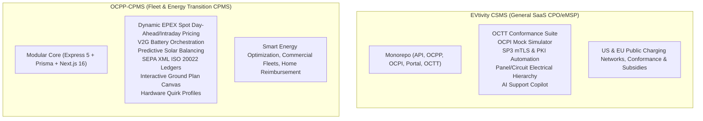

# Architectural Comparison & Strategic Roadmap: OCPP-CPMS vs. EVtivity-CSMS

This document provides an in-depth comparative analysis between **`OCPP-CPMS`** and [**`evtivity/evtivity-csms`**](https://github.com/evtivity/evtivity-csms), detailing essential feature gaps, unique strengths, and an actionable implementation plan for upcoming enhancements.

---

## 1. System Positioning & Architectural Overview



### High-Level Comparison

| Dimension | **Our Repository (`OCPP-CPMS`)** | **`evtivity-csms`** |
| :--- | :--- | :--- |
| **Primary Domain** | **Energy transition & fleet management** (EPEX spot dynamic rates, V2G orchestration, solar predictive balancing, SEPA reimbursements, station ground plans). | **General-purpose commercial CPO / eMSP platform** (OCTT protocol conformance, hierarchical electrical panels, US NEVI compliance, Stripe billing, AI assistant). |
| **Architecture** | Monolithic modular backend (Express 5 + Prisma + WebSocket port 9220) with Next.js 16 App Router UI. | Monorepo architecture (`packages/api`, `packages/ocpp`, `packages/ocpi`, `packages/csms`, `packages/portal`, `packages/octt`, `packages/worker`, Drizzle ORM). |
| **Database & ORM** | PostgreSQL with Prisma ORM 7.8 | PostgreSQL with Drizzle ORM |
| **Protocol Versions** | OCPP 1.6-J, 2.0.1, draft 2.1 | OCPP 1.6-J, 2.1 (with OCA codegen) |
| **Roaming** | OCPI 2.2.1 & OICP (Hubject) | OCPI 2.2.1 & 2.3.0 (CPO + eMSP endpoints) |
| **Payment Gateways** | Mollie (iDEAL, Bancontact, Sofort, SEPA, Cards) | Stripe |

---

## 2. Competitive Superpowers: What Our Repository Has That EVtivity Lacks

Our repository contains domain-specific capabilities that provide substantial competitive advantages for European fleets, smart charging operators, and energy transition deployments:

1. **Dynamic EPEX Spot Day-Ahead & Intraday Tariffs**:
   - Ingests hourly energy market spot prices via `EpexSpotService`.
   - Computes dynamic operator margins and handles negative power market pricing seamlessly.
2. **Vehicle-to-Grid (V2G) Fleet Orchestration**:
   - Real-time battery State of Charge (SoC) management via `V2GOrchestrationService`.
   - Enforces driver minimum reserve thresholds before permitting reverse grid discharge.
   - Calculates discharge revenue and grid stabilization tariffs.
3. **Predictive Solar Load Balancing**:
   - Solar curve modeling via `PredictiveBalancingService` that automatically throttles EV fleet charging power to match onsite rooftop PV output without requiring external EMS gateway hardware.
4. **SEPA ISO 20022 XML (`pain.001`) Direct Banking Export**:
   - Monthly employee home charging expense ledgers via `ReimbursementService` and `SepaXmlService` for direct batch payout generation.
5. **Interactive 2D Station Ground Plan Canvas**:
   - Drag-and-drop visual station blueprint editor (`@dnd-kit`) allowing CPOs to map physical parking spaces and EVSEs onto site diagrams.
6. **Hardware Quirk Profiles Engine**:
   - Granular compatibility layer for non-standard charger vendor behaviors (e.g. Alfen, EVBox, ABB, Schneider) overriding configuration keys and response timings.
7. **Multimedia Screen Advertisement Campaign Scheduler**:
   - Targeted video and banner media campaign scheduler targeting charger LCD screens via OCPP data transfers.

---

## 3. Gap Analysis: What EVtivity Has & Necessity Assessment

```
┌────────────────────────────────────────────────────────────────────────┐
│                        PRIORITIZED GAPS MATRIX                         │
├───────────────────┬───────────────────────────┬────────────────────────┤
│ 🔴 Tier 1: High   │ 🟡 Tier 2: Valuable       │ ⚪ Tier 3: Low/Optional│
├───────────────────┼───────────────────────────┼────────────────────────┤
│ • SendLocalList   │ • Standalone Guest Portal │ • NEVI Uptime (US-only)│
│ • Reservations    │ • OCPI Mock Simulator     │ • Carbon gCO2 Tracking │
│ • Audit Logging   │ • OCTT Test Harness       │ • LLM Chatbot Copilot  │
│ • SP2/SP3 & PKI   │ • Display Messages        │                        │
│                   │ • Panel-Circuit Hierarchy │                        │
└───────────────────┴───────────────────────────┴────────────────────────┘
```

### 🔴 Tier 1: Essential Gaps (High Value for Enterprise Production)

#### 1. Local Authorization List Management (`SendLocalList`)
- **Description:** Push-synchronization of RFID whitelist tags and tokens to the charger's onboard persistent memory via OCPP `SendLocalList` (supporting full and differential updates with version hashes).
- **Impact:** Ensures authorized drivers can initiate charging sessions even when cellular/Ethernet connectivity is temporarily down.
- **Verdict:** **Essential.** Prevents "stranded driver" incidents in offline conditions.

#### 2. EVSE Reservation Lifecycle (`ReserveNow` & `CancelReservation`)
- **Description:** Connector reservation booking, expiry timer handling, reservation fee tracking, and OCPI `commands/RESERVE_NOW` integration.
- **Impact:** Allows fleet drivers and roaming users to hold a charging plug prior to arrival.
- **Verdict:** **Essential.** Standard protocol feature required by many enterprise tenders and roaming partners.

#### 3. Granular Immutable Audit Logging
- **Description:** Structured logging of all administrative actions (remote resets, power limit adjustments, tariff alterations, user role grants).
- **Impact:** Required for enterprise compliance (SOC 2, ISO 27001) and operational incident post-mortems.
- **Verdict:** **Essential.** Simple and high-value to introduce via Prisma middleware.

#### 4. OCPP Security Profiles SP1–SP3 & Automated mTLS PKI
- **Description:** Automated CSR processing (`SignCertificate`, `CertificateSigned`), CA cert pushes (`InstallCertificate`), and client certificate validation for mutual TLS (SP3).
- **Impact:** Required for high-security public tenders, highway DC fast charging networks, and ISO 15118 root certificate distribution.
- **Verdict:** **Essential for enterprise & DC fast charger deployments.**

---

### 🟡 Tier 2: Valuable / Good-to-Have (Evaluate for Future Phases)

#### 5. Standalone Lightweight Driver & Guest Charging Portal
- **Description:** Dedicated mobile web app for ad-hoc users scanning QR codes at physical chargers to initiate payment and monitor session progress without creating an operator account.
- **Verdict:** **Valuable.** We have ad-hoc payments (`/payments`) and mobile companion views, but packaging them into an ultra-clean guest experience will boost ad-hoc conversions.

#### 6. Built-in OCPI Partner Simulator
- **Description:** Local mock CPO and eMSP server for automated testing of OCPI 2.2.1 handshakes, tokens, CDRs, and sessions.
- **Verdict:** **Recommended for QA/Testing.** Eliminates dependency on external staging sandboxes when developing roaming features.

#### 7. OCPP Conformance Test Harness (OCTT)
- **Description:** Test runner automating Open Charge Alliance (OCA) compliance test suites against the CSMS WebSocket endpoints.
- **Verdict:** **Recommended for official certifications.**

#### 8. Station Display Message System (`SetDisplayMessage`)
- **Description:** 8 state-specific screen message templates (available, charging, suspended, faulted, tariffs) pushed to charger displays via OCPP 2.0.1/2.1.
- **Verdict:** **Nice-to-have** for hardware with integrated graphical displays.

#### 9. Hierarchical Electrical Panel Tree Modeling
- **Description:** Multi-level electrical structure (Main Distribution Panel -> Sub-panels -> Breakers -> Circuits -> EVSEs) with unmanaged load meter compensation.
- **Verdict:** **Optional.** Our `ChargeGroup` cluster balancing with solar curves covers >90% of commercial use cases, but panel modeling is beneficial for complex multi-tenant industrial installations.

---

### ⚪ Tier 3: Non-Essential / Low Priority for Our Market

#### 10. NEVI Compliance & Uptime Reporting
- **Description:** US federal grant uptime calculation (97% requirement) with specific outage exclusion criteria.
- **Verdict:** **Low priority / skip** unless expanding specifically into US federally funded sites.

#### 11. Grid Carbon Intensity Tracking (`carbon.ts`)
- **Description:** Regional gCO2/kWh emissions estimation.
- **Verdict:** **Low priority.** Our native EPEX dynamic pricing and solar forecasting already optimize for green, low-cost charging hours.

#### 12. Integrated LLM Operator Assistant & Helpdesk
- **Description:** Natural language tool-calling assistant for querying fleet KPIs and generating customer support replies.
- **Verdict:** **Optional peripheral feature.**

---

## 4. Strategic Enhancement Roadmap

Based on this evaluation, the following 4-phase roadmap is recommended to incorporate the high-value features into `OCPP-CPMS`:

### Phase 1: Local Authorization & Offline Resilience
- [ ] Add `LocalAuthList` and `LocalAuthListEntry` models in [schema.prisma](file:///home/koen/Git/OCPP-CPMS/Backend/prisma/schema.prisma).
- [ ] Implement `sendLocalList({ chargerId, listVersion, updateType, localAuthorizationList })` in [remoteControl.ts](file:///home/koen/Git/OCPP-CPMS/Backend/src/ocpp/remoteControl.ts).
- [ ] Implement auto-sync hook in [rfid.ts](file:///home/koen/Git/OCPP-CPMS/Backend/src/api/rfid/) when cards are modified or added.
- [ ] Add Local Auth List status and sync button in the charger detail UI.

### Phase 2: Reservations Engine (`ReserveNow` / `CancelReservation`)
- [ ] Add `Reservation` model in [schema.prisma](file:///home/koen/Git/OCPP-CPMS/Backend/prisma/schema.prisma) with fields: `reservationId`, `expiryDate`, `idTag`, `connectorId`, `status: Active | Expired | Consumed | Cancelled`.
- [ ] Implement `reserveNow` and `cancelReservation` remote control RPC helpers.
- [ ] Add background cron job to expire overdue reservations and free up connector states.
- [ ] Connect reservation status to OCPI `commands/RESERVE_NOW` and `commands/CANCEL_RESERVATION`.

### Phase 3: Enterprise Audit Trail
- [ ] Add `AuditLog` model in [schema.prisma](file:///home/koen/Git/OCPP-CPMS/Backend/prisma/schema.prisma) (`userId`, `action`, `resource`, `resourceId`, `payload`, `ipAddress`, `timestamp`).
- [ ] Create audit middleware / service to record critical mutations (reboots, config updates, tariff changes, role modifications).
- [ ] Add an Audit Log viewer tab under the Settings page in Frontend.

### Phase 4: OCPP Security Profiles & PKI Automation (SP2 / SP3)
- [ ] Implement OCPP 1.6 & 2.0.1 certificate handlers: `SignCertificate`, `CertificateSigned`, `InstallCertificate`, `DeleteCertificate`.
- [ ] Provide mTLS listener configuration on port 9221 with client certificate validation against trusted CAs.
- [ ] Expose certificate status, expiry alerts, and CSR signing workflows in the Admin UI.
